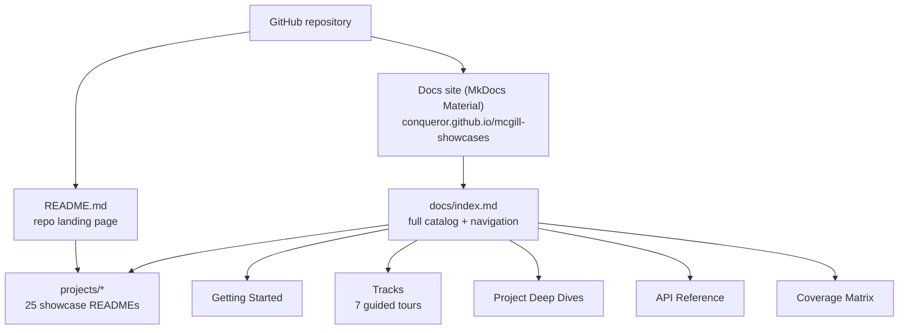
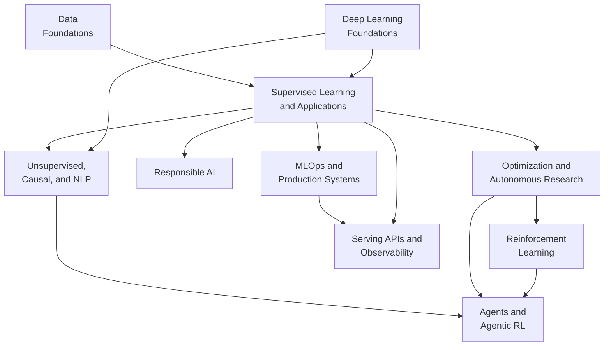

# McGill ML Showcases

Public, student-friendly machine learning showcase projects for learning by doing.

This repository contains tutorial-style projects with reproducible tooling (`uv` + `make`), clear learning flows, and practical artifacts.

[](https://github.com/conqueror/mcgill-showcases/actions/workflows/ci.yml)
[](https://github.com/conqueror/mcgill-showcases/actions/workflows/markdown-links.yml)
[](https://github.com/conqueror/mcgill-showcases/actions/workflows/notebooks-smoke.yml)
[](LICENSE)

## Table of Contents
- [Start Here](#start-here)
- [Project Catalog](#project-catalog)
  - [Deep Learning Foundations](#deep-learning-foundations)
  - [Data Foundations](#data-foundations)
  - [Supervised Learning and Applications](#supervised-learning-and-applications)
  - [Unsupervised, Causal, and NLP](#unsupervised-causal-and-nlp)
  - [Responsible AI](#responsible-ai)
  - [Optimization and Autonomous Research](#optimization-and-autonomous-research)
  - [Reinforcement Learning](#reinforcement-learning)
  - [Agents and Agentic RL](#agents-and-agentic-rl)
  - [MLOps and Production Systems](#mlops-and-production-systems)
  - [Serving APIs and Observability](#serving-apis-and-observability)
- [Clean-Checkout Data And Artifacts](#clean-checkout-data-and-artifacts)
- [Repository Commands](#repository-commands)
- [Documentation Site](#documentation-site)
- [Learning Path](#learning-path)
- [Coverage Matrix](#coverage-matrix)
- [How to Get Help](#how-to-get-help)
- [Contributing](#contributing)
- [License](#license)

## Start Here
1. Install Python 3.11+ and `uv`.
2. Run:
```bash
make sync
```
3. Pick a track and project from the [catalog](#project-catalog) below.
4. Enter that project and follow its `README.md`.

If this is your first time, start with [`sota-supervised-learning-showcase`](projects/sota-supervised-learning-showcase/README.md).
If you want the deep-learning sequence specifically, start with [`deep-learning-math-foundations-showcase`](projects/deep-learning-math-foundations-showcase/README.md).

## Project Catalog

Twenty-five self-contained showcases, grouped by track and ordered so each builds on the last.
Pick a track that matches your goal, or follow the [learning paths](#learning-path) for guided
cross-track sequences. Each project name links to its own `README.md`.

**Browse by track:** [Deep Learning Foundations](#deep-learning-foundations) ·
[Data Foundations](#data-foundations) ·
[Supervised Learning and Applications](#supervised-learning-and-applications) ·
[Unsupervised, Causal, and NLP](#unsupervised-causal-and-nlp) ·
[Responsible AI](#responsible-ai) ·
[Optimization and Autonomous Research](#optimization-and-autonomous-research) ·
[Reinforcement Learning](#reinforcement-learning) ·
[Agents and Agentic RL](#agents-and-agentic-rl) ·
[MLOps and Production Systems](#mlops-and-production-systems) ·
[Serving APIs and Observability](#serving-apis-and-observability)

### Deep Learning Foundations
Build the neural-network toolkit from the math up.

| Project | What you'll learn | Difficulty | Time | Prerequisites |
|---|---|---|---|---|
| [`deep-learning-math-foundations-showcase`](projects/deep-learning-math-foundations-showcase/README.md) | Essential math for deep learning: vectors, derivatives, entropy, and gradient descent | Beginner | 1.0-1.5 hours | Python basics, high-school algebra |
| [`neural-network-foundations-showcase`](projects/neural-network-foundations-showcase/README.md) | Perceptrons, activations, backprop intuition, initialization, and decision boundaries | Beginner | 1.0-1.5 hours | Python, basic algebra, deep-learning math foundations recommended |
| [`pytorch-training-regularization-showcase`](projects/pytorch-training-regularization-showcase/README.md) | PyTorch training loops, optimizers, schedulers, dropout, batch norm, and regularization experiments | Beginner-Intermediate | 1.5-2.0 hours | Python, neural-network foundations recommended |

### Data Foundations
Understand and prepare data before you model it.

| Project | What you'll learn | Difficulty | Time | Prerequisites |
|---|---|---|---|---|
| [`eda-leakage-profiling-showcase`](projects/eda-leakage-profiling-showcase/README.md) | Data profiling, missingness diagnostics, leakage analysis, split strategy comparison | Beginner-Intermediate | 1.5-2.0 hours | Python, pandas basics |
| [`feature-engineering-dimred-showcase`](projects/feature-engineering-dimred-showcase/README.md) | Encoding, feature selection, PCA/t-SNE/UMAP comparison | Beginner-Intermediate | 1.5-2.5 hours | Python, preprocessing basics |

### Supervised Learning and Applications
Core supervised modeling and applied case studies.

| Project | What you'll learn | Difficulty | Time | Prerequisites |
|---|---|---|---|---|
| [`sota-supervised-learning-showcase`](projects/sota-supervised-learning-showcase/README.md) | Supervised learning foundations + SOTA-style evaluation | Beginner-Intermediate | 1.5-2.5 hours | Python, basic classification/regression |
| [`credit-risk-classification-capstone-showcase`](projects/credit-risk-classification-capstone-showcase/README.md) | Credit default capstone (EDA, imbalance handling, threshold decisions) | Intermediate | 2-3 hours | Supervised ML basics, tabular data prep |
| [`nyc-demand-forecasting-foundations-showcase`](projects/nyc-demand-forecasting-foundations-showcase/README.md) | Time-aware demand forecasting with explicit train/val/test splits | Intermediate | 1.5-2.5 hours | Python, regression basics, time-based validation intuition |
| [`learning-to-rank-foundations-showcase`](projects/learning-to-rank-foundations-showcase/README.md) | Learning-to-rank foundations with grouped splits and NDCG | Intermediate | 1.5-2.5 hours | Python, ranking/recommendation basics |

### Unsupervised, Causal, and NLP
Methods that go beyond labeled supervised learning.

| Project | What you'll learn | Difficulty | Time | Prerequisites |
|---|---|---|---|---|
| [`sota-unsupervised-semisup-showcase`](projects/sota-unsupervised-semisup-showcase/README.md) | Unsupervised, semi-supervised, self-supervised, active learning | Intermediate | 2-3 hours | Python, basic ML intuition |
| [`causalml-kaggle-showcase`](projects/causalml-kaggle-showcase/README.md) | Causal inference, uplift modeling, policy simulation | Intermediate | 2-3 hours | Python, basic ML, Kaggle token |
| [`modern-nlp-pipeline-showcase`](projects/modern-nlp-pipeline-showcase/README.md) | Shared text pipeline for classification, retrieval, QA, and summarization on research abstracts | Intermediate | 2-3 hours | Python, basic ML, interest in NLP systems |

### Responsible AI
Explain, audit, and make models fair.

| Project | What you'll learn | Difficulty | Time | Prerequisites |
|---|---|---|---|---|
| [`xai-fairness-audit-showcase`](projects/xai-fairness-audit-showcase/README.md) | Explainability, subgroup fairness metrics, mitigation tradeoffs | Intermediate | 2-3 hours | Python, classification metrics |

### Optimization and Autonomous Research
Tune models and run autonomous, budgeted research loops.

| Project | What you'll learn | Difficulty | Time | Prerequisites |
|---|---|---|---|---|
| [`automl-hpo-showcase`](projects/automl-hpo-showcase/README.md) | Hyperparameter optimization strategy benchmarking (grid/random/TPE) | Intermediate | 1.5-2.5 hours | Python, model tuning basics |
| [`autoresearch`](projects/autoresearch/README.md) | Fixed-budget autonomous research loops with Codex/Claude launch briefs for macOS and Unix | Intermediate-Advanced | 2-3 hours | Python, basic ML, Git, access to Apple Silicon or an NVIDIA GPU for the real upstream path |

### Reinforcement Learning
Sequential decision-making from bandits to policy gradients.

| Project | What you'll learn | Difficulty | Time | Prerequisites |
|---|---|---|---|---|
| [`rl-bandits-policy-showcase`](projects/rl-bandits-policy-showcase/README.md) | Multi-armed bandits, reward/regret analysis, policy recommendation | Intermediate | 1.5-2.5 hours | Python, probability basics |
| [`student-support-rl-showcase`](projects/student-support-rl-showcase/README.md) | Contextual bandits, MDPs, dynamic programming (exact Q*), tabular Q-learning and SARSA, REINFORCE policy gradients, optional DQN/PPO comparison, reward hacking, offline evaluation, and deployment caution | Intermediate | 1.5-2.5 hours | Python, probability basics, `rl-bandits-policy-showcase` helpful |

### Agents and Agentic RL
Build agents, then learn the policies that drive them.

| Project | What you'll learn | Difficulty | Time | Prerequisites |
|---|---|---|---|---|
| [`agentic-course-assistant-showcase`](projects/agentic-course-assistant-showcase/README.md) | Agent routing, tools, guardrails, traces, eval rubrics, A2A/session/memory concepts, and optional OpenAI Agents SDK / Google ADK examples | Intermediate | 1-1.5 hours | Python, basic ML workflow vocabulary |
| [`adaptive-course-assistant-rl-showcase`](projects/adaptive-course-assistant-rl-showcase/README.md) | Learned pedagogical intervention around a deterministic course assistant: contextual bandit, tutoring MDP, Q-learning, SARSA, REINFORCE, optional DQN/PPO bridge, policy export, and governance | Intermediate | 1.5-2.5 hours | Python, basic ML workflow vocabulary, `agentic-course-assistant-showcase` or `student-support-rl-showcase` helpful |
| [`learning-agents-showcase`](projects/learning-agents-showcase/README.md) | Standalone capstone on where learning lives in an agent: contextual bandits, tabular RL, offline RL and off-policy evaluation, cost-aware cascades, governance, plus an OpenAI Agents SDK bridge, RLHF/DPO/GRPO/RLVR, MARL, and an optional NumPy DQN/PPO deep-RL lane | Intermediate | 1.5-2.5 hours | Python, basic ML workflow vocabulary, `agentic-course-assistant-showcase` or `student-support-rl-showcase` helpful |

### MLOps and Production Systems
Operate, monitor, and release models safely.

| Project | What you'll learn | Difficulty | Time | Prerequisites |
|---|---|---|---|---|
| [`mlops-drift-production-showcase`](projects/mlops-drift-production-showcase/README.md) | MLOps lifecycle, drift detection, retraining decisions, local API serving | Intermediate | 2-3 hours | Python, ML basics, API basics |
| [`batch-vs-stream-ml-systems-showcase`](projects/batch-vs-stream-ml-systems-showcase/README.md) | Batch vs stream KPI pipelines, parity and latency analysis | Intermediate | 2-3 hours | Python, data systems basics |
| [`model-release-rollout-showcase`](projects/model-release-rollout-showcase/README.md) | Canary rollout, promote/hold/rollback decisions, registry artifacts | Intermediate | 1.5-2.0 hours | Python, model metrics basics |

### Serving APIs and Observability
Ship models behind real APIs with metrics and tracing.

| Project | What you'll learn | Difficulty | Time | Prerequisites |
|---|---|---|---|---|
| [`ranking-api-productization-showcase`](projects/ranking-api-productization-showcase/README.md) | FastAPI ranking service, schema contracts, structured logging, OpenAPI | Intermediate | 1.5-2.5 hours | Python, API basics, model serving basics |
| [`demand-api-observability-showcase`](projects/demand-api-observability-showcase/README.md) | Demand prediction API with Prometheus metrics and optional OTel tracing | Intermediate | 1.5-2.5 hours | Python, API basics, observability basics |

## Clean-Checkout Data And Artifacts

This repo keeps generated outputs out of git so students can reproduce them locally.
Most projects write files under `artifacts/` only after `make run`, `make smoke`, or a
similar project command. A clean checkout may therefore contain only placeholders such
as `.gitkeep`.

Raw local inputs are also kept out of git by default. Projects that need starter data
either generate it in code or ship a small bundled sample dataset inside `src/` so
tests and smoke runs work on a normal laptop without private files.

Use each project README as the source of truth, but the usual flow is:

```bash
make sync
make smoke  # or make run
make verify
make test
```

If `make verify` reports missing artifacts before a run, generate the artifacts first.
The verifier is checking the stable contract for what the project is expected to
produce, not requiring generated outputs to be committed.

## Repository Commands

Use root commands to run quality gates across all projects:

```bash
make help
make sync
make lint
make ty
make test
make check
make check-contracts
make verify
make smoke
make docs-build
make docs-serve
make docs-check
make harness-preflight
make harness-lint
```

Project-specific runs should be started from each project folder.

Contract note:
- `make check-contracts` bootstraps missing supervised artifacts in quick mode, then validates split/EDA/leakage/eval/experiment contracts.
- `make harness-preflight` and `make harness-lint` validate the repo-local public harness-lite bootstrap.

## Documentation Site

This repository has two complementary front doors:

- **`README.md`** (this file) — the GitHub landing page: the full [project catalog](#project-catalog), repository commands, and contributor pointers.
- **Docs site** — the complete, browsable documentation, built with MkDocs Material and published at [conqueror.github.io/mcgill-showcases](https://conqueror.github.io/mcgill-showcases/). Source lives in `docs/`; the home page `docs/index.md` carries the full catalog and navigation.



**Live quick links:**
[Home](https://conqueror.github.io/mcgill-showcases/) ·
[Getting Started](https://conqueror.github.io/mcgill-showcases/getting-started/) ·
[Showcase Architecture](https://conqueror.github.io/mcgill-showcases/showcase-architecture/) ·
[API Overview](https://conqueror.github.io/mcgill-showcases/api/) ·
[Ranking API](https://conqueror.github.io/mcgill-showcases/api/ranking-api/) ·
[Demand API](https://conqueror.github.io/mcgill-showcases/api/demand-api/) ·
[Glossary](https://conqueror.github.io/mcgill-showcases/glossary/)

**Build and serve locally:**

```bash
make docs-serve   # live local preview
make docs-check   # strict build check
```

- Config: `mkdocs.yml` · docs dependencies: `docs/requirements-mkdocs.txt`
- Main entry points: `docs/index.md`, `docs/showcase-architecture.md`, `docs/new-showcase-playbook.md`, `docs/api/index.md`
- API docs: GitHub Pages serves static API reference pages with embedded ReDoc viewers (backed by versioned OpenAPI JSON). Interactive Swagger UI (`/docs`) is available when you run a FastAPI showcase locally with `make dev`.

## Learning Path

The tracks build on each other roughly top-to-bottom (foundations first, systems last). Arrows show
the most common progressions and cross-track jumps:



**Cross-track sequences** (project-level):

- **Deep learning foundations:** deep-learning math foundations → neural-network foundations → pytorch training regularization → supervised or unsupervised.
- **Core ML:** supervised → unsupervised/semisup → causal.
- **Data quality:** eda leakage profiling → feature engineering → supervised contract artifacts.
- **Production:** supervised → mlops drift → batch vs stream.
- **Release:** mlops drift → batch vs stream → model rollout.
- **Forecasting:** nyc-demand forecasting foundations → demand API observability → model rollout.
- **Ranking:** learning-to-rank foundations → ranking API productization → model rollout.
- **NLP systems:** pytorch training regularization → modern NLP pipeline → learning to rank → ranking API productization.
- **Responsible AI:** supervised → xai fairness → causal.
- **Optimization:** supervised → automl hpo → autoresearch → rl bandits → student support rl.
- **Agent frameworks:** automl hpo → autoresearch → agentic course assistant → model rollout.
- **Agent-plus-RL bridge:** autoresearch → agentic course assistant → adaptive course assistant RL → rerun adaptive DRL bridge → student support RL.
- **Learning-agent capstone:** autoresearch → agentic course assistant → adaptive course assistant RL → learning agents showcase.

See the full set of guided, step-by-step paths (A–Q) in `docs/learning-path.md`.

## Coverage Matrix

Not sure which project demonstrates a given technique? The coverage matrix maps each ML aspect —
splits, imbalance handling, explainability, fairness, HPO, drift, experiment tracking,
productionization, RL, and agents — to the project that demonstrates it and the concrete command and
artifact that prove it.

- Full matrix: `docs/aspect-coverage-matrix.md` (also on the [docs site](https://conqueror.github.io/mcgill-showcases/aspect-coverage-matrix/)).
- Use it to match a course topic to a runnable command and its generated evidence.

## How to Get Help
- Read `docs/faq.md` and `docs/troubleshooting.md` first.
- Ask learning questions using GitHub Issues template: "Learning Question".
- Open bug reports with reproducible steps and command output.

## Contributing
See `CONTRIBUTING.md` for setup, standards, and pull request workflow.

## Harness Lite
- Repo-local harness config: `.codex/config.toml`
- Routing manifest: `.codex/harness/role-skill-matrix.toml`
- Operating pack: `docs/agents/oodaris-harness-v2-operating-pack.md`

## License
MIT License. See `LICENSE`.
