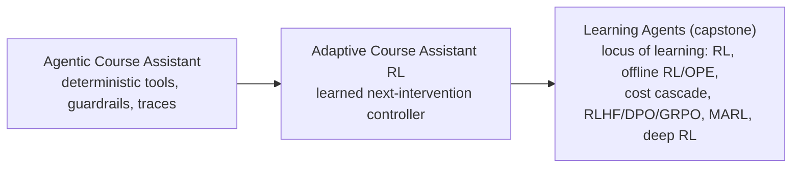

# Agentic RL Track

This track answers one question: **where does learning live inside an agent?** Start from a fully
deterministic agent, then hand just the *next decision* to a learned controller, and finish at a
capstone that maps every locus of learning — orchestration-policy RL, offline RL and off-policy
evaluation, cost-aware cascades, preference optimization (RLHF/DPO/GRPO/RLVR), multi-agent RL, and an
optional deep-RL bridge — onto one inspectable system.

## Recommended Sequence

1. `projects/agentic-course-assistant-showcase` (the deterministic agent foundation)
2. `projects/adaptive-course-assistant-rl-showcase` (a learned intervention controller around that assistant)
3. `projects/learning-agents-showcase` (the standalone capstone: every locus of learning in one place)



## Core Skills Covered

- Drawing the boundary between deterministic agent workflow and the one decision worth learning.
- Exporting a learned policy as an inspectable router an agent can call (`policy_router.json`, action mappings).
- Orchestration-policy RL: learning *which tool/step to take* rather than generating answers from scratch.
- Offline RL from logged agent traces, and off-policy evaluation (IS / WIS / DM / DR) before any rollout.
- Cost-aware cascades: trading answer quality against compute/latency on a Pareto curve.
- Preference optimization concepts — RLHF, DPO, GRPO, and RLVR — on a small, traceable toy.
- Multi-agent RL: independent learners vs. joint action learning on a coordination game.
- An optional vendored-NumPy DQN/PPO bridge so deep RL is comparable to the tabular baselines.
- Governance: shadow/reject gates and deployment memos for learned-policy systems.

## Primary Showcases

The deterministic agent foundation (start here if you have not done the
[Agent Frameworks track](agent-frameworks.md)):

```bash
cd projects/agentic-course-assistant-showcase
make sync
make smoke
make verify
```

The learned intervention controller around that assistant:

```bash
cd projects/adaptive-course-assistant-rl-showcase
make sync
make smoke
make verify
# optional deep-RL bridge:
make sync-drl
make run-drl-optional
```

The capstone — runs all four locus-of-learning lanes locally:

```bash
cd projects/learning-agents-showcase
make sync
make smoke
make verify
# optional OpenAI Agents SDK bridge (gated) and deep-RL lane:
make sync-sdk
make run-drl
```

Then read the in-project guides:

- [Adaptive: `docs/system-boundary.md`](https://github.com/conqueror/mcgill-showcases/blob/main/projects/adaptive-course-assistant-rl-showcase/docs/system-boundary.md)
- [Adaptive: `docs/policy-export-and-agent-bridge.md`](https://github.com/conqueror/mcgill-showcases/blob/main/projects/adaptive-course-assistant-rl-showcase/docs/policy-export-and-agent-bridge.md)
- [Capstone: `docs/locus-of-learning.md`](https://github.com/conqueror/mcgill-showcases/blob/main/projects/learning-agents-showcase/docs/locus-of-learning.md)
- [Capstone: `docs/offline-rl-and-ope.md`](https://github.com/conqueror/mcgill-showcases/blob/main/projects/learning-agents-showcase/docs/offline-rl-and-ope.md)
- [Capstone: `docs/cost-aware-cascade.md`](https://github.com/conqueror/mcgill-showcases/blob/main/projects/learning-agents-showcase/docs/cost-aware-cascade.md)
- [Capstone: `docs/lane-b-preference-optimization.md`](https://github.com/conqueror/mcgill-showcases/blob/main/projects/learning-agents-showcase/docs/lane-b-preference-optimization.md)
- [Capstone: `docs/lane-c-marl.md`](https://github.com/conqueror/mcgill-showcases/blob/main/projects/learning-agents-showcase/docs/lane-c-marl.md)
- [Capstone: `docs/results-dashboard.md`](https://github.com/conqueror/mcgill-showcases/blob/main/projects/learning-agents-showcase/docs/results-dashboard.md)

## Evidence Artifacts To Inspect

Learned controller around a deterministic assistant (`projects/adaptive-course-assistant-rl-showcase`):

- `artifacts/assistant/episode_trace.json` (the deterministic workflow the policy wraps)
- `artifacts/bridge/learning_agent_story.md`, `artifacts/bridge/policy_router.json`, `artifacts/bridge/action_mapping.md`
- `artifacts/q_learning/training_curve.csv` and `artifacts/bandit/contextual_policy_metrics.csv`
- `artifacts/drl_optional/dqn_training_summary.csv` and `artifacts/drl_optional/ppo_training_summary.csv`
- `artifacts/business/deployment_recommendation.md`

Capstone — locus of learning (`projects/learning-agents-showcase`):

- `artifacts/offline_rl/dataset_summary.csv` and `artifacts/offline_rl/training_curve.csv`
- `artifacts/ope/estimator_comparison.csv` (IS / WIS / DM / DR)
- `artifacts/cost_cascade/cost_quality_curve.csv`
- `artifacts/preference/method_comparison.csv` and `artifacts/preference/training_curves.csv` (RLHF/DPO/GRPO/RLVR)
- `artifacts/marl/coordination_comparison.csv` and `artifacts/marl/training_curves.csv`
- `artifacts/sdk_bridge/orchestration_trace.csv` and `artifacts/sdk_bridge/bridge_report.md`
- `artifacts/eval/policy_comparison.csv` and `artifacts/business/deploy_shadow_reject_memo.md`
- `artifacts/drl_optional/rl_family_comparison.csv` and `artifacts/drl_optional/bridge_report.md`

## Prerequisites

This track assumes the RL fundamentals from the [Reinforcement Learning track](reinforcement-learning.md)
(bandits, MDPs, Q-learning, SARSA, REINFORCE) and the deterministic-agent mechanics from the
[Agent Frameworks track](agent-frameworks.md) (tools, guardrails, traces, evals).

## Suggested Reflection Prompts

- Which decisions in the assistant should stay deterministic even after you add a learned controller?
- What does exporting the policy as a router (rather than retraining the agent) buy you operationally?
- When the logged-policy and target-policy differ, which OPE estimator do you trust, and why?
- On the cost–quality curve, where is the "good enough" operating point, and who decides?
- RLHF vs. DPO vs. GRPO vs. RLVR: which assumption about the reward signal does each one make?
- In the coordination game, when does independent learning fail where joint action learning succeeds?
- What governance gate would you require before any of these learned policies touches a real student?
