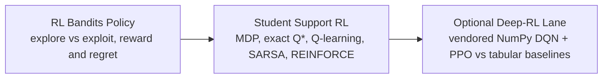

# Reinforcement Learning Track

This track teaches sequential decision-making from the ground up. Start with exploration vs.
exploitation in multi-armed bandits, climb the full model-free control ladder on a small,
inspectable student-support MDP, and finish with an optional deep-RL (DQN/PPO) bridge that compares
against the tabular baselines — no heavyweight framework required.

## Recommended Sequence

1. `projects/rl-bandits-policy-showcase`
2. `projects/student-support-rl-showcase`
3. Optional deep-RL lane inside `projects/student-support-rl-showcase` (`make sync-drl && make run-drl-optional`)



## Core Skills Covered

- Exploration vs. exploitation: epsilon-greedy, UCB1, and Thompson sampling, scored by reward and regret.
- Framing a decision problem as a Markov decision process (states, actions, transitions, reward).
- Exact dynamic programming for a ground-truth optimal action-value table (Q*) on a small MDP.
- Model-free control: tabular Q-learning (off-policy) and SARSA (on-policy), and why their training curves differ.
- Policy-gradient learning with REINFORCE and the value-baseline intuition.
- Reward design and reward hacking: how a proxy reward diverges from the true objective.
- Offline evaluation and governance gates before any online rollout.
- An optional vendored-NumPy DQN/PPO bridge that compares deep RL against the tabular baselines without PyTorch.

## Primary Showcases

Bandits first — exploration, regret, and a policy recommendation:

```bash
cd projects/rl-bandits-policy-showcase
make sync
make smoke
make verify
```

Then the full ladder — MDP, dynamic programming, Q-learning, SARSA, and REINFORCE:

```bash
cd projects/student-support-rl-showcase
make sync
make smoke
make verify
```

Optional deep-RL bridge (no PyTorch required):

```bash
cd projects/student-support-rl-showcase
make sync-drl
make run-drl-optional
make verify
```

Then read the in-project guides:

- [`docs/00-start-here.md`](https://github.com/conqueror/mcgill-showcases/blob/main/projects/student-support-rl-showcase/docs/00-start-here.md)
- [`docs/algorithm-ladder.md`](https://github.com/conqueror/mcgill-showcases/blob/main/projects/student-support-rl-showcase/docs/algorithm-ladder.md)
- [`docs/value-based-learning.md`](https://github.com/conqueror/mcgill-showcases/blob/main/projects/student-support-rl-showcase/docs/value-based-learning.md)
- [`docs/policy-gradient-and-actor-critic.md`](https://github.com/conqueror/mcgill-showcases/blob/main/projects/student-support-rl-showcase/docs/policy-gradient-and-actor-critic.md)
- [`docs/reward-design-and-hacking.md`](https://github.com/conqueror/mcgill-showcases/blob/main/projects/student-support-rl-showcase/docs/reward-design-and-hacking.md)
- [`docs/deep-rl.md`](https://github.com/conqueror/mcgill-showcases/blob/main/projects/student-support-rl-showcase/docs/deep-rl.md)
- [`docs/math-notes.md`](https://github.com/conqueror/mcgill-showcases/blob/main/projects/student-support-rl-showcase/docs/math-notes.md)

## Evidence Artifacts To Inspect

Bandits (`projects/rl-bandits-policy-showcase`):

- `artifacts/sim/policy_comparison.csv`
- `artifacts/sim/reward_trace.csv`
- `artifacts/sim/regret_trace.csv`
- `artifacts/sim/policy_recommendation.md`

Full ladder (`projects/student-support-rl-showcase`):

- `artifacts/concepts/algorithm_progression.md`
- `artifacts/dp/optimal_action_values.csv` and `artifacts/dp/q_learning_gap.csv` (tabular Q-learning vs exact Q*)
- `artifacts/q_learning/training_curve.csv` and `artifacts/q_learning/q_table.csv`
- `artifacts/policy_gradient/training_curve.csv`
- `artifacts/eval/policy_comparison.csv` and `artifacts/eval/scenario_results.csv`
- `artifacts/reward/reward_hacking_report.md`, `artifacts/reward/reward_spec_good.md`, `artifacts/reward/reward_spec_bad.md`
- `artifacts/governance/safety_controls.md` and `artifacts/governance/offline_eval_plan.md`

Optional deep-RL lane (`projects/student-support-rl-showcase/artifacts/drl_optional/`):

- `rl_family_comparison.csv`
- `training_summary.csv`
- `bridge_report.md`

## Where This Leads

Once you understand learned policies in isolation, the [Agentic RL track](agentic-rl.md) shows where
that learning lives *inside* an agent: a learned controller wrapped around a deterministic assistant,
plus offline RL, off-policy evaluation, and cost-aware routing. For the optimization framing of the
same projects (search budgets, objective choice), see the [Optimization track](optimization.md).

## Suggested Reflection Prompts

- When does Thompson sampling beat UCB1, and what does the regret curve actually show?
- How close does tabular Q-learning get to the exact dynamic-programming Q*, and where is the gap largest?
- Where do the Q-learning and SARSA training curves diverge, and why does on-policy vs off-policy matter here?
- Which reward term creates the biggest gap between proxy reward and the true objective?
- What offline check would you require before letting this policy run online?
- Does the optional DQN/PPO lane actually beat the tabular baseline on this small MDP — and is the extra complexity justified?
