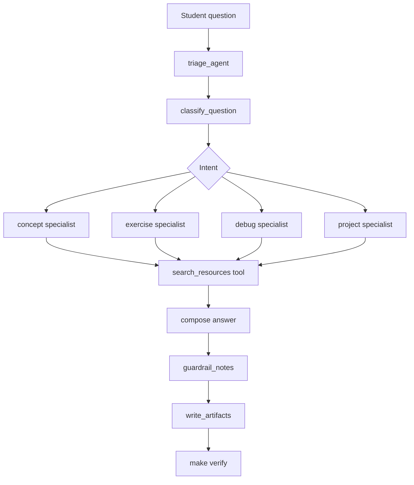
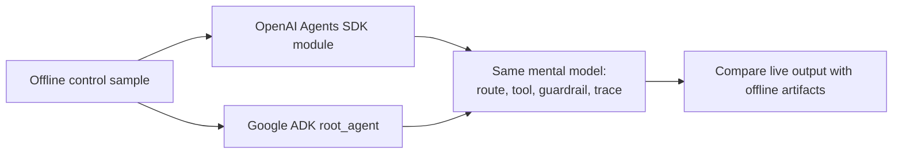

# Agentic Course Assistant Showcase

Learn how agent frameworks route work, call tools, apply guardrails, and leave behind evidence you
can actually inspect.

This project builds a small course assistant for machine-learning students. The default path is
deterministic and offline, so you can learn the workflow before you ever need an API key. The
optional modules show the same basic shape with the OpenAI Agents SDK and Google ADK, and the
generated concept atlas ties that work back to the larger agent-engineering course.

## Learning Outcomes

By the end of this project, you should be able to:

- explain the difference between a deterministic agent workflow and a hosted SDK workflow,
- route a student question to a specialist agent intent,
- use a small course catalog as a tool,
- inspect an agent trace and identify each workflow step,
- compare OpenAI Agents SDK concepts with Google ADK concepts,
- explain sessions, memory, A2A, evals, agent-as-judge, skills, artifacts, and harness gates,
- add one guardrail that keeps an assistant scoped to public learning support.

## Prerequisites

- Python 3.11+
- `uv`
- Basic Python functions, dictionaries, and dataclasses
- Optional: an OpenAI API key plus the `openai` extra for `openai_agents_example.py`
- Optional: a Gemini or Vertex setup plus the `adk` extra for `google_adk_example.py`

## Quickstart

```bash
cd projects/agentic-course-assistant-showcase
make sync
make smoke
make verify
```

Ask your own question:

```bash
make run QUESTION="I understand train/test splits, but why is leakage so dangerous?"
```

Run quality checks:

```bash
make check
```

Generate the opt-in hosted OpenAI artifact bundle after configuring `OPENAI_API_KEY`:

```bash
make sync-openai
make run-openai QUESTION="How should I debug a suspicious validation score?"
make verify-openai
```

## Student Path

Use the docs in this order:

1. Run the deterministic offline harness with `make smoke`.
2. Follow [`docs/lab-guide.md`](docs/lab-guide.md) to inspect the answer, trace, tool output, and eval rubric.
3. Read [`docs/concept-map.md`](docs/concept-map.md) to connect each local artifact to OpenAI Agents SDK and Google ADK concepts.
4. Use [`docs/learning-guide.md`](docs/learning-guide.md) for reflection prompts and a small route-extension exercise.
5. Use [`docs/sdk-comparison.md`](docs/sdk-comparison.md) before installing optional live SDK extras.

The MkDocs site also includes an [Agentic Course Assistant deep dive](../../docs/deep-dives/agentic-course-assistant.md) and the [Agent Frameworks track](../../docs/tracks/agent-frameworks.md).

Install live SDK extras only when you are ready to run the hosted examples:

```bash
make sync-openai  # installs openai-agents
make sync-adk     # installs google-adk
make sync-live    # installs both optional SDK extras
```

For local hosted runs, copy `.env.example` to `.env` and set `OPENAI_API_KEY`
and/or `GEMINI_API_KEY`. The project keeps `.env` ignored and maps
`GEMINI_API_KEY` to `GOOGLE_API_KEY` for Google ADK compatibility at runtime.

## Key Artifacts

After `make run`, inspect:

- `artifacts/course_assistant_response.md`: the routed answer, matched resources, and trace.
- `artifacts/agent_trace.json`: machine-readable routing, guardrail, and resource evidence.
- `artifacts/resource_matches.csv`: course resources returned by the lookup tool.
- `artifacts/concepts/agentic_concepts.csv`: a comprehensive concept map across OpenAI Agents SDK, Google ADK, and this offline build.
- `artifacts/concepts/openai_vs_adk_concepts.json`: machine-readable framework comparison.
- `artifacts/concepts/refined_questions.md`: expanded questions students should answer before building.
- `artifacts/concepts/student_learning_path.md`: staged path from offline workflow to SDK, eval, A2A, and deployment extensions.
- `artifacts/evals/agent_judge_rubric.json`: rubric for an agent-as-judge or trace-grading extension.
- `artifacts/evals/concept_coverage.json`: coverage proof for requested concepts.
- `artifacts/manifest.json`: the artifact contract used by `make verify`.

## How The Assistant Works

The default offline workflow is intentionally small:



1. `triage_agent` receives the question.
2. `classify_question` routes it to `concept`, `exercise`, `debug`, or `project`.
3. `search_resources` acts as a deterministic course-catalog tool.
4. The selected specialist composes a short answer.
5. `guardrail_notes` adds scope and secret-handling reminders.
6. `write_artifacts` writes the response, trace, and matched resources.
7. `write_concept_artifacts` writes the concept atlas, refined questions, learning path, and eval rubric.

That gives students the right mental model without making the first run depend on API credentials.

## SDK Examples

This showcase now includes small optional reference modules for both the OpenAI Agents SDK and
Google ADK:



- `src/agentic_course_assistant/openai_agents_example.py` uses `Agent`, `Runner`, `function_tool`, tools, and handoffs.
- `src/agentic_course_assistant/google_adk_example.py` defines the ADK `root_agent` and function tool.
- `adk_course_assistant/agent.py` is an ADK-discoverable wrapper for `uv run adk run adk_course_assistant`.

Important boundary:

- these optional SDK examples show runtime orchestration,
- they do **not** train a policy,
- they do **not** make the assistant a learning agent by themselves.

If you want the learned-policy layer, the next project is `../adaptive-course-assistant-rl-showcase/README.md`.

The default classroom path and the main CI lane do not run these modules. That is intentional.
Credentials are optional, and the first student workflow stays offline. Keep the main path on
`make check` and `make verify`. Use `make sync-openai`, `make sync-adk`, or `make sync-live` only
when you are ready to try the hosted examples locally.

If you want the hosted OpenAI path to write the same kind of student-facing artifacts as the
offline build, use the dedicated bundle command instead of the inline snippet:

```bash
make run-openai QUESTION="How should I debug a suspicious validation score?"
make verify-openai
```

That command writes a separate bundle root at `artifacts/live_openai/`. Inside it, the hosted run
reuses the offline teaching contract under `artifacts/`, including:

- `artifacts/course_assistant_response.md`
- `artifacts/agent_trace.json`
- `artifacts/resource_matches.csv`
- `artifacts/evals/agent_judge_rubric.json`
- `artifacts/evals/concept_coverage.json`
- `artifacts/manifest.json`

One important boundary stays visible in that bundle: the local teaching adapter still performs
intent selection and course-catalog grounding before the hosted specialist call. The emitted JSON
trace is a teaching artifact for that combined workflow. It is not a raw OpenAI platform trace
dump.

Optional OpenAI run shape after configuring `OPENAI_API_KEY` outside source control:

```bash
uv run python - <<'PY'
import asyncio
from agentic_course_assistant.openai_agents_example import run_openai_agents_course_assistant

question = "How should I debug a suspicious validation score?"
print(asyncio.run(run_openai_agents_course_assistant(question)))
PY
```

Optional Google ADK run shape after configuring the Gemini or Vertex credentials expected by ADK:

```bash
uv run adk run adk_course_assistant
```

## Comprehensive Concept Atlas

The concept atlas covers the requested topics, plus the adjacent ones students usually ask about
after the first run:

- tool calls and function tools,
- guardrails, human approval, callbacks, plugins, and policy checks,
- tracing, observability, artifacts, and reproducible evidence,
- agentic workflows, multi-agent orchestration, handoffs, triage, and agents-as-tools,
- evals, trace grading, and agent-as-judge rubrics,
- A2A, MCP, hosted tools, connectors, and remote-agent boundaries,
- sessions, state, memory, events, privacy, and retention,
- skills, harness gates, tests, deployment, auth, cost, latency, versioning, and rollback.

Read `docs/concept-atlas.md` after running `make smoke`, then inspect the generated files under `artifacts/concepts/` and `artifacts/evals/`.

## Common Failure Modes

- Starting with a large multi-agent design before a one-agent trace works.
- Treating a tool call as magic instead of a typed function with inputs and outputs.
- Forgetting that model-backed agents need guardrails and trace inspection.
- Adding A2A, memory, or deployment before the offline artifact contract is stable.
- Pasting API keys into prompts, logs, screenshots, or artifacts.
- Comparing OpenAI Agents SDK and Google ADK without separating routing, tools, state, and deployment concerns.

## Suggested Next Projects

- `../autoresearch/README.md`
- `../modern-nlp-pipeline-showcase/README.md`
- `../model-release-rollout-showcase/README.md`

## Project Structure

```text
agentic-course-assistant-showcase/
├── README.md
├── Makefile
├── pyproject.toml
├── docs/
├── scripts/
├── src/agentic_course_assistant/
├── tests/
└── artifacts/
```
