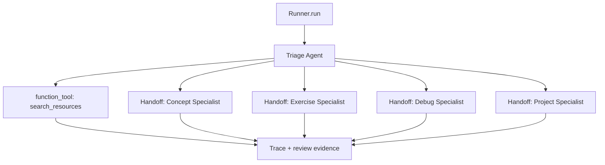
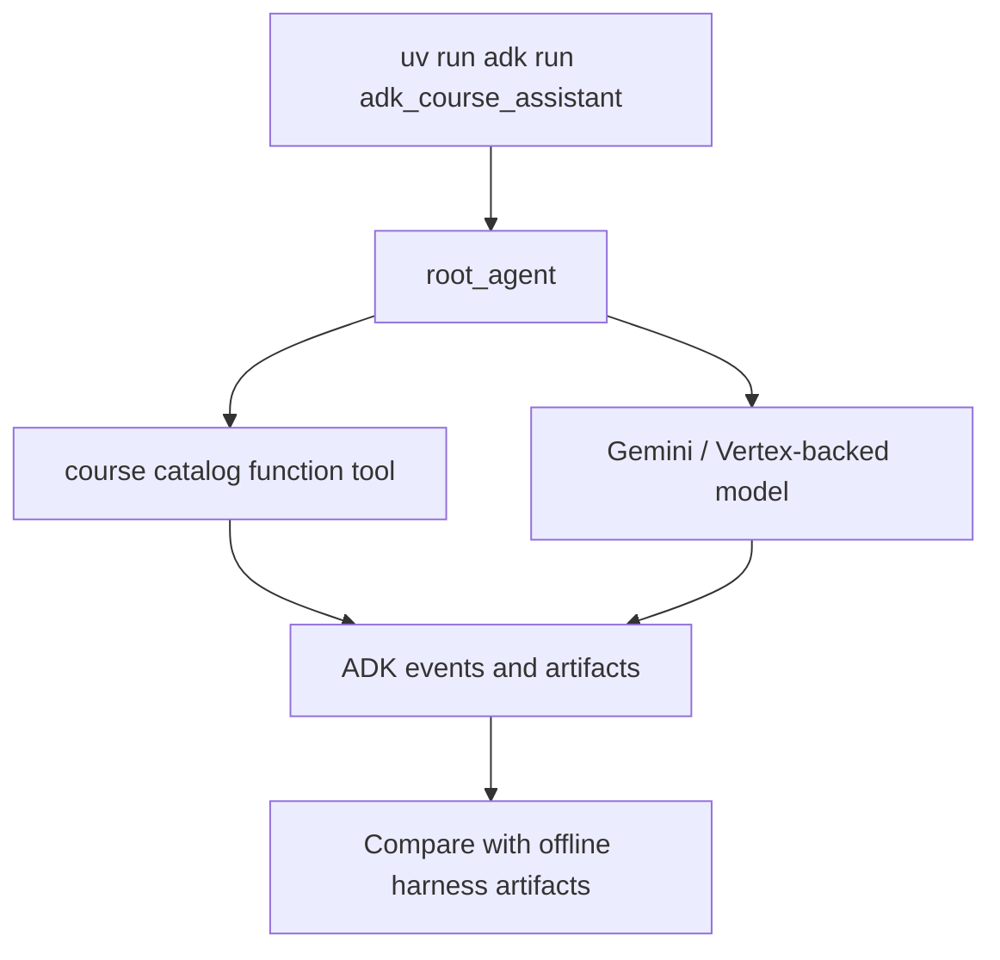

# OpenAI Agents SDK And Google ADK Notes

## Existing Repo Coverage

Before this showcase, the repository had an `autoresearch` project about autonomous research loops,
but it did not have a direct OpenAI Agents SDK or Google ADK example. This project adds small
reference modules for both frameworks.

## OpenAI Agents SDK Shape

Use the OpenAI Agents SDK when the lesson is about Python-first orchestration:

- `Agent` definitions,
- `Runner.run`,
- function tools,
- handoffs between specialists,
- agents-as-tools when a manager should stay in control,
- sessions and resumable state for multi-turn or approval flows,
- guardrails and human review for safety,
- tracing and trace grading as the workflow grows.

In this showcase, `openai_agents_example.py` maps the offline course assistant to a triage agent
and a small set of specialist handoffs.

If students want the hosted path to produce the same kind of inspectable artifacts as the offline
build, `scripts/run_openai_showcase.py` writes a separate bundle root at `artifacts/live_openai/`
and reuses the offline teaching contract inside that namespace. The local teaching adapter still
handles intent selection and catalog grounding before the hosted specialist call, and the trace
says that clearly.

What it does **not** do:

- no RL or DRL training loop,
- no learned intervention policy,
- no MARL setup,
- no claim that `Runner.run(...)` alone makes the assistant a learning agent.

The hosted artifact bundle also avoids a common overclaim:

- it writes a comparable student-facing `agent_trace.json`,
- it does **not** claim that this local JSON file is the raw OpenAI tracing backend.

Use this project to learn the runtime shape. Use
`projects/adaptive-course-assistant-rl-showcase` to learn where a policy learner could attach.



Install the optional OpenAI Agents SDK extra when you are ready to run it:

```bash
cd projects/agentic-course-assistant-showcase
make sync-openai
```

## Google ADK Shape

Use Google ADK when the lesson is about an agent project that runs through ADK tooling:

- a discoverable `root_agent`,
- function tools,
- Gemini or Vertex-backed model configuration,
- local `adk run` or `adk web` development loops,
- sessions, state, memory, artifacts, events, and runner services,
- callbacks and plugins for policy, logging, metrics, and behavior checks,
- evaluation files, custom metrics, traces, and user simulation,
- A2A, MCP, and multi-agent workflows as students advance.

In this showcase, `google_adk_example.py` keeps the first ADK example small: one `root_agent` and
one lookup tool. The `adk_course_assistant/agent.py` wrapper gives ADK the `agent.py` layout it
expects:



```bash
cd projects/agentic-course-assistant-showcase
make sync-adk
uv run adk run adk_course_assistant
```

Use `make sync-live` if you want both `openai-agents` and `google-adk` available in the same environment.

## Good first showcase ideas

- Course assistant: route questions to concept, exercise, debug, or project-planning specialists.
- Research digest agent: retrieve project docs and produce evidence-grounded summaries.
- Experiment reviewer: inspect model metrics and recommend keep, rerun, or rollback.
- Dataset triage helper: classify data-quality issues and suggest EDA checks.
- API support assistant: answer local API contract questions from OpenAPI and README artifacts.

The course assistant is a strong first build because it is immediately useful, small enough to
test, and safe to run without private data.

## Concept Coverage Matrix

| Concept | OpenAI Agents SDK lens | Google ADK lens | Showcase artifact |
|---|---|---|---|
| Tool calls / function tools | `function_tool`, hosted tools, MCP, agents-as-tools | Function tools, `AgentTool`, MCP tools | `resource_matches.csv` |
| Guardrails | Input/output/tool guardrails and human review | Callbacks, plugins, safety controls, confirmations | `agent_trace.json` |
| Tracing | Built-in traces and custom spans | Distributed traces for LLM/tool/API paths | `agent_trace.json` |
| Agentic workflows | Agent loop with tools, handoffs, approvals, state | Workflow agents: sequential, parallel, loop | `course_assistant_response.md` |
| Evals | Trace grading, graders, datasets, eval runs | Eval sets, CLI/web evals, custom metrics | `agent_judge_rubric.json` |
| Agent as judge | Trace/eval grader over route, tool, policy, output | Custom metric or evaluator agent | `agent_judge_rubric.json` |
| Multi-agent orchestration | Handoffs or agents-as-tools | Hierarchies, routing, workflow agents | `agent_trace.json` |
| Handoff / triage | Triage handoff transfers answer ownership | Routing among sub-agents or workflow branches | `agent_trace.json` |
| A2A | Adapter/protocol boundary around remote agents | A2A exposing and consuming guides | `student_learning_path.md` |
| Sessions | SDK sessions or conversation continuation strategies | `Session`, `State`, `Events` | `agent_trace.json` |
| Memory | App-owned durable memory strategy | `MemoryService` and searchable long-term knowledge | `student_learning_path.md` |
| Skills | Reusable prompts, agents, tools, or MCP-backed packs | ADK Skills via `SkillToolset` | `refined_questions.md` |
| Harness | Local tests plus traces/evals | Local tests plus ADK evals/traces | run ledger and manifest |

For the full list, run `make smoke` and inspect:

```bash
open artifacts/concepts/agentic_concepts.csv
open artifacts/concepts/openai_vs_adk_concepts.json
open artifacts/evals/agent_judge_rubric.json
```
