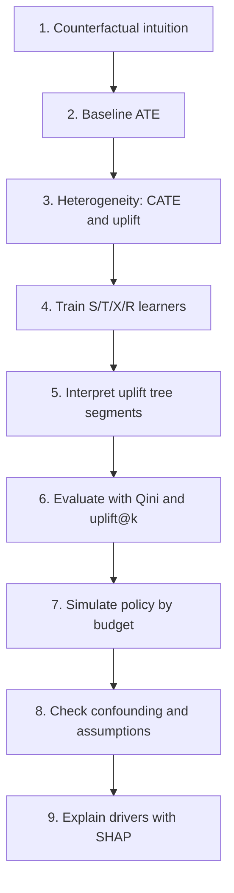
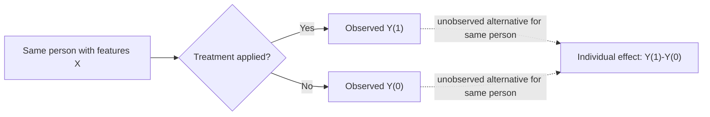
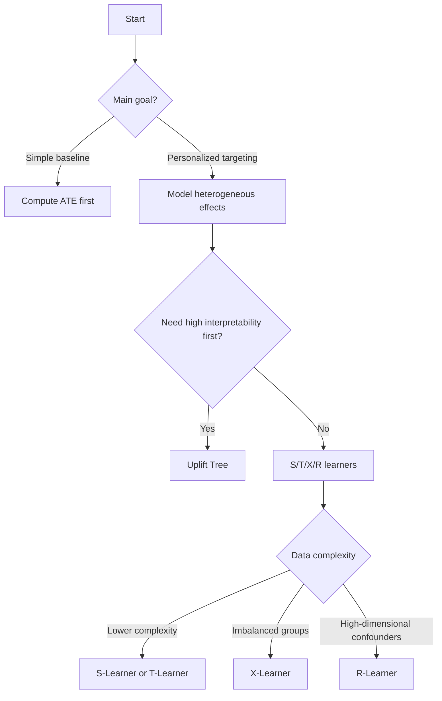
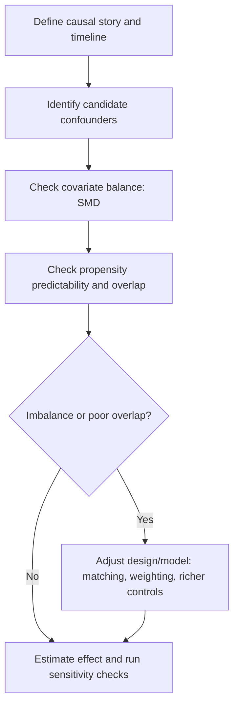

# Causal Inference Learning Project (CausalML + uv + Kaggle)

Learn causal inference by building and analyzing an uplift modeling pipeline end-to-end.

This project uses:
- **CausalML** for treatment-effect and uplift algorithms.
- **uv** for reproducible environments and commands.
- **Kaggle Marketing A/B data** (`faviovaz/marketing-ab-testing`) as a practical starting point.

## What you should learn
By the end of this project, you should be able to:
- Explain **counterfactual thinking** in plain language.
- Distinguish **ATE**, **CATE**, and individual uplift.
- Understand **what-if analysis** and how it maps to treatment decisions.
- Train and compare **S/T/X/R learners** and **uplift trees**.
- Interpret results with **Qini curves**, **uplift@k**, and **policy simulation**.
- Explain model behavior with **SHAP**.
- Check when a causal claim is likely weak due to **confounding or poor overlap**.

## How to learn this project intuitively by yourself
Use this cycle for every section and notebook:
1. **Predict first**: before running code, write down what you expect.
2. **Run the code**: execute one small block at a time.
3. **Explain in plain language**: summarize the result in one sentence.
4. **Stress-test the idea**: change one assumption (budget, model, subgroup, feature).
5. **Decide**: answer, "What action would I take based on this output?"

If you can explain each output as a decision, you are learning causal inference correctly.

## Learning flow


## Quick start
### 1) Install dependencies
```bash
make sync
```

### 2) Configure Kaggle API (one-time)
- Place your token at `~/.kaggle/kaggle.json`
- Secure file permissions:
```bash
chmod 600 ~/.kaggle/kaggle.json
```

### 3) Download data
```bash
make download
```

### 4) Run core pipeline
```bash
make pipeline
```

### 5) Run policy simulation
```bash
make policy
```

### 6) Run confounding checks
```bash
make confounding
```

### 7) Run quality checks (`ruff` + `ty` + `pytest`)
```bash
make check
```

### 8) Verify artifact completeness
```bash
make verify
```

## Makefile commands
Use these shortcuts for all common actions:

| Target | What it runs |
|---|---|
| `make sync` | `uv sync --extra dev` |
| `make download` | download Kaggle dataset |
| `make pipeline` | run core causal modeling pipeline |
| `make policy` | run budget policy simulation |
| `make confounding` | run confounding diagnostics |
| `make verify` | validate required artifacts |
| `make verify-strict` | validate artifacts + notebook outputs |
| `make ruff` | `uv run ruff check .` |
| `make ty` | `uv run mypy src scripts` |
| `make pytest` | `uv run pytest` |
| `make check` | run `ruff`, `ty`, and `pytest` |
| `make all` | run `sync` then `check` |

## Notebook learning path
Work through these in order:
1. `notebooks/01_counterfactuals_and_ate.ipynb`
2. `notebooks/02_meta_learners_s_t_x_r.ipynb`
3. `notebooks/03_uplift_tree_interpretability.ipynb`
4. `notebooks/04_qini_and_targeting_policy.ipynb`
5. `notebooks/05_capstone_policy_simulation.ipynb`
6. `notebooks/06_confounding_conditions.ipynb`
7. `notebooks/07_shap_interpretability.ipynb`

## Worksheet support
Use the worksheet while progressing through notebooks:
- `docs/student-worksheet.md`

The worksheet helps you:
- predict outcomes before running code,
- capture key metrics and decisions,
- transfer each concept to another domain.

## Intuitive concept guide with domain examples

### Counterfactual
A counterfactual asks: "What would have happened to this same person/unit under a different action?"
- Marketing: If this customer had not seen the ad, would they still convert?
- Healthcare: If this patient had received Drug B instead of Drug A, would recovery change?
- Education: If this student had received tutoring, would their score increase?

### What-if analysis
What-if analysis tests possible decisions before acting.
- Marketing: What if we only target the top 20% predicted uplift users?
- Operations: What if we prioritize stores with highest expected stockout reduction?
- Product: What if we show feature onboarding only to users with positive expected lift?

### ATE (Average Treatment Effect)
ATE is the average effect across everyone.
- Marketing: average conversion lift from campaign exposure.
- Healthcare: average blood pressure reduction from a treatment.
- HR: average retention lift from mentorship program.

### CATE (Conditional Average Treatment Effect)
CATE is the average effect for a subgroup.
- Marketing: uplift for new users vs returning users.
- Healthcare: treatment effect for older patients vs younger patients.
- Lending: effect of reminder messages for different credit-risk bands.

### Uplift modeling
Uplift modeling predicts incremental change caused by treatment, not just outcome probability.
- Marketing: who buys *because* of the email, not who buys anyway.
- Healthcare: who improves *because* of intervention, not who recovers naturally.
- Product: who activates *because* of a walkthrough, not high-intent users who activate regardless.

### Interpretability of results
Interpretability answers: "Why did the model recommend this action?"
- Segment view: uplift trees show split-based segments.
- Feature view: SHAP ranks features that increase/decrease uplift predictions.
- Policy view: budget simulation shows expected incremental conversions per model.

### Conditions (assumptions)
You need key conditions before trusting causal effects:
- **Consistency**: treatment meaning is stable.
- **Exchangeability**: no unmeasured confounders after conditioning on observed features.
- **Positivity**: each user type has both treatment and control possibility.
- **No interference**: one unit's treatment does not directly alter another unit's outcome.
- **Temporal order**: causes are measured before outcomes.

### Visualization
Visualizations should answer decisions, not only show pretty charts:
- Qini curve: which model ranks users better for targeting?
- Uplift histogram: where are high-impact segments?
- Budget-value curve: which policy wins at each budget?
- Propensity overlap: do treated/control groups have comparable support?

### SHAP (sometimes written incorrectly as "SHAPE")
SHAP values show feature contributions to predictions.
- Marketing: which behavior patterns drive predicted uplift?
- Healthcare: which clinical indicators drive treatment-response prediction?
- Operations: which store/time features drive replenishment policy lift?

## Potential outcomes intuition


## Different algorithms and when to pick which one


Quick selection guide:
- **S-Learner**: fast baseline, one model, good first comparison.
- **T-Learner**: intuitive split between treated/control models.
- **X-Learner**: strong when treatment groups are imbalanced.
- **R-Learner**: useful with complex nuisance structure and confounders.
- **Uplift Tree**: best when transparent segment rules are a priority.

## How to decide if confounding might exist
Use this workflow:


Practical checks in this project:
- `artifacts/covariate_balance.csv`: standardized mean differences by feature.
- `artifacts/figures/propensity_overlap.png`: overlap between treatment/control propensity distributions.
- `artifacts/confounding_summary.txt`: compact summary (`AUC`, overlap share, imbalance count).

## How diagram correctness is ensured
To keep diagrams reliable and readable, this project follows these rules:
1. One diagram, one idea (no overloaded charts).
2. Standard Mermaid flowchart syntax only (simple nodes, simple edges).
3. Direction is consistent with the explanation (`TD` or `LR` as needed).
4. Diagram labels use plain text and avoid syntax-breaking characters.
5. Every diagram is paired with a textual interpretation immediately below/near it.

## Visualization checklist (what each plot should answer)
- `qini_curves.png`: Which model gives the best ranking of incremental impact?
- `best_model_uplift_distribution.png`: Are there clear high-uplift segments?
- `policy_incremental_conversions.png`: Which model wins at each budget?
- `propensity_overlap.png`: Are groups comparable enough for credible effect estimation?
- `notebook_shap_summary.png`: Which features drive uplift predictions most?

## What else should you learn next?
After finishing this project, add these concepts:
- **Sensitivity analysis** for hidden confounding.
- **Policy risk bounds** (optimistic vs conservative targeting).
- **Treatment effect calibration** and uncertainty-aware decisions.
- **Interference/network effects** (spillover between users).
- **Uplift in multi-treatment settings** (more than one possible action).
- **Fairness in treatment policies** across protected groups.

## Scripts and outputs
### `scripts/run_pipeline.py`
- Trains S/T/X/R + uplift tree.
- Produces:
  - `artifacts/metrics_summary.csv`
  - `artifacts/uplift_tree.txt`
  - `artifacts/figures/qini_curves.png`
  - `artifacts/figures/best_model_uplift_distribution.png`

### `scripts/policy_simulator.py`
- Simulates budget-based targeting outcomes.
- Produces:
  - `artifacts/policy_simulation.csv`
  - `artifacts/policy_best_models.csv`
  - `artifacts/figures/policy_incremental_conversions.png`

### `scripts/confounding_checks.py`
- Runs balance + propensity diagnostics.
- Produces:
  - `artifacts/covariate_balance.csv`
  - `artifacts/propensity_scores.csv`
  - `artifacts/confounding_summary.txt`
  - `artifacts/figures/propensity_overlap.png`

### `scripts/verify_learning_artifacts.py`
- Checks that required outputs exist and have the expected schema.
- Optionally checks notebook-generated figures:
  - `make verify-strict`
- Returns non-zero exit code when required artifacts are missing.

## Project structure
```text
causalml-kaggle-showcase/
├── Makefile
├── README.md
├── pyproject.toml
├── docs/
│   ├── algorithm-cards.md
│   ├── learning-guide.md
│   └── student-worksheet.md
├── scripts/
│   ├── confounding_checks.py
│   ├── download_kaggle_dataset.py
│   ├── policy_simulator.py
│   ├── run_pipeline.py
│   └── verify_learning_artifacts.py
├── notebooks/
│   ├── 01_counterfactuals_and_ate.ipynb
│   ├── 02_meta_learners_s_t_x_r.ipynb
│   ├── 03_uplift_tree_interpretability.ipynb
│   ├── 04_qini_and_targeting_policy.ipynb
│   ├── 05_capstone_policy_simulation.ipynb
│   ├── 06_confounding_conditions.ipynb
│   └── 07_shap_interpretability.ipynb
├── src/causal_showcase/
│   ├── data.py
│   ├── diagnostics.py
│   ├── evaluation.py
│   ├── modeling.py
│   ├── plots.py
│   ├── policy.py
│   └── verification.py
├── tests/
└── artifacts/
```

## Contributing
See `../../CONTRIBUTING.md` for setup, quality gates, and pull request expectations.

## License
This project is licensed under the MIT License. See `../../LICENSE`.
