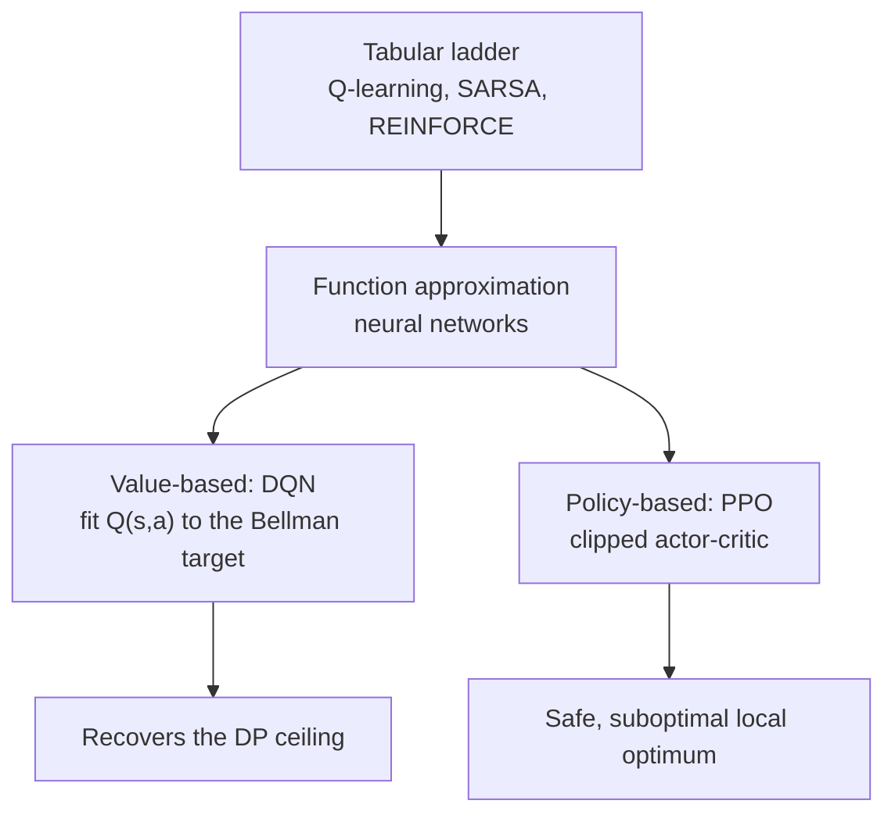

# Deep RL: Function Approximation (DQN and PPO)

The tabular ladder ([the RL ladder](rl-ladder.md)) keys a table on the discrete state. That works
here because the agent-decision MDP is tiny — a few hundred reachable states — but real agents face
state spaces far too large to enumerate. The fix is **function approximation**: replace the lookup
table with a neural network that maps state *features* to values or action probabilities. This is
the deep-RL rung, and it is an **optional** lane: it is implemented from scratch in NumPy (no torch)
so the showcase stays self-contained and laptop-friendly, and it is generated on demand with
`make run-drl` rather than as part of the core `make smoke` path.

This lane is also the showcase's clearest worked example of *validating a method against ground
truth*: because dynamic programming gives the exact optimum `Q*` for this MDP, we can check whether
a deep learner actually recovers the known ceiling before trusting the same machinery on a problem
where the answer is unknown.



## Feature encoding

Both methods consume the state as a feature vector rather than a table key. The environment ships
`AgentState.as_normalized_vector`, which scales each of the seven state fields to `[0, 1]` so no
coordinate dominates the gradient. The code lives in `src/learning_agents/deep_rl.py`
(`state_features`), and the shared network is a one-hidden-layer perceptron (`MLP`) with manual
forward/backward passes and gradient-norm clipping.

## DQN: value-based deep RL

DQN is the neural descendant of tabular Q-learning. Instead of a table `Q(s, a)`, a network
`Q_theta(s, a)` is trained to satisfy the same Bellman optimality target, with two standard
stabilizers: an **experience-replay** buffer (so updates reuse past transitions and decorrelate
them) and a periodically-synced **target network** `Q_bar` (so the regression target does not chase
its own tail).

```text
y       = r + gamma * (1 - done) * max_a' Q_bar(s', a')   (Bellman target)
loss    = ( Q_theta(s, a) - y )^2                          (fit only the taken action a)
update  = one SGD step on loss, computed over a replay minibatch
```

where `gamma` is the discount (0.9 here), `r` the reward, `s'` the next state, and `done` flags a
terminal transition. The trained network induces a greedy policy `pi(s) = argmax_a Q_theta(s, a)`,
wrapped via `build_model_policy` so it is scored by the same harness as every other policy.

## PPO: policy-gradient / actor-critic deep RL

PPO is the neural, variance-reduced descendant of REINFORCE. It optimizes a policy network
`pi_theta(a|s) = softmax(...)` directly, using a learned value network (the **critic**) as a
baseline. Its signature move is the **clipped surrogate** objective, which keeps each update close to
the behaviour policy so a single step cannot wreck the policy:

```text
rho     = pi_new(a|s) / pi_old(a|s)            (probability ratio)
A       = G - V(s)        (advantage: return minus the critic baseline, then normalized)
L       = mean( min( rho * A , clip(rho, 1 - eps, 1 + eps) * A ) ) + c_ent * H(pi)
```

where `G` is the discounted return-to-go, `V(s)` the critic's value estimate, `eps` the clip range,
`H(pi)` the policy entropy, and `c_ent` a small entropy bonus that keeps exploration alive. The
critic is regressed toward `G` with a mean-squared-error loss. See
[the math notes](math-notes.md) for the full set of update rules.

## What the comparison shows

Running `make run-drl` trains all three learners and writes
`artifacts/drl_optional/rl_family_comparison.csv` (graded by the shared offline harness), plus
per-scenario rollups, a training summary, and two notes. The measured head-to-head:

| policy | family | avg_reward | avg_escalation_rate | solved_rate |
| --- | --- | --- | --- | --- |
| `dqn` | value_based_deep | 1.18 | 0.33 | 1.0 |
| `q_learning` | tabular_value_based | 0.84 | 0.67 | 1.0 |
| `ppo` | actor_critic_policy_gradient | 0.69 | 0.73 | 0.9 |

Training budgets (seed 0, deterministic): DQN 1500 episodes, PPO 150 iterations of 30 episodes
each, and the tabular `q_learning` baseline 5000 episodes. PPO's result is **not** an under-training
artifact — it stays at `0.6933` whether trained for 150, 300, or 450 iterations, so the gap is the
algorithm settling into a local optimum, not a lack of compute.

Two honest lessons come out of this:

- **DQN recovers the dynamic-programming ceiling.** Its `1.18` is essentially the optimum: the
  `dp_optimal` policy scores `1.2142` in `artifacts/eval/policy_comparison.csv` (and about `1.19`
  under this lane's six-seed evaluation). Value-function approximation generalizes across similar
  states and reaches the known-optimal return — the method is validated against ground truth.
- **PPO converges to a safe, suboptimal local optimum.** With a modestly-positive escalation action
  always available, the policy-gradient method settles into a low-variance policy that
  over-escalates (escalation rate `0.73`) and leaves reward on the table. This is a real, well-known
  pitfall: on small discrete action spaces value bootstrapping is often more sample-efficient and
  reliable, while policy-gradient methods like PPO earn their keep on large or continuous action
  spaces.

A caution on reading the table: this is **not** a claim that "deep beats tabular." The `q_learning`
row is the core ladder's value-based learner (it over-escalates for the same reasons described in
[the RL ladder](rl-ladder.md)), included here for continuity. The takeaway is about *families* —
value-based vs policy-gradient — and about deep value approximation matching a known optimum, not
about neural networks being intrinsically better than a table on a problem small enough to tabulate.

## How to run

```bash
make run-drl    # trains DQN, PPO, and a tabular Q-learning baseline; writes artifacts/drl_optional/
make verify     # validates the optional group (all-or-nothing) when present
```

The lane is optional by design: the core contract in `src/learning_agents/reporting.py`
(`OPTIONAL_DRL_ARTIFACTS`) treats the five `artifacts/drl_optional/` files as a group that is either
absent or complete, so `make smoke` / `make verify` never *require* it, but it is fully validated
whenever it has been generated. No extra dependency is needed — the networks are pure NumPy.

## See also

- [The RL ladder](rl-ladder.md) — the tabular methods DQN and PPO generalize.
- [Offline RL and off-policy evaluation](offline-rl-and-ope.md) — another way to scale value learning.
- [Mathematical notes](math-notes.md) — the consolidated update rules.
- [Where learning lives](locus-of-learning.md) — how this rung fits the orchestration-policy locus.
