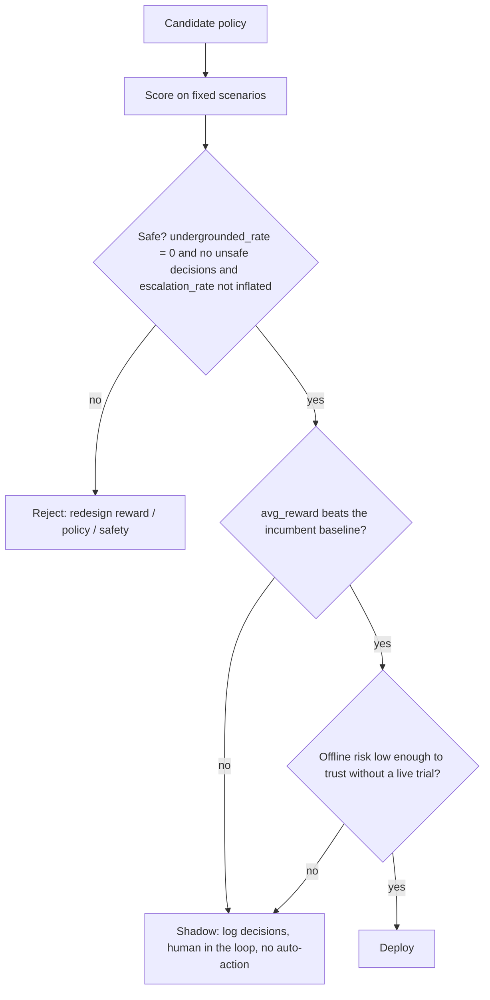

# Evaluation and Governance: Deploy, Shadow, or Reject

A learned policy is not a product. Before it touches a real user, it has to clear a
gate. This page is about that gate: the offline metrics we compute, the table we
read them off, and the three-way decision -- **deploy**, **shadow**, or **reject** --
that they feed. The running example is the agent-orchestration controller from this
showcase, which on each user request decides whether to `answer_direct`, `retrieve`
more evidence, `clarify` an ambiguous ask, or `escalate` to a human.

The headline result is uncomfortable on purpose: the online-trained `q_learning`
policy solves every scenario yet is **rejected**, while the hand-written
`heuristic_router` stays the incumbent and an offline-trained policy is the only
candidate worth shadowing. Reward alone would have told the opposite story. That gap
is the lesson.

## Why one number is not enough

The tempting summary of a policy is its average return. Each rollout estimates the
finite-horizon (undiscounted) return

```text
G_t = sum_{k>=0} r_{t+k+1}
```

where `r` is the per-step reward and the sum runs to the horizon `H` (here `H = 5`
steps). Averaging `G_t` over scenarios and seeds is Monte Carlo policy evaluation: the
empirical mean approximates the policy's value under the scenario distribution. For a
metric `m` measured over a policy's `N` episodes the report is

```text
m_hat = (1/N) * sum_{i=1..N} m_i
```

the unbiased estimate of `E[m]`.

The problem is that `G_t` hides bad behavior. A policy can rack up high reward while
hallucinating (answering before it is grounded), needlessly handing trivial requests
to a human, or burning budget on pointless retrieval. So `src/learning_agents/evaluation.py`
reports a **vector** of metrics next to the scalar return, and governance reads all of
them at once.

One honesty note that governs how much these numbers are worth.
`src/learning_agents/evaluation.py` does **not** perform true off-policy evaluation. It
has white-box access to the simulator and *re-simulates* each policy inside the known
model. That is reproducible and exact within the model, but it inherits the simulator's
biases: a policy that looks good here is only guaranteed good *in this model*. Treat the
table as a comparison harness, not a deployment certificate. Estimating a policy's value
from a *fixed log collected by another policy* -- the harder, real problem -- is the
subject of [offline RL and OPE](offline-rl-and-ope.md).

## The governance metric vector

Every metric below comes from the summary table in
`artifacts/eval/policy_comparison.csv`, produced by the `evaluate_policies` function in
`src/learning_agents/evaluation.py`.

- **`avg_reward`** -- mean finite-horizon return `G_t` per episode. The headline
  objective, and the leaderboard sort key. High is good, but high alone is not
  sufficient.
- **`escalation_rate`** -- fraction of episodes that ended by handing off to a human.
  Escalation is terminal, so the per-episode count is 0 or 1 and its mean is a rate.
  Escalating a genuinely hard or ambiguous request is correct; escalating an easy,
  unambiguous one is a needless, expensive cop-out.
- **`undergrounded_rate`** -- of the episodes that committed a *direct answer*, the
  fraction whose evidence was inadequate for the request's difficulty. This is the
  hallucination-risk gate. A policy that never answers has no answers to be
  under-grounded, so its rate is 0 by convention.
- **`unsafe_or_questionable_decisions`** -- mean count per episode of two failure
  modes: answering while under-grounded, or escalating an easy and unambiguous request.
  This is the explicit safety counter.
- **`solved_rate`** -- fraction of episodes that reached a genuinely good outcome,
  defined *independently* of reward. An episode is solved only if it ended in a
  well-grounded direct answer (adequate evidence for the difficulty **and** ambiguity
  fully resolved) or a truly-warranted escalation (difficulty `>= 2` or ambiguity
  present). Answering while under-grounded, or escalating a trivial ask, does not count.
  Reporting `solved_rate` separately from `avg_reward` is what keeps reward hacking
  legible: a policy can game the proxy and still be visibly unsolved.
- **`avg_steps`** -- mean number of actions before the episode terminated. A latency and
  effort proxy.
- **`avg_action_cost`** -- mean summed per-action resource cost (retrieval, clarification,
  and escalation each cost something). A budget proxy, and the hook into the
  [cost-aware cascade](cost-aware-cascade.md).

The point of carrying `solved_rate`, `escalation_rate`, and `undergrounded_rate`
*alongside* `avg_reward` is that no single one of them can be trusted in isolation.
Governance is a multi-objective decision, not a leaderboard.

## The policy comparison table

All five policies, scored on the same fixed scenario bank, sorted by `avg_reward`
descending. Every number is read directly from `artifacts/eval/policy_comparison.csv`.

| policy | avg_reward | escalation_rate | undergrounded_rate | unsafe_decisions | solved_rate | avg_steps | avg_action_cost |
| --- | --- | --- | --- | --- | --- | --- | --- |
| `dp_optimal` | 1.2142 | 0.2833 | 0.0 | 0.0 | 1.0 | 2.05 | 0.8467 |
| `offline_fqi` | 1.2067 | 0.30 | 0.0 | 0.0 | 1.0 | 2.0 | 0.8533 |
| `heuristic_router` | 1.16 | 0.0 | 0.0 | 0.0 | 1.0 | 3.0667 | 0.84 |
| `q_learning` | 0.8525 | 0.65 | 0.0 | 0.0 | 1.0 | 1.2167 | 1.07 |
| `random` | -1.1817 | 1.0 | 0.0 | 0.4667 | 0.5333 | 3.0 | 2.3 |

Read it row by row.

- **`dp_optimal` (reward 1.2142)** is the **planning ceiling**, not a deployable policy.
  It is the exact optimal action-value function `Q*` computed by backward induction in
  `src/learning_agents/dynamic_programming.py`. It assumes a known model, so it cannot be
  shipped against real users -- but it tells us the best score any learner could hope to
  approach. See [the RL ladder](rl-ladder.md) for why planning sits above learning here.
- **`offline_fqi` (reward 1.2067)** is the strongest *learned* candidate. It is offline
  Fitted-Q Iteration trained only on a log of the heuristic's behavior, and it lands
  within `1.2142 - 1.2067 = 0.0075` of the ceiling -- it nearly matches `Q*` without ever
  seeing the model. Its escalation rate (0.30) is close to the optimal 0.2833, and it
  never under-grounds or makes an unsafe decision.
- **`heuristic_router` (reward 1.16)** is the **safe incumbent**: a strong hand-written
  baseline that never escalates (rate 0.0), never under-grounds, and solves every
  scenario. It pays for that safety with the most steps (3.0667), because it grounds
  thoroughly before answering. This is the bar every learned policy must beat to earn a
  promotion.
- **`q_learning` (reward 0.8525)** is online tabular Q-learning trained for 400 episodes.
  It *also* posts `solved_rate` 1.0 -- and it is still **rejected**. Its escalation rate
  is 0.65: it has learned to dump the majority of requests on a human, including easy
  ones, because a guaranteed-mediocre hand-off beats the risk of a wrong answer under a
  half-trained value function. Its reward (0.8525) is well below the incumbent's 1.16. A
  reward-only view would already flag it; the escalation column shows *why* it is unsafe.
- **`random` (reward -1.1817)** is the **floor**. It escalates every time (rate 1.0),
  makes unsafe-or-questionable decisions at rate 0.4667, and solves barely half the
  scenarios (0.5333). It exists to anchor the bottom of the scale.

A subtle point about `solved_rate`. Four of five policies score 1.0 on it, yet they are
nowhere near equivalent. `q_learning` reaches `solved_rate` 1.0 *by escalating* -- and
under the `_is_solved` rule, escalating a hard-or-ambiguous request counts as solved.
So `solved_rate` alone would rank a chronic over-escalator as perfect. Only by reading
`escalation_rate` and `avg_reward` next to it does the over-escalation become visible.
This is exactly why the metric is a vector.

## The deploy / shadow / reject decision

The governance verdict has three outcomes, summarized from
`artifacts/business/deploy_shadow_reject_memo.md`:

- **deploy** -- let the policy act on real users automatically. Rare in this teaching
  repo, and appropriate only when offline risk is low *and* the policy clears the
  baseline.
- **shadow** -- run the policy in parallel with the incumbent, log what it *would* have
  done, keep a human in the loop, and take no automated action. This is how you gather
  the real-world evidence the simulator cannot give you.
- **reject** -- send it back. Redesign the reward, the policy, or the safety controls
  before going further.

The decision is the conjunction of a safety test and a value test:



Note that the safety gate is checked **before** the value gate. A policy that is unsafe
is rejected no matter how high its reward -- you cannot buy back a hallucination with a
better average score. Only a safe policy is allowed to compete on value, and only a
safe, baseline-beating, low-offline-risk policy is deployed.

### Applying the gate to our five policies

- **`random` -> reject.** It fails the safety gate outright: unsafe-or-questionable
  decisions at rate 0.4667 and a `solved_rate` of only 0.5333. It never reaches the value
  test.
- **`q_learning` -> reject.** This is the instructive one. It passes the narrow
  `undergrounded_rate = 0` check, but it fails on inflated escalation (0.65) -- it has
  learned to escalate rather than answer -- and it fails the value test anyway, because
  `0.8525 < 1.16`. The memo's stated reason, *"the learned policy still over-escalates or
  returns too many under-grounded answers,"* is precisely this case. High `solved_rate`
  does not rescue it.
- **`heuristic_router` -> the incumbent baseline.** It is safe (no under-grounding, no
  unsafe decisions, no needless escalation) and it solves every scenario. It is not a
  *learned* candidate; it is the bar. It is the policy already running, and it is the
  reward (1.16) every learner must beat.
- **`offline_fqi` -> shadow.** It is safe (under-grounded 0.0, unsafe 0.0), and it beats
  the incumbent on reward (`1.2067 > 1.16`). That clears the first two gates. But it was
  trained on a finite offline log, so its real-world risk is not yet established -- the
  exact situation the simulator cannot certify. The correct next step is to **shadow** it:
  run it alongside `heuristic_router`, log its decisions, keep humans in the loop, and
  promote it only once live evidence confirms the simulator's verdict.
- **`dp_optimal` -> not deployable.** It needs the true model and so cannot face real
  users at all. It stays the ceiling that tells us `offline_fqi` is nearly as good as
  anything could be.

The end-state of the gate on this run: nothing is auto-deployed, the heuristic remains
in production, `offline_fqi` advances to shadow, and `q_learning` and `random` are
rejected.

## Why the rejected policy looks good and the strong one stays out

It is worth dwelling on the inversion, because it is the whole reason governance is a
separate discipline.

`q_learning` has the *highest* `solved_rate` tier (1.0) and the *lowest* `avg_steps`
(1.2167) -- it is fast and it "solves" everything. If you ranked policies by either of
those columns it would look excellent. But speed here is a symptom: it terminates in
barely more than one step because it escalates immediately. The escalation column
(0.65) and the reward column (0.8525, below baseline) reveal that the speed is bought by
dumping work on humans. The vector catches what any single column would miss. For more
on how a misspecified objective produces exactly this kind of "good-looking but wrong"
policy, see [reward design and hacking](reward-design-and-hacking.md).

Meanwhile `offline_fqi`, the genuinely strong learned policy, is held *out* of
deployment despite beating the baseline. Not because it is suspect on the metrics -- it
is clean -- but because offline training on a finite log carries model risk that
simulator scores cannot retire. The honest move is to shadow it, not to ship it. "Beats
the baseline in simulation" earns a trial, not a launch.

## See also

- [The RL ladder](rl-ladder.md) -- where planning, online learning, and offline learning
  sit relative to each other, and why `dp_optimal` is a ceiling rather than a product.
- [Offline RL and OPE](offline-rl-and-ope.md) -- how `offline_fqi` is trained and how to
  estimate a target policy's value from a fixed log instead of re-simulating it.
- [Reward design and hacking](reward-design-and-hacking.md) -- why a high-reward policy
  can still be unsafe, and how the metric vector exposes it.
- [The cost-aware cascade](cost-aware-cascade.md) -- the budget and effort tradeoffs
  behind `avg_action_cost` and `avg_steps`.
