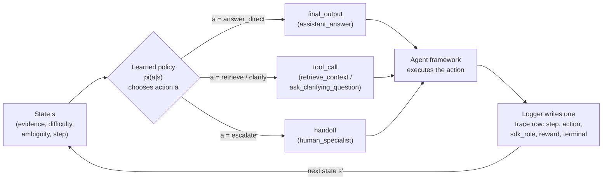

# Lane A: The Agent Framework as Environment (OpenAI Agents SDK)

This page is the first of three "locus of learning" lanes. Each lane fixes a different answer to one question: *when we say an agent "learns", which component actually changes?* Lane A's answer is the most surprising to newcomers, because it puts the learning somewhere most people would not look.

## Thesis: RL learns the orchestration policy, not the framework

An LLM-powered agent has several places where learning *could* live:

- the **orchestration policy** — which tool to call, when to ask a clarifying question, when to hand off to a human;
- the **LLM weights** — the parameters of the underlying language model;
- the **multi-agent coordination** — how several agents divide and combine work.

Lane A isolates the first one. Here, reinforcement learning learns the **orchestration policy** `pi(a|s)`: a mapping from the agent's current state `s` to a probability distribution over routing actions `a`. An agent framework — the OpenAI Agents SDK in this showcase — is the **environment, executor, and logger** that runs those decisions. It is emphatically *not* the trainer.

The split is worth stating bluntly, because the framework's marketing rarely does:

```text
learned policy pi(a|s)   decides which action to take
agent framework (SDK)    executes that action and records the trace
RL training loop         improves pi(a|s) from the recorded rewards
```

The framework decides nothing about *how* to route. Given a state it does not choose the tool; it only runs whatever tool, handoff, or final output the policy selected, and writes down what happened. The deeper point, which this whole lane exists to make concrete: **frameworks execute learned policies; they do not themselves learn.** Swapping the SDK for another runtime would change *how* the action is carried out and logged, not *which* action is right — that is the policy's job, and the policy is what RL trains.

The implementation lives in `src/learning_agents/sdk_bridge.py`. Its module docstring states the same reframing, and the rest of the `learning_agents` package is the RL that produces the policy the bridge runs.

## The action-to-SDK-construct mapping

The bridge between "an RL action" and "a thing an agent framework does" is a small crosswalk. The MDP has four discrete actions (defined in `src/learning_agents/environment.py` as `ACTION_LABELS`), and each maps to exactly one SDK construct. From the `SDK_CONSTRUCT_BY_ACTION` table in `src/learning_agents/sdk_bridge.py`:

| Action `a` | SDK role | SDK target | What the framework does |
| --- | --- | --- | --- |
| `answer_direct` | `final_output` | `assistant_answer` | Emit the final answer; the run completes. |
| `retrieve` | `tool_call` | `retrieve_context` | Call the retrieval function tool to gather grounding. |
| `clarify` | `tool_call` | `ask_clarifying_question` | Call the clarification function tool. |
| `escalate` | `handoff` | `human_specialist` | Hand off to a human-specialist agent. |

Read this table as the *type signature* of the interface. The learned policy emits an integer in `{0, 1, 2, 3}`; the framework interprets that integer as one of three SDK primitives — a **final output** (the agent's answer, which ends the run), a **function-tool call** (retrieve or clarify), or a **handoff** (escalate to a different agent). Two distinct actions, `retrieve` and `clarify`, both surface as tool calls but to *different* tools, which is why the mapping carries a separate `sdk_target` alongside the `sdk_role`.

This is what makes the thesis non-vacuous. "RL learns the policy and the SDK executes it" is just words until you can point at the line where action `3` becomes a real `handoff` to a `human_specialist` agent. The crosswalk is that line.

## How the policy drives the loop

Here is the control flow, with the responsibilities color-separated. The policy is the only learning component; everything to its right is the framework doing as it is told.



Two layers make this real, deliberately separated by *what can run offline*:

1. **The pure-Python demonstration** — `run_bridged_episode` in `src/learning_agents/sdk_bridge.py`. It rolls the learned policy out inside this package's own `AgentDecisionEnvironment` (the stand-in runtime) and, for each decision, annotates the step with the SDK construct that decision *would* drive. The loop is exactly the agent loop you would see from the SDK, except the decisions come from the learned policy rather than from free-running LLM tool-choice. No SDK and no network are required, which is why this is the testable heart of the lane.
2. **The gated live adapter** — `build_agents_sdk_agent` in the same module. It constructs a real `agents.Agent` with function tools for `retrieve`/`clarify` and a `human_specialist` handoff, so the *same* mapping wires straight into the live framework.

The state `s` the policy reasons over is the MDP state from `src/learning_agents/environment.py`: how much evidence has been gathered, the request's difficulty and ambiguity, and the step index. The framework never inspects these to make a choice — it only receives the action and acts.

## The gated optional dependency

A core design constraint of this showcase is that it runs **offline, with no SDK and no network, by default**. The live-SDK path is hidden behind an optional dependency so the core never requires it.

The gate works in two pieces, both in `src/learning_agents/sdk_bridge.py`:

- `sdk_available()` is a cheap, import-free probe. It checks only the module spec (`importlib.util.find_spec("agents")`), so it can report whether the live path is enabled without importing or running anything.
- `build_agents_sdk_agent` raises `OptionalSDKError` when the SDK is absent, instructing the caller to run `uv sync --extra sdk` (which adds the `openai-agents` package). Callers that want the real `agents.Agent` catch this and fall back to the offline `run_bridged_episode`.

So the two paths are:

```text
default:           offline demonstration; no SDK, no network
uv sync --extra sdk + credentials:   live agents.Agent bridge enabled
```

Even with the extra installed, *constructing* the agent needs no network; only *running* it against a model does, and that is intentionally left to the caller. In the environment that generated the artifacts here, the SDK is **not installed**, so the offline demonstration is what produced the trace below (see `artifacts/sdk_bridge/bridge_report.md`, "Live SDK status").

This gating is itself the thesis in dependency form: if the framework were the learner, you could not run the showcase without it. Because the framework is only the executor, you can learn and evaluate the entire policy with the SDK absent, then drop the *same* policy into the live runtime when you want it.

## The orchestration trace

`run_bridged_episode` returns one row per decision step, and the runner writes them to `artifacts/sdk_bridge/orchestration_trace.csv`. The columns are `step`, `scenario_name`, `action_label`, `sdk_role`, `sdk_target`, `reward`, and `terminal`. This is exactly the shape an Agents-SDK run would log — the difference is only the *source* of the decisions.

The recorded trace covers five scenarios:

| step | scenario | action | SDK role | reward | terminal |
| --- | --- | --- | --- | --- | --- |
| 0 | `easy_factual` | `answer_direct` | `final_output` | 2.0 | yes |
| 0 | `howto_medium` | `retrieve` | `tool_call` | -0.5 | no |
| 1 | `howto_medium` | `answer_direct` | `final_output` | 2.0 | yes |
| 0 | `ambiguous_query` | `escalate` | `handoff` | 0.45 | yes |
| 0 | `hard_debug` | `escalate` | `handoff` | 0.45 | yes |
| 0 | `needs_escalation` | `escalate` | `handoff` | 0.9 | yes |

Read the trace as a sequence of `(s, a, r)` tuples. The easy factual question is answered in one step for reward `2.0`. The medium how-to takes two steps: a `retrieve` tool call that costs `-0.5` (gathering evidence is not free), followed by an `answer_direct` worth `2.0`. The three harder scenarios all `escalate`, and notice the rewards differ — escalation earns only `0.45` when a cheaper action might have sufficed, but `0.9` on `needs_escalation`, the one scenario where a handoff is genuinely the right call. That reward gradient is precisely the signal RL uses to learn *when* escalation pays off.

## The bridge report

`bridge_report_markdown` renders the narrative artifact at `artifacts/sdk_bridge/bridge_report.md`. It is generated, not hand-written, so it cannot drift from the code: it restates the thesis, prints the action-to-SDK-construct mapping straight from `action_tool_mapping()`, and records the live-SDK status for the current environment (here: not installed, with the `uv sync --extra sdk` instruction to enable it). If you change the crosswalk in `SDK_CONSTRUCT_BY_ACTION`, regenerating the report updates the table automatically.

## Which policy should the framework run?

Lane A defines the *interface*; the rest of the showcase decides *which* policy belongs on the other side of it. That distinction matters, because not every learned policy is fit to drive a live agent. The framework will faithfully execute whatever you hand it — including a bad policy — so the choice is a governance decision, not a framework one.

From `artifacts/eval/policy_comparison.csv` (avg reward / escalation rate / avg steps / solved rate):

| policy | avg reward | escalation rate | avg steps | solved rate |
| --- | --- | --- | --- | --- |
| `dp_optimal` | 1.2142 | 0.2833 | 2.05 | 1.0 |
| `offline_fqi` | 1.2067 | 0.30 | 2.0 | 1.0 |
| `heuristic_router` | 1.16 | 0.0 | 3.0667 | 1.0 |
| `q_learning` | 0.8525 | 0.65 | 1.2167 | 1.0 |
| `random` | -1.1817 | 1.0 | 3.0 | 0.5333 |

The honest tensions here are the lesson:

- `dp_optimal` is the **planning ceiling** — exact `Q*` computed by backward induction in `src/learning_agents/dynamic_programming.py`. It is what perfect knowledge of the MDP buys you.
- `offline_fqi` (offline Fitted-Q learned from the heuristic log) reaches `1.2067`, **nearly matching the ceiling** without ever interacting online.
- `q_learning` — online tabular, trained 400 episodes — scores only `0.8525` and escalates 65% of the time. It **over-escalates**, and is **governance-REJECTED** for exactly that reason. The framework would happily run it; the governance gate is what stops you.
- `random` is the floor at `-1.1817`, escalating on every request.

So the framework is policy-agnostic by design, and that is a feature with a sharp edge: the safety of a live agent is determined entirely upstream, by which policy you certify before wiring it to the executor. See [evaluation and governance](evaluation-and-governance.md) for how that gate is run, and the [RL ladder](rl-ladder.md) for how these policies are produced.

## What this lane is and is not

- It **is** a faithful, testable bridge: the offline `run_bridged_episode` produces the same trace shape a live run would, and `build_agents_sdk_agent` proves the mapping wires into the real `agents.Agent`.
- It is **not** a claim that the SDK learns anything. The SDK is runtime and logging. Every number on this page traces to a policy the RL code learned, evaluated under the same environment the framework would execute.
- It is **not** a benchmark of the OpenAI Agents SDK's performance. The artifacts here are generated offline, with the SDK absent, precisely to show that the policy and its evaluation do not depend on the framework being present.

## See also

- [Locus of learning](locus-of-learning.md) — the three lanes (orchestration policy, LLM weights, coordination) and why this one is Lane A.
- [Showcase architecture](showcase-architecture.md) — how `src/learning_agents/sdk_bridge.py`, the environment, and the artifact contract fit together.
- [Evaluation and governance](evaluation-and-governance.md) — how a policy is certified (or rejected) before a framework runs it.
- [The RL ladder](rl-ladder.md) — how `dp_optimal`, `offline_fqi`, and `q_learning` are produced.
