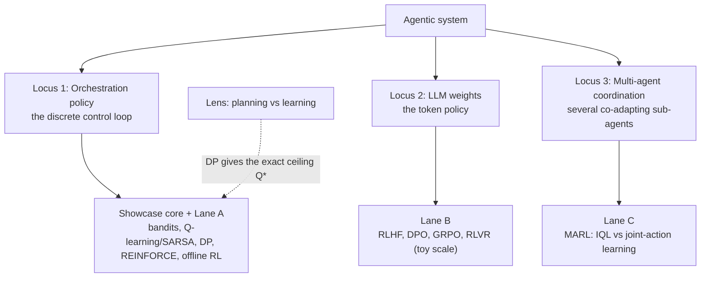

# Where Learning Lives in an Agentic System

When someone says an agent "learns," it is worth pausing to ask the sharper question:
*which part of it changes?* An LLM agent is not one monolithic model. It is a large
language model wrapped in a control loop that decides, at each turn, what to do next:
retrieve evidence, ask a clarifying question, answer directly, hand off to a human, or
stop. Learning can touch the loop, the model, or the way several agents coordinate. These
are three genuinely different places, optimized by different algorithm families, with
different costs and risks. This page defines them precisely and shows exactly where this
showcase demonstrates each one.

The one-sentence thesis: **in practice, most "agent learning" is learning the
orchestration policy, not retraining the model's weights.** This showcase is built around
that locus, and treats the other two as carefully scoped lanes.

## The three loci, at a glance



## Locus 1: the orchestration policy

This is the agent's *control loop expressed as a policy* `pi(a|s)`: given the current
state `s` (the user's intent, ambiguity, evidence gathered so far, attempts made, remaining
budget), choose a discrete action `a` from a small menu — route, pick a tool, clarify,
escalate to a human, or stop. The reward `r` scores the *quality and cost* of those
decisions, not the prose.

- **What is optimized:** the discrete decision policy `pi(a|s)` over a handful of actions.
- **What stays fixed:** the LLM weights. The language model is a frozen component the policy
  calls; it never receives a gradient here.
- **Methods:** the classic RL ladder. Contextual bandits for stateless action choice,
  then full sequential control with Q-learning and SARSA (temporal-difference learning),
  dynamic programming for exact planning, REINFORCE for policy gradients, and offline RL
  (Fitted-Q) plus off-policy evaluation when you can only learn from logs.

The intuition for why this is where learning usually lives: the action space is tiny
(here, four actions), the reward is cheap to define from a rubric, and a wrong decision —
escalating a question the agent could have answered, or burning the budget on needless
retrieval — is expensive and observable. You get most of the leverage from teaching the
agent *when to do what*, and you get it without a GPU.

### Where this showcase demonstrates it

This is the **showcase core**, and it is the part that runs end to end today. The headline
comparison lives in `artifacts/eval/policy_comparison.csv`. Each policy is scored on average
reward, escalation rate, average steps, and solved rate:

| Policy | avg_reward | escalation_rate | avg_steps | solved_rate |
|---|---|---|---|---|
| `dp_optimal` | 1.2142 | 0.2833 | 2.05 | 1.0 |
| `offline_fqi` | 1.2067 | 0.30 | 2.0 | 1.0 |
| `heuristic_router` | 1.16 | 0.0 | 3.0667 | 1.0 |
| `q_learning` | 0.8525 | 0.65 | 1.2167 | 1.0 |
| `random` | -1.1817 | 1.0 | 3.0 | 0.5333 |

Read this table as the spine of the whole project. `random` is the floor (avg_reward
-1.1817, only 0.5333 solved, and it escalates every single time). The
`heuristic_router` is a strong hand-written baseline at 1.16 that *never* escalates but
pays for it in extra steps (3.0667). The interesting tension is between the learned
policies, which the next sections unpack.

There is also a **Lane A** within this locus: the orchestration policy is wired to a real
agent framework. In `src/learning_agents/sdk_bridge.py`, each of the four MDP actions maps
to an OpenAI Agents SDK construct — `answer_direct` becomes the final output,
`retrieve_context` and `ask_clarifying_question` become function-tool calls, and `escalate`
becomes a handoff to a human-specialist agent. The lesson Lane A makes concrete: **RL
learns the policy; the framework is the environment, executor, and logger — not the
trainer.** The SDK carries out the decisions and records the trace; it decides nothing about
how to route.

## Locus 2: the LLM weights

This is the *token policy*. Here `pi(a|s)` is read at a finer grain: given the tokens so
far (`s`), the model places a distribution over the next token (`a`), and learning changes
the model's parameters `theta` so that the sequences it generates are more preferred. This
is the locus that produced instruction-tuned and reasoning models.

- **What is optimized:** the LLM weights `theta` (the token-generation policy).
- **What stays fixed:** the orchestration loop around it. In this locus we are not learning
  *when* to call a tool; we are learning *what tokens to emit*.
- **Methods:** the preference-optimization family. RLHF (fit a reward model from
  preferences, then do KL-penalized policy-gradient against it), DPO (optimize the policy
  directly on preferences, no reward model), GRPO (a critic-free policy gradient whose
  baseline is a sampled group's mean), and RLVR (GRPO driven by a programmatic correctness
  verifier).

The shared mechanism worth internalizing is the **KL leash**. All of these methods pull the
tuned policy toward higher preference *while* penalizing how far it drifts from a fixed
reference policy `pi_ref` (the pretrained model), measured by `KL` (Kullback-Leibler
divergence). The RLHF objective makes this explicit:

```text
maximize over theta:   E_{r ~ pi}[ reward_phi(r) ]  -  beta * KL(pi || pi_ref)
```

Here `reward_phi` is the learned reward model, `beta` is the KL weight (the leash
strength), and `pi_ref` is the reference policy. Crank `beta` down and the model overfits
the reward and collapses; crank it up and it never moves. DPO reaches a provably equivalent
objective without ever fitting `reward_phi`, by optimizing a logistic loss directly on
`(prompt, chosen, rejected)` preference triples.

### Where this showcase demonstrates it

This is **Lane B**, and it is deliberately **toy-scale**: a tabular 4x5 "language model"
(four prompts, five candidate responses) implemented in
`src/learning_agents/preference_optimization.py`. There is no neural net and no GPU; the
point is to make the *mechanisms* — the Bradley-Terry reward loss, the KL-penalized policy
gradient, the DPO logistic loss, the group-relative advantage — visible at a scale you can
run in milliseconds. The comparison is in `artifacts/preference/method_comparison.csv`:

| Method | expected_quality | win_rate_vs_reference | kl_to_reference |
|---|---|---|---|
| `reference` | 0.49 | 0.5 | 0.0 |
| `rlhf` | 0.9994 | 0.8996 | 1.5995 |
| `dpo` | 0.9995 | 0.8997 | 1.5986 |
| `grpo` | 0.9988 | 0.8991 | 1.593 |
| `rlvr` | 0.9988 | 0.899 | 1.5927 |

All four methods lift expected quality from the uniform reference's 0.49 to about 0.999,
with a controlled KL of about 1.6 to the reference — by four different mechanisms that
nonetheless converge on the same answer. The honest caveat stays loud: this is concepts at
small scale, not a real language model.

## Locus 3: multi-agent coordination

The third locus appears once an agent system has *more than one* learning policy — a
researcher and a responder, a planner and a solver, a team of specialists. Now several
policies co-adapt, and the defining difficulty is **non-stationarity**: from any one
agent's point of view the environment keeps shifting, because the other agents are learning
at the same time.

- **What is optimized:** several sub-agent policies that adapt jointly.
- **What stays fixed:** typically the LLM weights of each agent; the coordination *between*
  them is the learned object.
- **Methods:** multi-agent RL (MARL) — independent learners, joint-action / centralized
  learners, and scalable centralized-training-decentralized-execution methods (QMIX, MAPPO,
  COMA).

### Where this showcase demonstrates it

This is **Lane C**, in `src/learning_agents/marl.py`. It uses the classic cooperative
Climbing game (Claus and Boutilier, 1998), relabeled as a researcher choosing effort and a
responder choosing answer depth. Both agents share one team reward read from a payoff
matrix whose rows are the researcher's actions (`deep_research`, `search`, `skim`) and whose
columns are the responder's (`detailed`, `standard`, `brief`):

```text
              detailed  standard  brief
deep_research    11       -30       0
search          -30        7        6
skim              0        0        5
```

The optimum is `(deep_research, detailed) = 11`, but the cells next to it are
catastrophically penalized (-30), so an agent that cannot count on its partner is punished
for reaching toward the optimum. The comparison in
`artifacts/marl/coordination_comparison.csv`:

| Learner | coordination_success_rate | final_joint_action | final_team_reward | optimal_team_reward |
|---|---|---|---|---|
| `independent` (IQL) | 0.0 | `skim+brief` | 5.0 | 11.0 |
| `joint` (JAL, centralized) | 1.0 | `deep_research+detailed` | 11.0 | 11.0 |

Independent Q-learning never reaches the optimum: each agent averages the risky action's
value over the partner's exploration (relative overgeneralization), so both retreat to the
safe `skim+brief` equilibrium worth 5. The centralized joint-action learner, which sees the
full joint action space, reaches 11 every time. The catch — and the reason real systems use
CTDE rather than a literal joint table — is that the joint action space grows
multiplicatively with the number of agents.

## A fourth lens: planning versus learning

Cutting across the first locus is a distinction worth its own heading: **planning** versus
**learning**. If you know the environment's dynamics, you do not need to learn `Q(s,a)` by
trial and error — you can *compute* it. Dynamic programming does exactly this, solving the
Bellman optimality equation by backward induction:

```text
Q*(s, a) = r(s, a) + gamma * sum_{s'} P(s' | s, a) * max_{a'} Q*(s', a')
```

where `Q*(s,a)` is the optimal action value, `gamma` is the discount factor, `r(s,a)` is the
reward, `s'` is the next state, and `P(s'|s,a)` is the transition probability. This gives the
**exact ceiling**: in `artifacts/eval/policy_comparison.csv`, `dp_optimal` scores 1.2142,
and that is the best any policy on this MDP can do. The full optimal table lives in
`artifacts/dp/optimal_action_values.csv`.

Learning *approximates* that ceiling without ever being handed `P`. The gap between the two
is itself a teaching artifact: `artifacts/dp/q_learning_gap.csv` records, state by state, how
far online Q-learning's estimate sits from `Q*`. Online tabular Q-learning converges to `Q*`
only around 5000 episodes; this showcase trains 400 on purpose, so the residual gap is the
lesson rather than a bug.

## The punchline: offline beats online here, and nearly catches the ceiling

Return to the core table with the planning-versus-learning lens in hand, because the most
important result in this showcase is a comparison *between two learners*.

- The **online** learner, `q_learning`, scores only **0.8525** and escalates 65% of the
  time. With just 400 episodes it has not converged, and it has learned to over-escalate —
  the cheap-looking action that dumps hard cases on a human. The deployment review in this
  showcase **rejects** it on exactly these governance grounds.
- The **offline** learner, `offline_fqi`, scores **1.2067** — it beats the online learner
  decisively and lands within 0.0075 of the DP ceiling (1.2142). It learns Fitted-Q from a
  fixed log of the heuristic router's behavior, with no new environment interaction at all.

This inversion — offline beating online — is not magic. The offline dataset, summarized in
`artifacts/offline_rl/dataset_summary.csv`, is 1418 transitions generated by the
`heuristic_router` made epsilon-soft (epsilon = 0.6), covering 196 of 371 decision states
(coverage_fraction 0.5283). Learning from a *competent* behavior policy's log, even a noisy
one, gives Fitted-Q a far better starting signal than 400 episodes of online exploration
from scratch. The FQI Bellman residual collapses cleanly across sweeps — 2.0, 1.8, 1.62,
0.945, 0.3402, 0.0 — converging in six sweeps, with 466 state-action pairs updated each
sweep (`artifacts/offline_rl/training_curve.csv`).

The lesson generalizes: in real agent systems you usually *have* a log of a working
heuristic and you *cannot* afford reckless online exploration against live users. Offline RL
plus honest off-policy evaluation is the realistic path, and it can get you close to optimal.

## Summary table

| Locus | Lane | Methods | Code | Artifact | Headline |
|---|---|---|---|---|---|
| Orchestration policy | core | bandits, Q-learning, SARSA, DP, REINFORCE, offline RL | `src/learning_agents/policies.py` | `artifacts/eval/policy_comparison.csv` | `offline_fqi` 1.2067 nears the `dp_optimal` ceiling 1.2142 |
| Orchestration policy | Lane A | the same policy, executed by a framework | `src/learning_agents/sdk_bridge.py` | `artifacts/agents_sdk/bridge_report.md` | RL learns the policy; the SDK only executes and logs it |
| LLM weights | Lane B | RLHF, DPO, GRPO, RLVR | `src/learning_agents/preference_optimization.py` | `artifacts/preference/method_comparison.csv` | all four lift quality 0.49 -> ~0.999 at KL ~1.6 (toy scale) |
| Multi-agent coordination | Lane C | IQL vs joint-action learning (CTDE foundations) | `src/learning_agents/marl.py` | `artifacts/marl/coordination_comparison.csv` | IQL 0.0 vs JAL 1.0 coordination success |
| Planning (cross-cutting lens) | core | dynamic programming (backward induction) | `src/learning_agents/dynamic_programming.py` | `artifacts/dp/optimal_action_values.csv` | exact ceiling `Q*`; `dp_optimal` 1.2142 |

## See also

- [Start here](00-start-here.md) for the reading order and the honest boundary between this
  capstone and its sibling showcases.
- [The RL ladder](rl-ladder.md) walks the orchestration-policy methods in order, from
  bandits to policy gradients.
- [Offline RL and OPE](offline-rl-and-ope.md) unpacks why `offline_fqi` works and how to
  trust an estimate from logs alone.
- [Lane B: preference optimization](lane-b-preference-optimization.md) and
  [Lane C: MARL](lane-c-marl.md) go deep on the other two loci.
