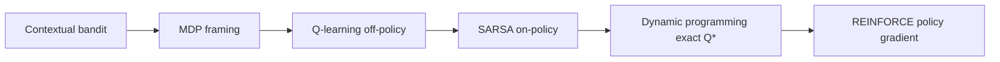

# The RL Ladder: Bandit to MDP to Q-learning to SARSA to DP to REINFORCE

This page climbs the classic reinforcement-learning ladder one rung at a time, using a single shared problem: the *agent-decision MDP* in `src/learning_agents/environment.py`. In this world the agent is an assistant's own control loop. One user request arrives, and at each step the agent chooses one orchestration move -- `answer_direct`, `retrieve`, `clarify`, or `escalate` -- under a judge-rubric reward that scores answer quality, grounding, cost, and safety. Every rung below learns or plans a *policy over those four moves*; none of them write answer text.

The ladder is worth climbing slowly because each rung changes exactly one idea. We move from a one-shot decision (bandit) to a sequence (MDP), from learning values off-policy (Q-learning) to learning them on-policy (SARSA), from sampling to solving exactly (dynamic programming), and finally from valuing actions to parameterizing the policy directly (REINFORCE). The honest punchline is at the bottom: the online Q-learning agent we actually trained is good enough to look plausible and bad enough to be governance-rejected, and that gap is the lesson.

## Notation you will need

Define these once and reuse them throughout:

- `s`, `s-prime` -- the current state and the next state. Here a state is seven discrete integers `(step, intent, difficulty, ambiguity, evidence, attempts, budget)`.
- `a`, `A` -- an action; `A` denotes the action actually taken in a sampled transition.
- `r` -- the immediate reward emitted after acting (written `R_{t+1}` in the source).
- `pi(a|s)` -- the policy, the probability of action `a` in state `s`.
- `gamma` -- the discount factor in `[0, 1]`; the showcase uses `gamma = 0.9`.
- `Q(s,a)` -- the action value, the expected discounted return from taking `a` in `s` then following the policy.
- `V(s)` -- the state value, `V(s) = max_a Q(s,a)` for the optimal policy.
- `alpha` -- the step size (learning rate) of a temporal-difference update.
- `epsilon` -- the exploration rate of an epsilon-greedy behaviour policy.
- `A` (advantage) -- in the policy-gradient section, the baseline-subtracted return `G_t - b`. (Context disambiguates the action `A` from the advantage.)
- `G_t` -- the return, `G_t = sum_k gamma^k r_{t+k+1}`, the quantity every value below estimates.

## The ladder at a glance



Read left to right, each arrow adds one capability. The bandit decides once; the MDP makes decisions sequential; Q-learning and SARSA learn action values from samples (off- vs on-policy); dynamic programming computes those values exactly because it is handed the model; REINFORCE skips values and optimizes the policy itself. The same six fields of `s` flow through all of them.

## Rung 0: the contextual bandit

A contextual bandit sees a context, picks one action, collects one reward, and stops. There is no `s-prime`: the next state never feeds back into the decision. Formally it maximizes the immediate `r` given the context, with no `gamma` and no `Q(s,a)` over future steps. The agent-decision problem becomes a bandit if you force a commit on the first step -- answer immediately, never retrieve or clarify. That throws away the entire reason the action set has four moves. The bandit rung is covered in depth in [exploration and bandits](exploration-and-bandits.md); here it is the floor the MDP rises above.

## Rung 1: the MDP framing

A Markov decision process adds sequence. The agent acts, the world transitions to `s-prime`, and the agent acts again, until the episode terminates. The MDP tuple realized in `src/learning_agents/environment.py` is `(S, A, P, R, gamma, H)`:

- `S` -- the seven-integer discrete state, fully observed (observation equals state, so this is not a POMDP).
- `A` -- four actions: `answer_direct` and `escalate` are terminal commits; `retrieve` adds grounding; `clarify` reduces ambiguity.
- `P` -- the transition kernel. Honesty: `P` is *deterministic* given `(s, a)`. The only randomness is a plus-or-minus-one jitter on the *start* state in `reset`; `step` never samples.
- `R` -- the judge-rubric reward `r = R(s, a, s-prime, done)`, owned by `src/learning_agents/reward.py`.
- `gamma` -- the discount, owned by the agent (`0.9`).
- `H` -- the horizon, default 5 steps.

Everything an agent wants is summarized by the return `G_t = sum_k gamma^k r_{t+k+1}`. The job of the next rungs is to estimate, for each state, which action maximizes that return.

### Planning versus learning

This is the fork that organizes the rest of the ladder. *Planning* methods are handed `P` and `R` and compute the answer directly (dynamic programming, rung 4). *Learning* methods are denied the model and must estimate values from sampled transitions `(s, a, r, s-prime)` (Q-learning and SARSA, rungs 2 and 3; REINFORCE, rung 5). Same MDP, same optimum -- the difference is whether you may read the rules or must infer them by acting.

## Rung 2: Q-learning (off-policy TD control)

Temporal-difference learning updates a value estimate toward a *bootstrapped target*: a one-step reward plus the discounted value of where you landed. The TD(0) target for the optimal action value, and the Q-learning update from `src/learning_agents/q_learning.py`, are:

```text
TD(0) target (greedy bootstrap):   target = r + gamma * max_a' Q(s-prime, a')      (target = r if terminal)
TD error:                          delta  = target - Q(s, A)
Q-learning update:                 Q(s, A) <- Q(s, A) + alpha * delta

where
  r              = immediate reward R_{t+1} from the transition
  gamma          = discount factor (0.9)
  max_a' Q(...)  = value of the BEST next action (a greedy choice, maybe not taken)
  Q(s, A)        = current estimate for the action A actually taken
  alpha          = step size (0.35 in the trained run)
  delta          = temporal-difference error
```

The single load-bearing symbol is `max_a'`. Q-learning's behaviour policy is epsilon-greedy and exploratory, but the target bootstraps from the value of the *greedy* next action, not the one the agent actually took. That decoupling of behaviour from target is what makes Q-learning **off-policy**: it chases the Bellman optimality values `Q*(s,a)` no matter how exploratory the data was. In the code, the line `future_value = max(q_table[next_key])` is the entire off-policy mechanism.

## Rung 3: SARSA (on-policy TD control)

SARSA changes exactly one symbol. Instead of bootstrapping from the best next action, it bootstraps from the action it *actually takes next*. The update from `src/learning_agents/sarsa.py`:

```text
SARSA target (on-policy):   target = r + gamma * Q(s-prime, A')      (target = r if terminal)
TD error:                   delta  = target - Q(s, A)
SARSA update:               Q(s, A) <- Q(s, A) + alpha * delta

where
  A'  = the next action the epsilon-greedy behaviour policy CHOOSES (not the max)
  (all other symbols as in rung 2)
```

The name SARSA comes from the quintuple it consumes: state, action, reward, next state, next action `(s, A, r, s-prime, A')`. Because the target folds in the value of exploratory moves, SARSA learns the value of the policy it actually follows, exploration included. That makes it **on-policy**. In the textbook Cliff-Walking task this makes SARSA more conservative than Q-learning near costly mistakes; whether that gap appears here, and its sign, depends on the reward and seed, so the showcase treats it as something to observe rather than assert. The one line that defines the method is `next_action_values[next_action]` instead of `max(next_action_values)`.

### Off-policy versus on-policy in one sentence

Off-policy (Q-learning) learns the value of a *target* policy (greedy) while behaving under a different *behaviour* policy (epsilon-greedy); on-policy (SARSA) learns the value of the one policy it both follows and evaluates. Off-policy is what later lets us learn from logged data we did not generate -- the premise of [offline RL and OPE](offline-rl-and-ope.md).

## Rung 4: dynamic programming (exact Q\*)

Dynamic programming is the planning rung. It is handed the model and solves the MDP exactly, giving the ground-truth optimum every learning rung is trying to reach. The fixed point it computes is the Bellman optimality equation; the algorithm in `src/learning_agents/dynamic_programming.py` is backward induction (value iteration specialized to a finite horizon):

```text
Bellman optimality (deterministic transition s-prime = T(s, a)):
    Q*(s, a) = r + (0 if done else gamma * max_a' Q*(s-prime, a'))
Optimal state value:
    V*(s) = max_a Q*(s, a)
Optimal policy:
    pi*(s) = argmax_a Q*(s, a)

where
  T(s, a)  = the known deterministic transition (the model, queried via model_step)
  r        = R(s, a, s-prime, done), the same judge-rubric reward the learners see
  Q*(s, a) = the exact optimal action value (no sampling, no approximation)
```

Backward induction works here because every acting state reached at decision step `t` has `step == t`, and terminal states are never acted on. Solving states by *descending* `step` means each successor's `Q*` is already known when needed, so a single ordered sweep yields the exact fixed point -- no iteration to convergence required. The result is written to `artifacts/dp/optimal_action_values.csv`. For example, from the easy start state the optimum is `Q*(answer_direct) = 2.0`, correctly preferring an immediate answer over retrieving (`1.1`) or clarifying (`1.3`).

This `Q*` is the **planning ceiling**. In `artifacts/eval/policy_comparison.csv` the `dp_optimal` policy scores `avg_reward 1.2142` with `escalation_rate 0.2833`, `avg_steps 2.05`, and `solved_rate 1.0`. No learned policy in this showcase can legitimately beat that number; matching it is the goal.

## Rung 5: REINFORCE (Monte-Carlo policy gradient)

Every rung so far learned `Q(s,a)` and acted greedily. REINFORCE throws out the value table and optimizes the policy directly. The policy is a softmax over per-state logits `theta[s]`, and the update from `src/learning_agents/policy_gradient.py` is gradient ascent on expected return:

```text
Softmax policy:        pi(a|s) = exp(theta_{s,a}) / sum_a' exp(theta_{s,a'})
Return:                G_t = sum_k gamma^k r_{t+k+1}
Policy gradient:       grad J = E[ grad log pi(A_t | s_t) * (G_t - b) ]
Log-prob gradient:     d/d theta_{s,a'} log pi(A_t | s_t) = 1[a' = A_t] - pi(a' | s_t)
REINFORCE update:      theta_{s,a'} <- theta_{s,a'} + alpha * (G_t - b) * (1[a' = A_t] - pi(a' | s_t))

where
  theta_{s,a}     = the logit (preference) for action a in state s
  G_t             = the Monte-Carlo return from step t (whole-episode rollout, not bootstrapped)
  b               = a baseline; here the episode-mean return, for variance reduction
  (G_t - b)       = the advantage A: how much better this episode did than the baseline
  1[a' = A_t]     = 1 if a' is the action taken, else 0
  alpha           = step size (0.1)
```

The intuition lives in `(G_t - b) * (1[a' = A_t] - pi(a'|s))`: when the return beats the baseline, the update pushes logit mass *toward* the action taken and *away* from the rest, proportional to how surprising the action was under the current policy. This is the **score-function estimator** that PPO scales up behind a neural network; here it is a few lines over a lookup table. REINFORCE is on-policy and explores by *sampling its own stochastic policy*, not by epsilon-greedy. The mean-return baseline `b` is the simplest variance reduction and the seed of the "critic" in actor-critic methods.

## The honest story: a trained agent that gets rejected

Here is where the numbers stop being flattering. The online tabular Q-learning agent in this showcase was trained for **400 episodes**. In `artifacts/eval/policy_comparison.csv` it scores `avg_reward 0.8525` with an `escalation_rate of 0.65` -- it reaches for the human far too often. Against the governance bar in [evaluation and governance](evaluation-and-governance.md), that escalation rate gets the policy **rejected**: it over-escalates, burning the most expensive tier for requests it should have handled.

Contrast three policies from the same table:

- `dp_optimal` -- `avg_reward 1.2142`, the exact planning ceiling.
- `offline_fqi` -- `avg_reward 1.2067`, Fitted-Q learned *offline* from the heuristic log; it nearly matches the ceiling and easily clears governance.
- `heuristic_router` -- `avg_reward 1.16`, a hand-written baseline that never escalates (`escalation_rate 0.0`) but takes more steps (`avg_steps 3.0667`).
- `q_learning` -- `avg_reward 0.8525`, the online learner, rejected.
- `random` -- `avg_reward -1.1817`, the floor.

So the online learner is *beaten by a hand-written baseline and by an offline method*, and is the only learned policy that fails governance. Why ship it anyway?

### The gap is deliberate

Because the gap *is the lesson*. Online tabular Q-learning converges to `Q*` only at around **5000 episodes**; the showcase trains 400 on purpose. The residual error is recorded per state-action pair in `artifacts/dp/q_learning_gap.csv`, which holds the learned value, the exact `Q*`, and `abs_gap` for every shared decision. Reading it makes "model-free approaches the model-based optimum" a measurable claim rather than a slogan. Some entries are already tight: for the easy start state the learned `answer_direct` value is `1.999999` against `Q* = 2.0` (`abs_gap` about `1e-06`). Others are far off: in that same state the learned `clarify` value is `0.0` against `Q* = 1.3` (`abs_gap 1.3`), because epsilon-greedy rarely visited the path that would correct it in 400 episodes. The under-trained tail is exactly why the deployed greedy policy over-escalates.

The takeaway is the whole point of the planning rung: keep an exact `Q*` next to your learner so you can *see* how far sampling-based learning still has to go, instead of trusting a plausible-looking reward number. For the full numerical treatment of the Bellman equations and the convergence argument, see [math notes](math-notes.md).

## The rungs as a table

Every quantitative claim below traces to the named artifact under the project root.

| Rung | On/Off-policy or Planning | Update | Artifact | Headline |
| --- | --- | --- | --- | --- |
| Contextual bandit | Learning (one-shot, no `s-prime`) | maximize immediate `r` given context | `artifacts/eval/policy_comparison.csv` | The floor that sequence improves on; see exploration-and-bandits |
| MDP framing | Problem definition | return `G_t = sum_k gamma^k r_{t+k+1}` | `artifacts/eval/policy_comparison.csv` | Deterministic `P`, horizon `H=5`, four orchestration actions |
| Q-learning | Off-policy TD | `Q(s,A) += alpha * (r + gamma * max_a' Q(s-prime,a') - Q(s,A))` | `artifacts/dp/q_learning_gap.csv` | 400 episodes; over-escalates (rate `0.65`, reward `0.8525`); governance-REJECTED |
| SARSA | On-policy TD | `Q(s,A) += alpha * (r + gamma * Q(s-prime,A') - Q(s,A))` | `artifacts/dp/q_learning_gap.csv` | Same code as Q-learning but bootstraps the chosen `A'`, not the max |
| Dynamic programming | Planning (exact) | `Q*(s,a) = r + gamma * max_a' Q*(s-prime,a')` | `artifacts/dp/optimal_action_values.csv` | Exact `Q*` by backward induction; planning ceiling `avg_reward 1.2142` |
| REINFORCE | On-policy (policy gradient) | `theta_{s,a'} += alpha * (G_t - b) * (1[a'=A_t] - pi(a'|s))` | `artifacts/eval/policy_comparison.csv` | Optimizes `pi_theta` directly; the score-function estimator PPO scales up |

## Where this leads

The ladder does not stop at REINFORCE. Two directions follow directly. First, **off-policy learning from logs**: because Q-learning's target ignores the behaviour policy, you can learn from data you never generated -- the offline Fitted-Q result above (`1.2067`, nearly the ceiling) comes from exactly this, evaluated safely with off-policy estimators in [offline RL and OPE](offline-rl-and-ope.md). Second, **richer objectives**: the same return-maximization can be made cost-aware, traded against quality along a Pareto frontier in [cost-aware cascade](cost-aware-cascade.md), or pointed at human preferences. Throughout, keep the planning ceiling in view: a learned policy is only as trustworthy as its distance from `Q*` and its standing against governance.

## See also

- [exploration and bandits](exploration-and-bandits.md) -- rung 0 in depth: the one-shot decision the MDP rises above.
- [offline RL and OPE](offline-rl-and-ope.md) -- learning from logs (the offline-FQI policy that beats the online learner) and how to evaluate it safely.
- [evaluation and governance](evaluation-and-governance.md) -- the bar that rejects the over-escalating online Q-learning policy.
- [math notes](math-notes.md) -- the full Bellman equations, TD derivations, and the convergence argument behind the deliberate 400-episode gap.
