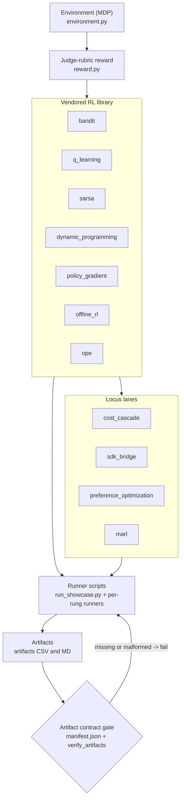

# Showcase Architecture

This page maps the project from the bottom up: a single environment that frames an
assistant's own control loop as a Markov decision process (MDP), a judge-rubric reward on
top of it, a vendored library of RL algorithms that learn or plan against that environment,
four "locus of learning" lanes that ask *which part of an agent system you optimize*, the
runner scripts that drive everything, and the deterministic artifacts those runs emit. Those
artifacts are governed by a contract tying the code, the tests, and the checked-in evidence
together — much of this page is about why that contract matters. If you have not read
[the start-here map](00-start-here.md) or [the locus-of-learning framing](locus-of-learning.md),
skim those first; this page assumes you know what the four lanes are *for*.

## The layers, top to bottom

The showcase is a stack: each layer depends only on the ones below it, so the dependency
graph is acyclic and any single rung can be inspected in isolation.

1. **Environment (the MDP)** — `src/learning_agents/environment.py` realizes the world.
2. **Reward (the judge rubric)** — `src/learning_agents/reward.py` supplies the scalar `R`.
3. **Vendored RL library** — one module per method, each importing the environment and
   reward, never each other.
4. **Locus lanes** — four modules that move the locus of optimization to a different part of
   an agent system.
5. **Runner scripts** — `scripts/` turns library calls into reproducible runs.
6. **Artifacts + contract** — every run writes evidence under `artifacts/`, gated by
   `src/learning_agents/reporting.py` and `scripts/verify_artifacts.py`.



## Layer 1: the environment as an MDP

An MDP is the standard formalization of sequential decision-making: the tuple
`(S, A, P, R, gamma, H)` — states `S`, actions `A`, a transition rule `P`, a reward `R`, a
discount `gamma` weighing future against immediate reward, and a finite horizon `H`. The
novelty here is what is modeled: not a robot or a game board, but an **assistant's own
control loop** over a single request. The agent does not learn the answer text but the
*orchestration policy* — when to answer, gather evidence, ask, or hand off.

**State `s`** (`AgentState` in `environment.py`): seven discrete integers — `step`,
`intent`, `difficulty`, `ambiguity`, `evidence`, `attempts`, `budget`. Each is capped
(`difficulty`/`ambiguity` at 2, `evidence` at 3, `budget` starts at 30 tenths of a unit),
so the joint state set is finite and a tabular method keys a table on `AgentState.as_tuple()`.
The observation equals the state, so this is an MDP, not a partially observed one.

**Actions `A`** (`ACTION_LABELS`), with costs from `ACTION_COSTS`:

```text
0  answer_direct   commit an answer now            (terminal; cost 0.0)
1  retrieve        gather one unit of grounding    (evidence += 1; cost 0.5)
2  clarify         resolve one unit of ambiguity   (ambiguity -= 1; cost 0.3)
3  escalate        hand off to a human             (terminal; cost 1.5)
```

`answer_direct` is free to *attempt* (its quality is judged separately); `escalate` is the
most expensive because it consumes a scarce human.

**Transition `P`.** The dynamics are **deterministic**: `_transition` is a pure function, so
`s-prime` is fixed given `s` and `a`, with no sampling. The `seed` passed to `reset(...)`
only jitters the *start* state (`difficulty`/`ambiguity` by `+/- 1`) and never reaches
`step` — which is why the showcase is **reproducible by seed**: same seed, same start, same
trajectory. An episode ends three ways: a commit action, the clock exceeding `H` (default
5), or a *budget violation* (the action is not applied, the clock advances, and the episode
ends as a forced give-up the reward then punishes — teaching the agent when to stop).

**Start-state distribution.** `SCENARIOS` lists five request profiles — `easy_factual`,
`howto_medium`, `ambiguous_query`, `hard_debug`, `needs_escalation` — each making a
different first move correct, so scoring one policy across all five measures generalization,
not luck. The agent maximizes the discounted return:

```text
G_t = sum over k>=0 of gamma^k * R_{t+k+1}
```

where `R_{t+1}` is the reward after acting at step `t`, `gamma` in `[0, 1]` is the discount
(owned by the agent, not the environment), and `G_t` is the return.

## Layer 2: the judge-rubric reward

The reward *is* the objective. `reward.py` ships two. The default, `judge_reward`
(re-exported as `default_reward`), is a *judge rubric*: the agent never sees ground-truth
text, so a multi-criterion rubric scores its committed action, as an LLM-as-judge or learned
reward model would. The terms (`rubric_breakdown`):

```text
answer_quality        +2.0  if answer_direct is well-grounded, else 0
hallucination_penalty -1.5  if answer_direct is under-grounded, else 0
escalation_value      +0.6 + 0.45 * need   for escalate (need = difficulty + ambiguity)
effort_penalty        -0.2  per needless retrieve/clarify, else 0
action_cost           -c(a) the raw price from ACTION_COSTS
R_{t+1}               = sum of the terms above, rounded to 4 dp
```

An answer is "well-grounded" only when `evidence_is_adequate(evidence, difficulty)` holds
*and* `ambiguity == 0`, so a good direct answer scores `+2.0` at zero cost — strictly above
an under-grounded answer (`-1.5`) or a needless escalation. The companion `hackable_reward`
breaks this on purpose: a flat `+3.0` for `escalate` and `+0.8` per `retrieve` regardless of
need, while under-crediting a good answer at `+1.0`. A learner that maximizes the proxy ranks
degenerate "always escalate" / "always retrieve" policies above the good one — the signature
of reward hacking. Every method on the next layer inherits the reward, so a bad objective
corrupts every learner above it. See [reward design and hacking](reward-design-and-hacking.md).

## Layer 3: the vendored RL library

This is the "RL ladder." Each method is a self-contained module that imports the environment
and reward but not its siblings, so any rung can be studied alone.

| Module | RL concept | Evidence artifact |
| --- | --- | --- |
| `src/learning_agents/bandit.py` | Contextual epsilon-greedy bandit; measure regret | `artifacts/bandit/regret_trace.csv` |
| `src/learning_agents/q_learning.py` | Off-policy tabular TD control (Bellman update) | `artifacts/q_learning/training_curve.csv` |
| `src/learning_agents/sarsa.py` | On-policy TD control (bootstraps the next action taken) | `artifacts/sarsa/training_curve.csv` |
| `src/learning_agents/dynamic_programming.py` | Exact `Q*` by backward induction (ground truth) | `artifacts/dp/q_learning_gap.csv` |
| `src/learning_agents/policy_gradient.py` | Tabular REINFORCE (optimize the policy directly) | `artifacts/policy_gradient/training_curve.csv` |
| `src/learning_agents/offline_rl.py` | Fitted-Q Iteration from a fixed log | `artifacts/offline_rl/training_curve.csv` |
| `src/learning_agents/ope.py` | Off-policy evaluation: IS, WIS, DM, doubly robust | `artifacts/ope/estimator_comparison.csv` |

These policies, plus the baselines in `src/learning_agents/policies.py` (`RandomPolicy`,
`HeuristicRouterPolicy`, `AlwaysEscalatePolicy`, `QTablePolicy`, `ModelPolicy`), all satisfy
one `Policy` protocol, so the harness in `src/learning_agents/evaluation.py` scores them with
one rollout loop. A greedy `QTablePolicy` acts as `pi(s) = argmax_a Q(s, a)`; the optimal
`Q*` satisfies the Bellman optimality relation:

```text
Q*(s, a) = E[ R_{t+1} + gamma * max over a' of Q*(s', a') ]
```

where `Q(s, a)` is the action value, `V(s) = max_a Q(s, a)` is the state value, and `s'` is
the next state.

### What the ladder shows

The offline comparison (`artifacts/eval/policy_comparison.csv`):

| Policy | avg_reward | escalation_rate | avg_steps | solved_rate | Note |
| --- | --- | --- | --- | --- | --- |
| `dp_optimal` | 1.2142 | 0.2833 | 2.05 | 1.0 | Planning ceiling: exact `Q*` via backward induction |
| `offline_fqi` | 1.2067 | 0.30 | 2.0 | 1.0 | Offline Fitted-Q from the log; nearly matches the ceiling |
| `heuristic_router` | 1.16 | 0.0 | 3.0667 | 1.0 | Strong hand-written baseline; never escalates, more steps |
| `q_learning` | 0.8525 | 0.65 | 1.2167 | 1.0 | Online tabular, 400 episodes; over-escalates; **governance REJECTED** |
| `random` | -1.1817 | 1.0 | 3.0 | 0.5333 | Floor; over-effort 0.6333, unsafe/questionable 0.4667 |

Two honest tensions. First, online `q_learning`, trained only 400 episodes on purpose,
*over-escalates* (rate 0.65) and is **rejected** by the governance rule below. Second,
**offline FQI** (1.2067) beats it handily and lands just under the exact DP ceiling (1.2142),
learning entirely from a logged dataset with no new interaction. The short online run is left
short *so the gap is visible*: backward induction reaches `Q*` exactly, while online Q-learning
would need roughly 5000 episodes to converge here, and the residual gap in
`artifacts/dp/q_learning_gap.csv` is itself the lesson.

The offline dataset (`artifacts/offline_rl/dataset_summary.csv`) holds 1418 transitions
covering 196 of 371 decision states (`coverage_fraction` 0.5283); the behavior policy is
`heuristic_router` made epsilon-soft with `epsilon = 0.6`. FQI's Bellman residual falls
`2.0, 1.8, 1.62, 0.945, 0.3402, 0.0` across six sweeps (466 state-action pairs per sweep).

Off-policy evaluation (`artifacts/ope/estimator_comparison.csv`) estimates a policy's value
*from the behavior log alone*; the lesson is overlap. For in-support targets every estimator
is accurate (`abs_error < 0.05`): `heuristic_router` (true 1.179) and `dp_optimal` (true
1.219) are within hundredths under importance sampling (IS), weighted IS (WIS), the direct
method (DM), and doubly robust (DR). For the off-support `random` target (true -1.074),
barely covered by the log, IS variance explodes (`abs_error` 0.5614) while WIS slashes it to
0.169 and DR — a fitted `Q`-model plus an IS correction — lands at 0.3539. See
[offline RL and OPE](offline-rl-and-ope.md).

## Layer 4: the four locus lanes

The lanes ask the framing question: *which part of an agent system do you put the learning
in?* Each is one module under `src/learning_agents/`.

**Cost-aware cascade — `src/learning_agents/cost_cascade.py`** sweeps an effort budget
(`artifacts/cost_cascade/cost_quality_curve.csv`):

| effort_budget | total_cost | avg_reward | escalation_rate | solved_rate |
| --- | --- | --- | --- | --- |
| 0 | 1.375 | 0.2592 | 0.7167 | 0.85 |
| 1 | 1.6667 | 0.2633 | 0.5333 | 0.8833 |
| 2 | 1.745 | 0.5183 | 0.2833 | 0.9 |
| 3 | 1.8767 | 0.91 | 0.1667 | 1.0 |
| 4 | 1.76 | 1.16 | 0.0 | 1.0 |

Total cost is **non-monotonic** in budget: budget 4 has the *best* reward (1.16) *and* a
lower total cost than budget 3 (1.76 < 1.8767), because once grounding and clarifying are
affordable, escalation — the expensive last tier — drops to zero. Pareto-non-dominated points
are budgets 0, 2, 4; budgets 1 and 3 are dominated. See
[cost-aware cascade](cost-aware-cascade.md).

**SDK bridge — `src/learning_agents/sdk_bridge.py`** (Lane A) drives an agent loop with the
learned policy and maps each step to an external agent-SDK construct, writing
`artifacts/sdk_bridge/orchestration_trace.csv` and a report. The SDK import is *gated* and
degrades gracefully when the optional dependency is absent.

**Preference optimization — `src/learning_agents/preference_optimization.py`** (Lane B)
compares RLHF, DPO, GRPO, and RLVR (`artifacts/preference/method_comparison.csv`):

| method | expected_quality | win_rate_vs_reference | kl_to_reference |
| --- | --- | --- | --- |
| reference | 0.49 | 0.5 | 0.0 |
| rlhf | 0.9994 | 0.8996 | 1.5995 |
| dpo | 0.9995 | 0.8997 | 1.5986 |
| grpo | 0.9988 | 0.8991 | 1.593 |
| rlvr | 0.9988 | 0.899 | 1.5927 |

All four lift expected quality from 0.49 to about 0.999 with a controlled KL of about 1.6 to
the reference. **Honesty: this is toy-scale** — a 4x5 quality matrix, not a real language
model — teaching the concepts (a preference signal, a `KL` leash keeping the tuned policy
near the reference, weighted by `beta`) at a readable scale. `KL` is the Kullback-Leibler
divergence. See [Lane B](lane-b-preference-optimization.md).

**Multi-agent RL — `src/learning_agents/marl.py`** (Lane C) has two agents (relabeled
researcher and responder) coordinate on the cooperative Climbing game (Claus and Boutilier,
1998), payoff rows = researcher `(deep_research, search, skim)`, cols = responder
`(detailed, standard, brief)` = `((11,-30,0),(-30,7,6),(0,0,5))`
(`artifacts/marl/coordination_comparison.csv`):

| method | coordination_success | final_joint_action | final_team_reward | optimal |
| --- | --- | --- | --- | --- |
| independent (IQL) | 0.0 | skim+brief | 5.0 | 11.0 |
| joint (JAL, centralised) | 1.0 | deep_research+detailed | 11.0 | 11.0 |

Independent Q-learners miscoordinate to a safe but suboptimal equilibrium; centralised
joint-action learning reaches the optimum. See [Lane C](lane-c-marl.md).

## Layer 5: the runner scripts

`scripts/` is the I/O boundary; each library call becomes a reproducible run that writes
artifacts. `scripts/run_showcase.py` is the all-in-one orchestrator, running every rung in
dependency order in a single process — bandit, MDP and concept docs, Q-learning, the exact
DP optimum and the learned-vs-optimal gap, SARSA, REINFORCE, offline RL and its coverage,
OPE graded against truth, the cost cascade, the offline comparison, the reward-hacking study,
the governance docs, the deploy/shadow/reject memo, and all four lanes. Focused per-rung
runners (`scripts/run_q_learning.py`, `scripts/run_offline_rl.py`, and so on) are wired
through the Makefile, and `scripts/verify_artifacts.py` checks the contract. Every runner
accepts `--quick` to shrink budgets for CI.

## Layer 6: the artifact contract (and why it matters)

This discipline is what makes the showcase trustworthy rather than just runnable. The
**artifact contract** — the exact set of files a complete run must emit, and the
columns/headings each must contain — is the single source of truth, shared by three parties:

1. **`src/learning_agents/reporting.py`** holds it *as code*: `REQUIRED_ARTIFACTS` (32 paths
   across every rung and lane) and `OPTIONAL_DRL_ARTIFACTS`, plus a per-path table of
   required CSV columns and Markdown headings.
2. **`artifacts/manifest.json`** is the same contract *frozen to disk*, written by
   `write_manifest` and committed.
3. **`scripts/verify_artifacts.py`** *enforces* it, and **`tests/test_reporting.py`**
   *asserts* that `REQUIRED_ARTIFACTS` matches `artifacts/manifest.json` byte-for-byte.

So: code declares the contract, the manifest pins it, the verifier gates on it, the tests
prove the three agree. Verification runs two passes — `missing_required_artifacts` checks
*presence*, then `artifact_validation_errors` checks *shape* (each CSV has its required
header columns and at least one data row; each Markdown file is non-empty and heading-led;
action labels only name actions the environment defines). A partial run fails loudly instead
of shipping silently. Two choices keep the evidence honest: the Q-table CSV columns are
*derived from* `AgentState`'s fields rather than retyped, and `undergrounded_answer_rate`
reuses the reward's own `evidence_is_adequate` predicate, so the safety metric is defined
exactly as the reward penalizes it. Because the environment is deterministic by seed,
re-running regenerates byte-identical evidence — which is what makes the diff of a
checked-in artifact meaningful in review.

`reporting.py` also owns the **governance decision**: `recommendation_from_summary` reads the
`q_learning` row, uses `heuristic_router` as the baseline, and returns deploy/shadow/reject.
It *rejects* any policy with `avg_escalation_rate > 0.5` or `avg_undergrounded_rate > 0.5`
before comparing reward — which is exactly why online Q-learning (escalation 0.65) is
rejected despite solving every scenario. See
[evaluation and governance](evaluation-and-governance.md).

## How to run it

From the project root, with `uv` installed (targets defined in the `Makefile`):

```text
make sync      Install dependencies: `uv sync --extra dev`.
make smoke     Quick end-to-end path: every per-rung runner with --quick.
make run       Full core showcase, one script per concept, at full budgets.
make verify    Enforce the artifact contract (scripts/verify_artifacts.py).
make check     Lint (ruff) + type-check (mypy) + tests (pytest).
```

A typical first pass: `make sync`, then `make smoke` for a fast artifact set, then
`make verify`, then `make check`. `make run-all` runs the whole ladder in one process via
`scripts/run_showcase.py`; `make sync-sdk` adds the optional agent-SDK extra for Lane A. The
full per-rung target list is printed by `make help`.

## Where each lane lives in `src/`

| Lane | Module | Role |
| --- | --- | --- |
| Cost-aware cascade | `src/learning_agents/cost_cascade.py` | Cost/quality operating frontier of the policy |
| Lane A: agent frameworks | `src/learning_agents/sdk_bridge.py` | Drives the learned policy through an agent-SDK loop (gated) |
| Lane B: preference optimization | `src/learning_agents/preference_optimization.py` | Toy RLHF/DPO/GRPO/RLVR with a KL leash |
| Lane C: MARL | `src/learning_agents/marl.py` | Independent vs centralised joint-action coordination |

## See also

- [The locus-of-learning framing](locus-of-learning.md) — the four lanes and why they exist.
- [The RL ladder](rl-ladder.md) — the bandit-to-policy-gradient progression in depth.
- [Offline RL and OPE](offline-rl-and-ope.md) — learning and evaluating from a fixed log.
- [Evaluation and governance](evaluation-and-governance.md) — the deploy/shadow/reject gate.
