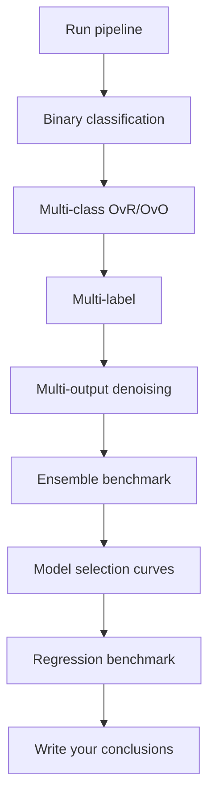
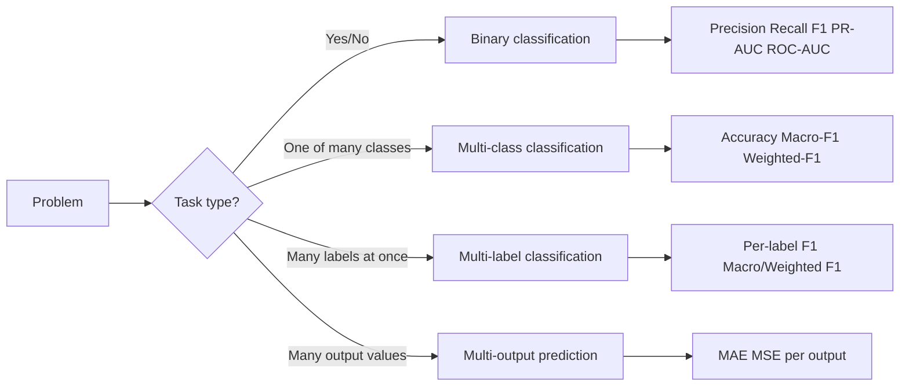

# SOTA Supervised Learning: Self-Guided Tutorial

This project is built as a step-by-step tutorial so you can learn supervised learning by doing.
You will run one pipeline, inspect artifacts, and connect each result to a core concept.

## What You Should Learn

By working through this project, you should be able to:
- handle imbalanced classification with upsampling and downsampling,
- explain binary, multi-class, multi-label, and multi-output tasks,
- choose and interpret classification metrics (precision, recall, F1, PR AUC, ROC AUC),
- compare tree-based and ensemble models,
- read validation and learning curves for model selection,
- compare baseline and advanced regression models.

## Why This Project Is Beginner-Friendly

- It uses local built-in datasets, so there are no API keys and no data download blockers.
- Each concept has a direct output file in `artifacts/` that you can inspect.
- The docs are organized as a guided path, not just API references.

## Learning Flow

1. Start with `docs/learning-flow.md`.
2. Run the project end to end.
3. Open one artifact at a time and answer the self-check questions.
4. Use `docs/domain-use-cases.md` to transfer each concept to real problems.
5. Use `docs/code-examples.md` to modify and experiment.

Need answer validation after you attempt checkpoints:
- `docs/checkpoint-answer-key.md`

## Quickstart

```bash
cd projects/sota-supervised-learning-showcase
make sync
make run
make test
```

One-command local quality gate:

```bash
make quality
```

Optional boosters (extra models):

```bash
make sync-boosting
```

## Makefile Commands

Use `make help` to list all commands.

Core commands:

```bash
make sync          # uv dependency sync (dev)
make run           # run tutorial pipeline
make test          # run pytest
make ruff-check    # lint checks
make ruff-format   # formatting check
make ty-check      # type checks
make lint          # ruff + ty
make quality       # full local quality gate
```

## What Gets Generated

After `run_showcase.py`, you get:
- `artifacts/binary_metrics.csv`
- `artifacts/pr_curves.csv`
- `artifacts/roc_curves.csv`
- `artifacts/multiclass_metrics.csv`
- `artifacts/multilabel_metrics.csv`
- `artifacts/multioutput_metrics.csv`
- `artifacts/classification_benchmark.csv`
- `artifacts/validation_curve.csv`
- `artifacts/learning_curve.csv`
- `artifacts/regression_benchmark.csv`
- `artifacts/model_selection_summary.json`
- `artifacts/summary.md`

## Concept Learning Map

| Concept | Where to run/read | What to look for |
|---|---|---|
| Imbalanced classes | `src/sota_supervised_showcase/data.py`, `artifacts/binary_metrics.csv` | How precision/recall/F1 changes by sampling strategy |
| Binary metrics + thresholds | `artifacts/pr_curves.csv`, `artifacts/roc_curves.csv` | Why threshold changes precision vs recall tradeoff |
| OvR vs OvO | `artifacts/multiclass_metrics.csv` | Which strategy performs better and why |
| Multi-label | `artifacts/multilabel_metrics.csv` | One sample can have multiple labels |
| Multi-output | `artifacts/multioutput_metrics.csv` | Predicting a full output vector, not one label |
| Ensemble methods | `artifacts/classification_benchmark.csv` | Why combining models can improve robustness |
| Model selection | `artifacts/validation_curve.csv`, `artifacts/learning_curve.csv` | Bias/variance and whether more data may help |
| Regression baselines | `artifacts/regression_benchmark.csv` | Why baseline comparison prevents misleading conclusions |

## Visual Learning Diagrams





More diagrams: `docs/diagrams.md`

## Suggested Study Path (Self-Paced)

- `docs/learning-flow.md`: complete walkthrough with checkpoints.
- `docs/algorithm-cards.md`: intuitive explanations of each algorithm.
- `docs/domain-use-cases.md`: healthcare, finance, retail, and operations examples.
- `docs/self-guided-one-pager.md`: shortest walkthrough when you have limited time.
- `docs/code-examples.md`: editable snippets for experimentation.
- `docs/checkpoint-answer-key.md`: verify your answers after each section.
- `docs/concept-learning-map.md`: concept-to-file guide.
- `docs/diagrams.md`: visual summaries.
- `notebooks/01_learning_journey.ipynb`: interactive notebook version of the flow.
- `notebooks/02_domain_case_studies.ipynb`: domain mini-cases with auto-check grading.
- `notebooks/03_error-analysis-workbench.ipynb`: interactive threshold/confusion-matrix deployment lab.

## Diagram Validation

Render-check all Mermaid diagrams:

```bash
./scripts/validate_mermaid.sh
```

Rendered SVG outputs are saved under `artifacts/diagrams/`.

## Markdown Link Validation

Check that all local links in `README.md` and `docs/*.md` resolve:

```bash
./scripts/validate_markdown_links.sh
```

## Notebook Validation

Check notebook JSON/schema health:

```bash
./scripts/validate_notebooks.sh
```

## CI Checks

GitHub Actions workflow:
- `../../.github/workflows/ci.yml`

It runs a matrix job and executes for this project:
1. `uv sync --extra dev`
2. lint checks
3. type checks
4. tests

## License

This project is licensed under the MIT License. See `../../LICENSE`.

## Contributing

See `../../CONTRIBUTING.md` for setup, quality checks, and contribution workflow.

## Self-Check: Are You Learning Intuitively?

You are on track if you can answer these without looking at notes:
- Why can a model with high accuracy still fail on a minority class?
- When is macro F1 more useful than weighted F1?
- Why might a voting or stacking model beat a single tree?
- What does it mean if training score is high but validation score is flat?
- Why must every regression model beat a baseline?

If not, revisit `docs/learning-flow.md` and redo the matching artifact section.

## Project Structure

```text
sota-supervised-learning-showcase/
├── README.md
├── Makefile
├── pyproject.toml
├── docs/
│   ├── algorithm-cards.md
│   ├── checkpoint-answer-key.md
│   ├── code-examples.md
│   ├── concept-learning-map.md
│   ├── diagrams.md
│   ├── domain-use-cases.md
│   ├── learning-flow.md
│   └── self-guided-one-pager.md
├── notebooks/
│   ├── 01_learning_journey.ipynb
│   ├── 02_domain_case_studies.ipynb
│   └── 03_error-analysis-workbench.ipynb
├── scripts/
│   ├── run_showcase.py
│   ├── run_quality_checks.sh
│   ├── validate_markdown_links.sh
│   ├── validate_notebooks.sh
│   └── validate_mermaid.sh
├── src/sota_supervised_showcase/
│   ├── __init__.py
│   ├── classification.py
│   ├── config.py
│   ├── data.py
│   └── regression.py
├── tests/
│   ├── test_classification.py
│   ├── test_data.py
│   └── test_regression.py
└── artifacts/
```
