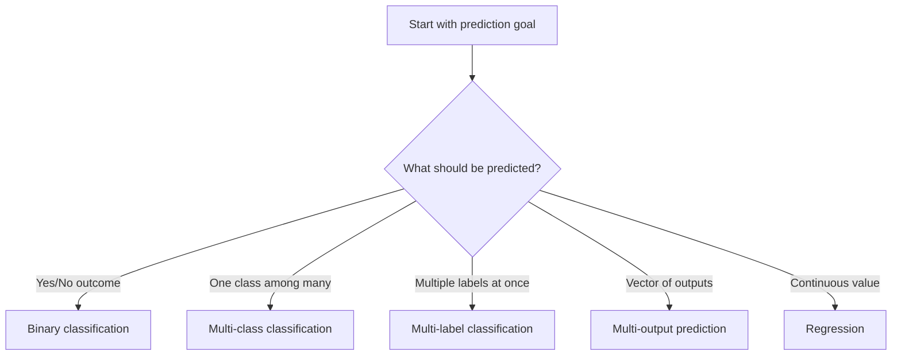
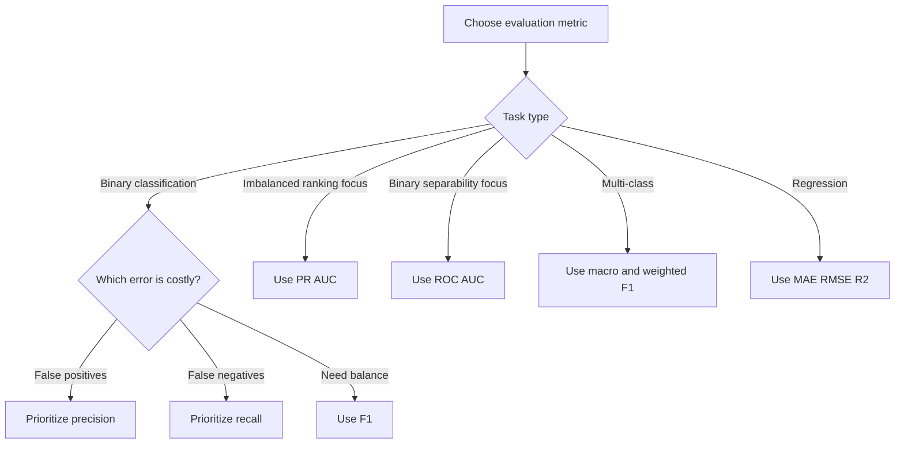
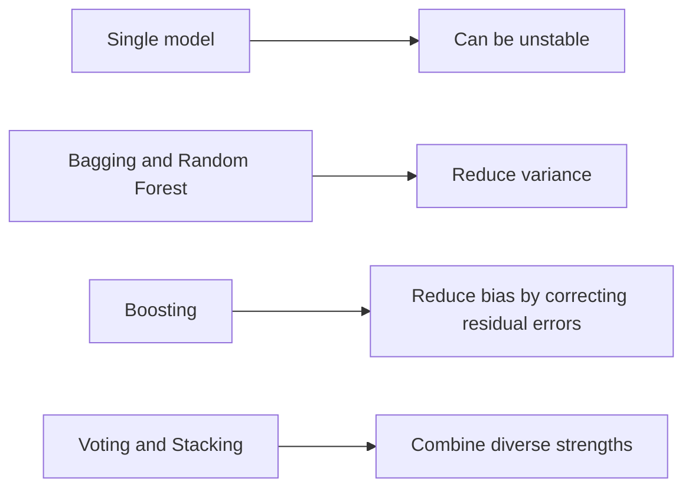
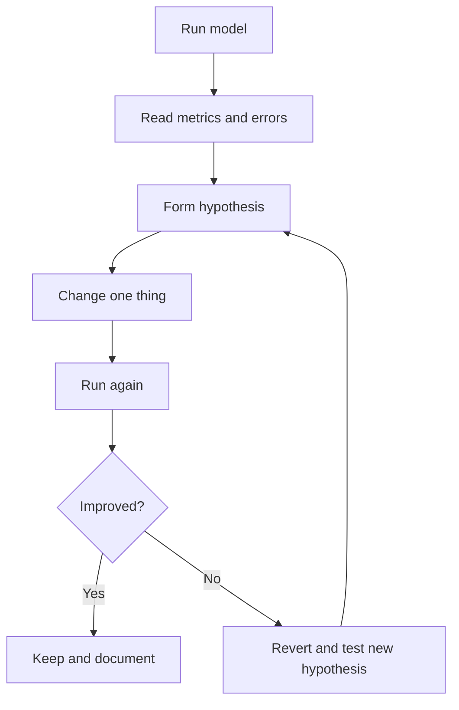
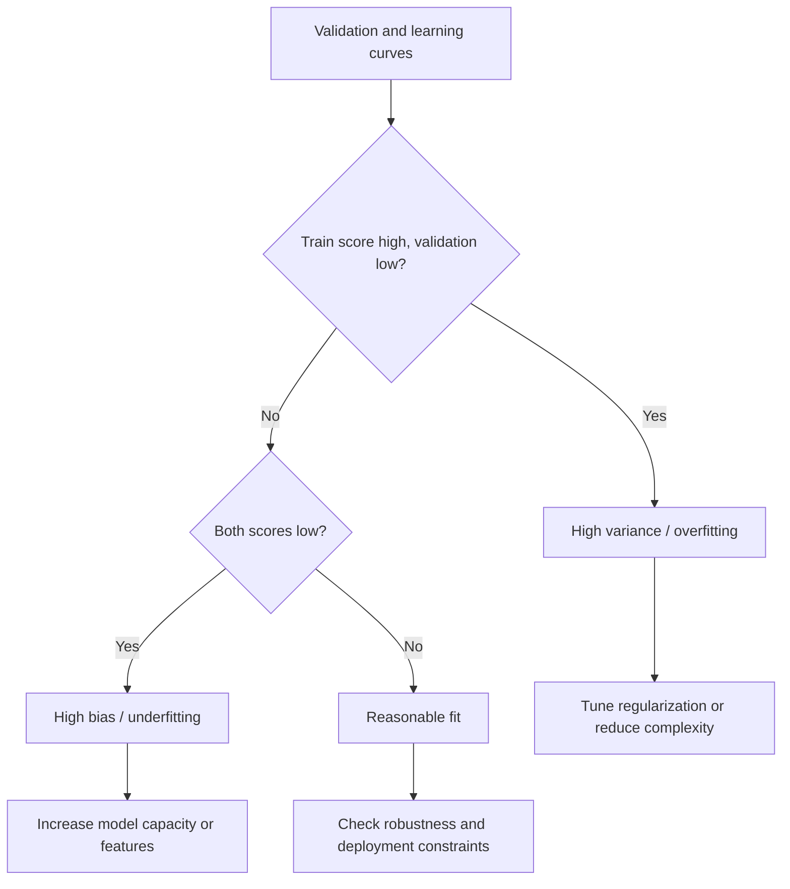

# Diagrams

These diagrams are designed to render in GitHub and Markdown viewers with Mermaid support.

## 1. Supervised Learning Task Picker

## 2. Metric Selection Guide

## 3. Ensemble Intuition

## 4. Learning Loop

## 5. Validation and Learning Curve Reading

