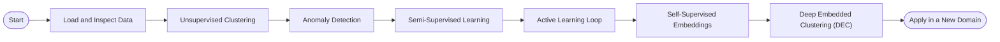
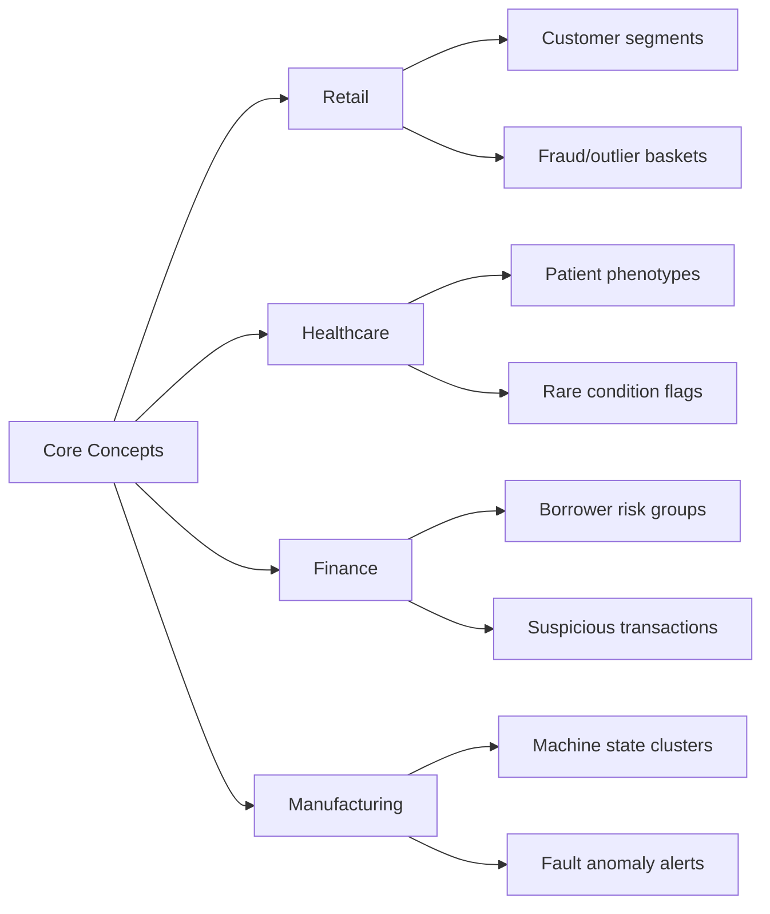
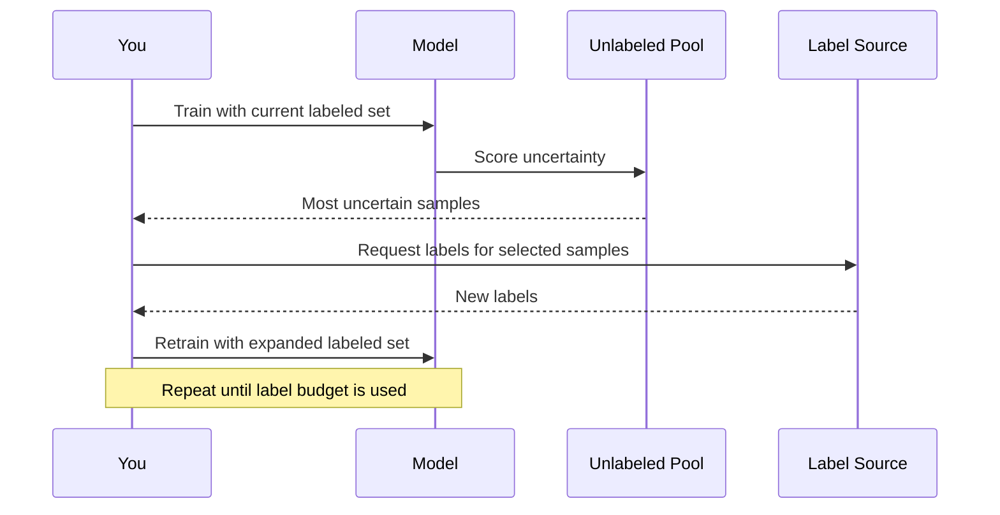
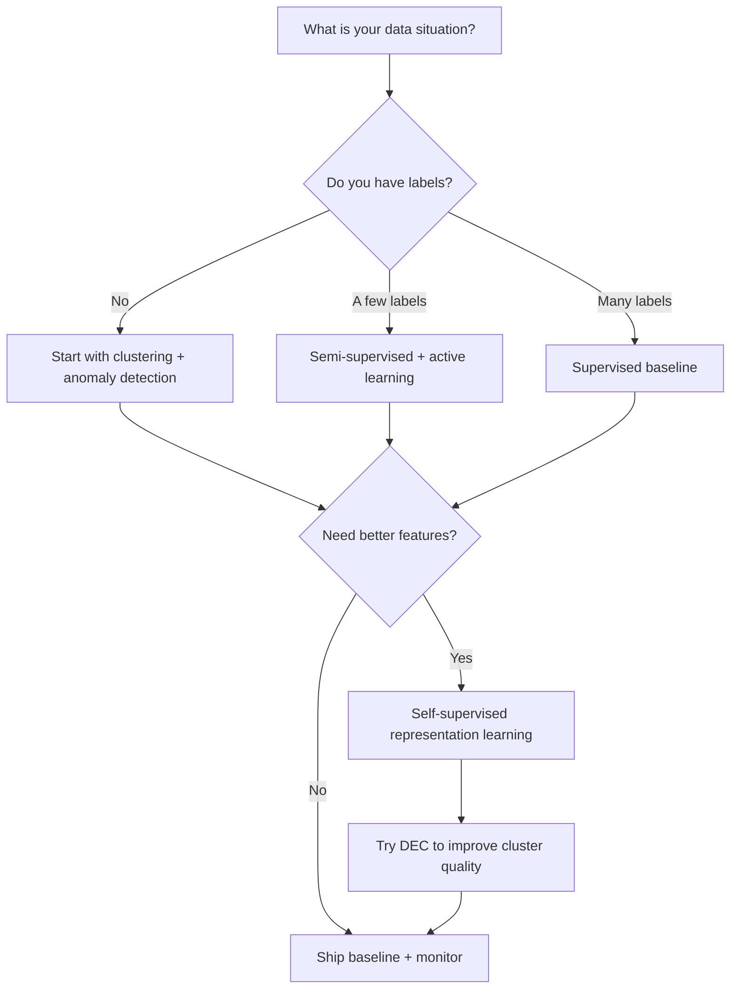

# Learn Unsupervised, Semi-Supervised, Self-Supervised, and Active Learning

This project is a hands-on tutorial. You run experiments, read the outputs, and build intuition step by step.

You can learn in two modes:
- `digits`: small visual dataset (fast and easy to inspect)
- `business`: credit-risk tabular dataset (realistic enterprise-style data)

Core tools used in the project:
- `uv`
- `scikit-learn`
- `pandas`
- `pytorch`
- `lightgbm`
- optional `hdbscan`

## What You Should Learn

By working through this project, you should learn how to:
1. Group similar examples without labels (clustering).
2. Detect rare or unusual patterns (anomaly detection).
3. Train models with only a small labeled subset (semi-supervised learning).
4. Choose which unlabeled examples to label next (active learning).
5. Learn useful representations without labels (self-supervised learning).
6. Refine clusters with a deep objective (DEC).
7. Transfer the same ideas across domains like retail, healthcare, finance, and manufacturing.

## Learning Flow



## Intuition: Same Concept, Different Domain

| Concept | Retail | Healthcare | Finance | Manufacturing |
|---|---|---|---|---|
| Clustering | Customer segments | Patient subtypes | Borrower groups | Machine behavior states |
| Anomaly detection | Fraud baskets | Rare adverse events | Suspicious transactions | Fault signatures |
| Semi-supervised learning | Few hand-labeled products | Few diagnosed records | Few verified risk labels | Few labeled failures |
| Active learning | Ask labels on hardest items | Ask labels on uncertain cases | Review uncertain loans | Inspect uncertain alerts |
| Self-supervised learning | Learn product/session embeddings | Learn patient timeline embeddings | Learn account embeddings | Learn sensor embeddings |
| DEC | Sharpen noisy segments | Sharpen phenotype groups | Sharpen risk clusters | Sharpen operating-state clusters |

### Domain Transfer Diagram



## How Active Learning Works (Intuitively)

You do not label everything.
You label the **most useful** examples first.



## Setup

```bash
cd projects/sota-unsupervised-semisup-showcase
uv sync --extra dev
```

Optional HDBSCAN support:

```bash
uv sync --extra dev --extra advanced
```

## Makefile Commands

You can run common tasks with `make`:

```bash
make help
make sync
make check
make diagrams
make quality
```

Key targets:
- `make sync`: install dependencies with `uv` (`dev` extras).
- `make sync-advanced`: install dependencies with `advanced` extras.
- `make ruff`: run lint checks.
- `make ty`: run type checks.
- `make test`: run unit tests.
- `make check`: run `ruff + ty + pytest`.
- `make diagrams`: validate Mermaid diagrams.
- `make smoke-digits`: quick run for `digits` mode.
- `make smoke-business`: quick run for `business` mode.
- `make quality`: full quality pipeline.

## Run Experiments

### 1) Digits Mode (recommended first)

```bash
uv run sota-showcase --dataset digits
```

### 2) Business Mode

```bash
uv run sota-showcase --dataset business
```

If your CSV is not in the default location:

```bash
uv run sota-showcase --dataset business --business-csv-path /path/to/loan.csv
```

### 3) Quick Smoke Run

```bash
uv run sota-showcase \
  --dataset business \
  --contrastive-epochs 1 \
  --dec-pretrain-epochs 1 \
  --dec-finetune-epochs 1 \
  --active-learning-rounds 3 \
  --active-learning-query-size 20
```

Default CLI settings are already tuned for typical student laptops (moderate runtime).
Use lower epochs for very fast checks or higher epochs when you want stronger model quality.

## Where to Look After a Run

Files are mode-prefixed so runs do not overwrite each other.

- Reports: `artifacts/reports/`
- Figures: `artifacts/figures/`

Important outputs:
- `artifacts/reports/digits_clustering_metrics.csv`
- `artifacts/reports/digits_anomaly_metrics.csv`
- `artifacts/reports/digits_semi_supervised_metrics.csv`
- `artifacts/reports/digits_active_learning_metrics.csv`
- `artifacts/reports/digits_self_supervised_metrics.csv`
- `artifacts/reports/digits_dec_metrics.csv`
- `artifacts/figures/digits_active_learning_curve.png`
- same files with `business_` prefix for business mode

`<mode>_run_summary.json` also includes:
- best method per module,
- best active learning strategy,
- `active_learning_gain_vs_random_at_final_round`.

## Learning-by-Doing Checklist

Use this exact order when learning solo:

1. Run `digits` mode and open `digits_kmeans_model_selection.csv` + `digits_clustering_ari.png`.
2. Open `digits_anomaly_metrics.csv` and compare precision/recall tradeoffs.
3. Open `digits_semi_supervised_metrics.csv` and compare with small labeled fraction.
4. Open `digits_active_learning_metrics.csv` and `digits_active_learning_curve.png`.
   - Check if `uncertainty` beats `random` at the same label budget.
5. Open `digits_self_supervised_metrics.csv` and compare raw vs embedding-based models.
6. Open `digits_dec_metrics.csv` and compare DEC vs latent KMeans.
7. Repeat steps 1-6 in `business` mode and compare what changes.

## Why This Tutorial Is Self-Learning Friendly

This project is designed so you can learn intuitively without external guidance:

1. Every concept has a runnable experiment and a concrete output file.
2. Every module has both metric tables (`.csv`) and visual artifacts (`.png`).
3. You compare at least two strategies every time (for example uncertainty vs random in active learning).
4. You repeat the same workflow on two very different datasets.
5. You get both fast smoke settings and fuller settings for deeper understanding.

## Concept Guide (Friendly Language)

For plain-language explanations and "when to use what":
- `docs/algorithms-and-rationale.md`
- `docs/domain-use-cases.md`

For business dataset preprocessing and target creation:
- `docs/business-dataset-notes.md`

For a full step-by-step learning session:
- `docs/learning-guide.md`

## How to Validate Diagram Rendering

All Mermaid source files are in `docs/diagrams/`.

Render/validate them with:

```bash
./scripts/validate_mermaid.sh
```

Rendered SVGs will appear in:
- `artifacts/figures/mermaid/`
- `artifacts/figures/mermaid/readme/` (README Mermaid blocks)

## One-Command Project Health Check

Run this if you want to confirm the whole project is healthy on your machine:

```bash
./scripts/review_quality.sh
```

It runs:
- lint checks,
- type checks (`ty`),
- unit tests,
- Mermaid render validation,
- quick smoke runs for `digits` and `business` modes.

## Method Selection Map



## Extra Practice Ideas

1. Replace uncertainty sampling with entropy sampling in `src/sota_showcase/active_learning.py`.
2. Increase `--labeled-fraction` and measure when semi-supervised gains disappear.
3. Swap logistic regression in active learning with a tree model and compare learning curves.
4. Add a third dataset from your own domain and reuse the same pipeline modules.

## Contributing

See `../../CONTRIBUTING.md` for setup, quality checks, and pull request checklist.

## License

This project is licensed under the MIT License. See `../../LICENSE`.
