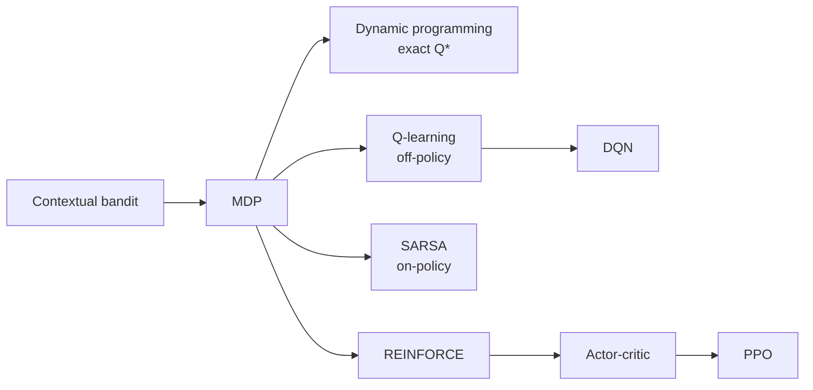

# Start Here

Welcome. This showcase teaches reinforcement learning and deep RL through one small, fully
inspectable domain: a synthetic **student-support intervention policy**. Every concept is backed by
code you can read in one sitting and an artifact (a CSV or Markdown file) you can open and check.

If you read nothing else, read this page, then [the algorithm ladder](algorithm-ladder.md).

> **Shortest path** (just want the gist?): run `make smoke`, read `artifacts/concepts/mdp_spec.md`,
> then open three artifacts — `artifacts/bandit/regret_trace.csv` (exploration), `artifacts/dp/q_learning_gap.csv`
> (learning vs. the exact optimum), and `artifacts/eval/policy_comparison.csv` (which policy wins, and
> why reward alone can mislead). The guides below go deeper, with full equations.

## The big idea: a ladder, one new concept per rung



Each rung changes exactly one idea, so you can always say what was preserved and what changed.

## Repository map

| Directory | What's in it |
|---|---|
| `src/student_support_rl/` | The library: the MDP, the algorithms, evaluation, reporting. Every module/class/function is documented. |
| `scripts/` | Thin CLI runners — one per concept — that turn the library into artifacts. |
| `tests/` | Tests that double as executable documentation of each algorithm's properties. |
| `docs/` | These guides. Concepts, equations, exercises. |
| `artifacts/` | Generated outputs you inspect to *see* each concept (created by `make run` / `make smoke`; the optional DQN/PPO comparison needs `make sync-drl` first). |

## Run it once

```bash
cd projects/student-support-rl-showcase
make sync          # install dependencies
make smoke         # fast end-to-end run (<60s) — generates every required artifact
make verify        # check the artifact contract holds
```

> The optional DQN/PPO comparison artifacts (`artifacts/drl_optional/…`) are produced only if you
> first install the extras with `make sync-drl`; otherwise that step writes a short fallback note and
> the core path continues unaffected.

`make run` does the full-fidelity run; `make run-all` does it in a single process. Each rung also
has its own target (`make run-bandit`, `make run-q-learning`, `make run-dp`, `make run-sarsa`,
`make run-reinforce`, …) — see `make help`.

## The map: concept → guide → code → artifact to inspect

| Concept | Guide | Code | Open this artifact |
|---|---|---|---|
| MDP, state/action/reward/transition | [mdp-and-environment](mdp-and-environment.md) | `environment.py` | `artifacts/mdp/sample_episodes.csv` |
| Exploration vs exploitation, regret | [exploration-and-bandits](exploration-and-bandits.md) | `bandit.py` | `artifacts/bandit/regret_trace.csv` |
| Exact optimum by dynamic programming | [value-based-learning](value-based-learning.md) | `dynamic_programming.py` | `artifacts/dp/optimal_action_values.csv` |
| Q-learning (off-policy TD) | [value-based-learning](value-based-learning.md) | `q_learning.py` | `artifacts/q_learning/training_curve.csv` |
| …vs the optimum (does it converge?) | [value-based-learning](value-based-learning.md) | `dynamic_programming.py` | `artifacts/dp/q_learning_gap.csv` |
| SARSA (on-policy TD) | [value-based-learning](value-based-learning.md) | `sarsa.py` | `artifacts/sarsa/training_curve.csv` |
| Policy gradient (REINFORCE) | [policy-gradient-and-actor-critic](policy-gradient-and-actor-critic.md) | `policy_gradient.py` | `artifacts/policy_gradient/training_curve.csv` |
| Deep RL: DQN, PPO (optional) | [deep-rl](deep-rl.md) | `drl.py` | `artifacts/drl_optional/rl_family_comparison.csv` |
| Reward design & reward hacking | [reward-design-and-hacking](reward-design-and-hacking.md) | `reward_design.py` | `artifacts/reward/reward_hacking_report.md` |
| Offline evaluation & governance | [evaluation-and-governance](evaluation-and-governance.md) | `evaluation.py`, `reporting.py` | `artifacts/eval/policy_comparison.csv` |

## Suggested reading order

1. **This page**, then [algorithm-ladder](algorithm-ladder.md) for the narrative arc.
2. [mdp-and-environment](mdp-and-environment.md) — the problem we're solving. Open
   `artifacts/concepts/mdp_spec.md` and one episode in `artifacts/mdp/sample_episodes.csv`.
3. [exploration-and-bandits](exploration-and-bandits.md) — the one-step warm-up and **regret**.
4. [value-based-learning](value-based-learning.md) — the core: exact `Q*` by dynamic programming,
   then Q-learning and SARSA, then the **gap** between learned and optimal.
5. [policy-gradient-and-actor-critic](policy-gradient-and-actor-critic.md) — optimizing the policy
   directly (REINFORCE), and how PPO scales it up.
6. [deep-rl](deep-rl.md) — function approximation, experience replay, target networks (optional lane).
7. [reward-design-and-hacking](reward-design-and-hacking.md) — why a good-looking reward can be wrong.
8. [evaluation-and-governance](evaluation-and-governance.md) — judging policies beyond reward, and
   the deploy / shadow / reject decision.
9. [exercises](exercises.md) — test yourself (solutions included).

## Reference, anytime

- [glossary](glossary.md) — every term, defined, with a pointer to where it lives in the code.
- [math-notes](math-notes.md) — the equation appendix; every algorithm's defining equation.
- [learning-guide](learning-guide.md) — beginner / core / advanced / business reading tracks.

## Using this for an assignment

This is a *teaching artifact*, not a template to copy. Read [anti-copy-policy](anti-copy-policy.md)
and [assignment-transfer-guide](assignment-transfer-guide.md): transfer the **design pattern** to a
materially different domain, don't reuse this one's environment, state, actions, or reward.
