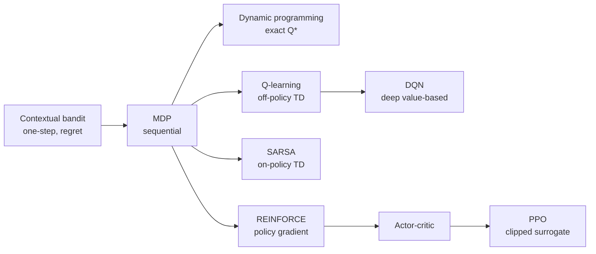

# Algorithm Ladder

This project is designed as a ladder, not a bag of disconnected RL buzzwords.

Each rung changes one idea at a time; the per-concept guides linked at the bottom go deep on each.

## 1. Contextual bandit

Start here when you want one decision at a time.

- Input: a student context such as engagement, completion, pressure, and prior interventions.
- Output: one action for that context.
- Key idea: there is no long trajectory to plan over, so the learning problem is about exploration and regret.

In this showcase, the contextual bandit is the warm-up before the MDP. It helps answer: "Which intervention looks best for this kind of student state right now?"

## 2. Tabular Q-learning

Move here when actions change future states.

- Input: the current MDP state.
- Output: an action value for each action.
- Key idea: use the Bellman update to learn long-term value, not just immediate payoff.

This is the first truly sequential control method in the showcase.

## Two value-based siblings the diagram shows: dynamic programming and SARSA

Both share Q-learning's value-based core and are covered in depth in
[value-based-learning.md](value-based-learning.md):

- **Dynamic programming** solves the *known* finite-horizon MDP exactly by backward induction,
  yielding the optimal `Q*`. It needs the model (transition + reward) that model-free Q-learning
  never sees — so it is the ground truth Q-learning is measured against
  (`artifacts/dp/q_learning_gap.csv`).
- **SARSA** is Q-learning's *on-policy* sibling: it bootstraps from the action it actually takes
  next under its ε-greedy policy, `Q(s', A')`, rather than the greedy `max_a' Q(s', a')`.

## 3. DQN

DQN keeps the Q-learning idea but changes the function approximator.

- Tabular Q-learning stores one value per state-action pair.
- DQN learns a neural approximation to the Q-function.

That matters when states are continuous, high-dimensional, or too numerous for a compact table.

## 4. Policy gradients

Policy-gradient methods change the learning target.

- Instead of learning values first and then deriving a policy, they optimize the policy directly.
- This makes stochastic policies more natural and opens the door to richer policy classes.

## 5. Actor-critic

Actor-critic methods combine two roles:

- the actor updates the policy,
- the critic estimates value information to guide the actor.

This usually makes direct policy optimization more stable than a plain policy-gradient update.

## 6. PPO

PPO is the actor-critic method used in this showcase.

- It is a policy-gradient algorithm.
- It uses an actor and a critic.
- It adds clipped updates so each policy step is less aggressive.

That makes PPO a useful teaching bridge from small custom RL examples to common DRL tooling.

## How to inspect the ladder in this project

- Contextual bandit: `artifacts/bandit/reward_trace.csv` and `artifacts/bandit/regret_trace.csv`
- Q-learning: `artifacts/q_learning/training_curve.csv` and `artifacts/q_learning/q_table.csv`
- Same-environment comparison: `artifacts/drl_optional/rl_family_comparison.csv`
- Per-scenario comparison: `artifacts/drl_optional/scenario_rollups.csv`
- Policy-gradient and actor-critic notes: `artifacts/drl_optional/policy_gradient_notes.md`

## The teaching connection

The intended progression is:

`contextual bandit -> tabular Q-learning -> DQN -> policy gradients -> actor-critic -> PPO`

Each step changes one important idea at a time, so students can say what was preserved and what changed.

## See also (per-concept deep dives)

- [MDP and environment](mdp-and-environment.md)
- [Exploration and bandits](exploration-and-bandits.md)
- [Value-based learning (DP, Q-learning, SARSA)](value-based-learning.md)
- [Deep RL (function approximation, DQN)](deep-rl.md)
- [Policy gradients and actor-critic](policy-gradient-and-actor-critic.md)
- [Reward design and hacking](reward-design-and-hacking.md)
- [Evaluation and governance](evaluation-and-governance.md)
- Reference: [glossary](glossary.md) · [math notes](math-notes.md) · [exercises](exercises.md)
