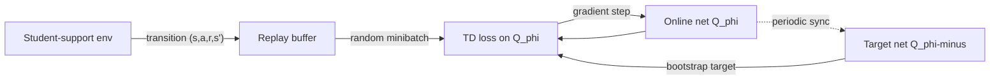
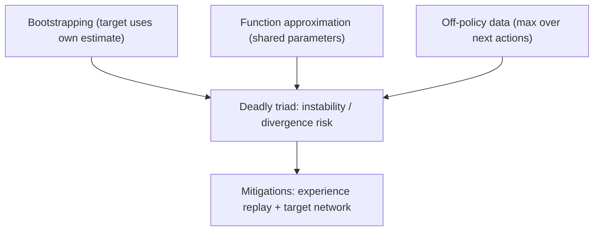

# Deep Value-Based RL: DQN, Function Approximation, and the Deadly Triad

## 1. Intuition

Tabular Q-learning ([value-based-learning.md](value-based-learning.md)) stores one number per
state-action pair. That works here only because the student-support MDP is small and discrete. The
moment the state is continuous, high-dimensional, or simply too large to enumerate, the table stops
being an option — and, worse, a table can never *generalize*: visiting `(s, a)` tells it nothing
about a nearby `(s', a)` it has not yet seen. **Deep value-based RL** replaces the table with a
parameterized function `Q_φ(s, a)` (a neural network) that is fit by regression toward the same
Bellman-optimality target Q-learning already uses. The function shares parameters across states, so
experience at one state updates the estimate everywhere similar. **DQN** (Deep Q-Network) is the
canonical instance: it is the rung directly above tabular Q-learning on the ladder
(contextual bandit -> MDP -> Q-learning -> **DQN** -> policy gradient -> actor-critic -> PPO), and
it is the showcase's bridge from the from-scratch tabular methods into a deep-RL library. The catch:
combining function approximation with the bootstrapped, off-policy Q-learning target is *unstable by
default*, so DQN earns its stability from two engineering tricks — experience replay and a target
network — and even then it is markedly harder to tune and reproduce than the tabular code.

## 2. Core mechanism

### From a table to a function

Tabular Q-learning treats `Q(s, a)` as a lookup. DQN treats it as the output of a network with
parameters `φ`, written `Q_φ(s, a)`. The control objective is unchanged from §2 and §5 of
[math-notes.md](math-notes.md): we still want the Bellman-optimality fixed point

```
Q*(s,a) = E[ R_{t+1} + γ·max_{a'} Q*(S_{t+1}, a') | S_t=s, A_t=a ]
```

The difference is purely *representational*. Tabular Q-learning nudges a single cell toward the
target with step size `α`; DQN instead treats the same target as a regression label and fits `Q_φ`
to it by minimizing squared error. The TD error `δ = target − Q(s,a)` (§4 of
[math-notes.md](math-notes.md)) survives intact — it is now the per-sample residual that the
network's gradient step shrinks, rather than a value added directly to a cell.

### The DQN loss

DQN minimizes the expected squared TD error over transitions `(s, a, r, s')` drawn from a replay
buffer, bootstrapping the target from a *separate* set of weights `φ⁻`:

```
L(φ) = E_{(s,a,r,s')~buffer} [ ( r + γ·max_{a'} Q_{φ⁻}(s',a')  −  Q_φ(s,a) )² ]
```

Read the three pieces against what you already know:

- `r + γ·max_{a'} Q_{φ⁻}(s',a')` is exactly the Q-learning target of §5 — reward after acting
  (`R_{t+1} = r` in the notation of [math-notes.md](math-notes.md)) plus discounted greedy next
  value. At a terminal step the bootstrap term drops and the target is just `r`.
- `Q_φ(s,a)` is the current estimate being corrected.
- The squared difference is `δ²`; gradient descent on `L(φ)` moves `Q_φ` toward the target, the
  function-approximation analogue of the tabular `Q ← Q + α·δ`.

This loss is stated once, canonically, in §10 of [math-notes.md](math-notes.md); see there for the
full framing rather than re-deriving here.

### The two stabilizers

A naive "neural Q-learning" — fit `Q_φ` online to a target computed from `Q_φ` itself on the most
recent transition — tends to diverge. DQN adds two fixes:

- **Experience replay.** Store each transition in a buffer and train on *random minibatches* drawn
  from it. Consecutive environment steps are heavily correlated (the student's state drifts slowly
  week to week); sampling at random **decorrelates** the data the optimizer sees, which is closer to
  the i.i.d. assumption supervised regression relies on, and it lets each transition be *reused*
  across many updates instead of being seen once and discarded.
- **Target network.** Compute the bootstrap target from a slowly-updated copy of the network,
  `Q_{φ⁻}`, whose weights are frozen (or Polyak-averaged) and only periodically synced to `φ`. This
  is why the loss above writes `Q_{φ⁻}`, not `Q_φ`, inside the target. Without it the regression
  label moves every time you update the thing you are fitting — the target *chases its own tail* —
  and the optimization becomes a moving-target problem. Freezing `φ⁻` gives a stable label for a
  while, turning each phase of learning into ordinary supervised regression.



### The deadly triad

DQN combines three ingredients, each individually fine, that are *jointly* prone to instability and
even divergence. Sutton & Barto call this the **deadly triad**:

1. **Bootstrapping** — the target depends on the model's own current estimate (`γ·max_{a'} Q(s',·)`),
   not a full Monte-Carlo return. Errors in the estimate feed back into the target.
2. **Function approximation** — one shared `φ` represents `Q` everywhere, so an update aimed at one
   state perturbs the values of others; the corrections are no longer local the way a table's are.
3. **Off-policy learning** — the `max_{a'}` makes DQN learn the *greedy* policy's values while
   behaving ε-greedily (the off-policy property inherited from Q-learning; see the off-policy/
   on-policy contrast in §6 of [math-notes.md](math-notes.md)). The states the buffer covers are
   therefore drawn from a different distribution than the policy being evaluated.

Tabular Q-learning has (1) and (3) but **not** (2), and it converges to `Q*` under standard
conditions. Add function approximation and those guarantees evaporate: the combination can diverge,
and there is no general convergence proof. Replay and the target network are precisely the
mitigations that make the triad behave well enough to train in practice — they do not make it
provably safe.



### Why DRL is harder to tune and reproduce

The cost of leaving the table is fragility. The tabular methods in this repo are essentially
hyperparameter-light and deterministic given a seed (the transition is deterministic; only the start
state is jittered — see §11 of [math-notes.md](math-notes.md)). DQN adds buffer size, batch size,
`learning_starts`, train frequency, gradient steps per update, the target-sync schedule, the network
architecture and its weight initialization, the optimizer and its learning rate, and the
exploration schedule (`exploration_fraction`, `exploration_final_eps`). Performance can swing widely
across seeds at fixed hyperparameters, the bootstrapped objective is non-stationary, and small
changes in any of these knobs can flip a run from learning to diverging. This is why deep-RL results
are notoriously sensitive and why this showcase keeps the *inspectable* mechanism in the tabular
modules and treats the deep stage as an optional black box.

## 3. In this showcase

**This stage is OPTIONAL and a black box by design.** The from-scratch, fully-inspectable mechanism
lives in the tabular modules ([`q_learning.py`](../src/student_support_rl/q_learning.py) for
value-based control, [`policy_gradient.py`](../src/student_support_rl/policy_gradient.py) for the
policy-gradient counterpart). The deep stage delegates replay buffers, target networks, neural
approximators, and optimizers to **Stable-Baselines3** — you will not find a hand-written replay
buffer or target-network sync in this repo, because the teaching value of those internals is already
delivered by the tabular code, and reimplementing SB3 would add noise, not insight.

What to open:

- **[`drl.py`](../src/student_support_rl/drl.py)** — `run_drl_comparison` wraps the student-support
  MDP as a `gymnasium.Env` and trains SB3's `DQN` and `PPO` on it, then evaluates both against the
  tabular Q-learning baseline on the **same** scenarios, horizon, and seed family. Look at the
  `build_model("dqn")` branch: `buffer_size`, `batch_size`, and `learning_starts` configure
  **experience replay**; the **target network** is maintained internally by SB3 (you will not see it
  in the source — that is the black-box boundary). Note `gamma=0.95` here versus `0.9` in the
  tabular code (§ Notation in [math-notes.md](math-notes.md)). Note too the `GymStudentSupportEnv`
  exposes a **6-dim normalized `Box`** observation (`as_normalized_vector`) and a `Discrete(4)`
  action space — this normalized feature vector is the input `s` to `Q_φ`, the concrete face of
  function approximation in this codebase. The dependencies are loaded lazily and a missing stack
  raises `OptionalDRLError` so the tabular path still runs without PyTorch/SB3 installed.
- **`artifacts/drl_optional/rl_family_comparison.csv`**
  — the head-to-head summary, one row per policy, each tagged with a `family`
  (`deep_value_based` for DQN, `actor_critic_policy_gradient` for PPO, `tabular_value_based` for
  Q-learning). This is the artifact to read first: it lets you compare the deep value-based method
  against the deep actor-critic method and the tabular baseline on identical test conditions.
- **`artifacts/drl_optional/training_summary.csv`**
  — the deep agents' learning trace (mean reward / mean final risk sampled at each training chunk).
  Read it to *see* the instability discussed above: the DQN reward column is non-monotonic across
  steps, a concrete reminder that the bootstrapped, function-approximated objective does not descend
  cleanly the way the tabular training curve does.

**Honest reading of the numbers.** Read the actual ordering off the CSV rather than assuming one — it
depends on the seed, the training budget, and tuning. In the checked-in run the deep agents happen to
edge out the tabular baseline (PPO `0.61`, DQN `0.34`, tabular Q-learning `−3.62` average reward), but
do **not** over-read that single result: the hyperparameters are deliberately tiny (a 512-transition
buffer, 32-step rollouts) and both deep agents train for only a few thousand steps on five scenarios,
so this is a fast demo, not a tuned benchmark. The real lesson is methodological — on a small,
fully-observed MDP like this one a tabular method is often competitive with (and can beat) an
under-budgeted deep method, and the ranking can flip with more training or tuning. Deep methods earn
their keep when the state space defeats a table, which is not the regime here. Treat these artifacts
as an illustration of the machinery and its fragility, not as evidence about which algorithm is "best."

## 4. Caveats

- **Black box by intent.** The stabilizers (replay, target network), the network architecture, and
  the optimizer all live inside Stable-Baselines3. You can read *that* DQN uses them in
  [`drl.py`](../src/student_support_rl/drl.py); you cannot step through *how* from this repo. For the
  step-by-step mechanism, study the tabular update in
  [`q_learning.py`](../src/student_support_rl/q_learning.py).
- **No convergence guarantee.** Unlike tabular Q-learning (which converges to `Q*` under standard
  visitation/step-size conditions, §11 of [math-notes.md](math-notes.md)), the deadly-triad
  combination has no general convergence proof. Replay and the target network are heuristics, not a
  fix.
- **Reproducibility is best-effort.** `run_drl_comparison` seeds Python, NumPy, and PyTorch (via
  `_seed_torch_if_available`, which also requests deterministic kernels when available), but
  deep-RL determinism is still subject to backend non-determinism, hardware, and library versions in
  ways the tabular code is not.
- **Toy hyperparameters.** As above, the configured budgets are sized for a fast teaching demo. The
  comparison shows the *shape* of deep value-based learning on this MDP, not a fair or tuned
  benchmark — and it is not a claim that DQN underperforms PPO or Q-learning in general.
- **Evaluation is simulator-based, not OPE.** Every policy here is scored by re-running it in the
  known environment (see [evaluation-and-governance.md](evaluation-and-governance.md) and §11 of
  [math-notes.md](math-notes.md)), not by off-policy evaluation from logged real data.

## See also

- [value-based-learning.md](value-based-learning.md) — tabular Q-learning and SARSA, the
  inspectable mechanism this guide deepens.
- [policy-gradient-and-actor-critic.md](policy-gradient-and-actor-critic.md) — the policy-gradient /
  actor-critic side of the ladder; PPO is the deep actor-critic that
  [`drl.py`](../src/student_support_rl/drl.py) compares against DQN.
- [mdp-and-environment.md](mdp-and-environment.md) — the MDP that `GymStudentSupportEnv` wraps for
  the deep agents.
- [exploration-and-bandits.md](exploration-and-bandits.md) — where ε-greedy exploration (annealed
  in DQN via `exploration_fraction`) is introduced.
- [evaluation-and-governance.md](evaluation-and-governance.md) — how the cross-method comparison is
  scored, and reproducibility caveats.
- [exercises.md](exercises.md) — practice problems.
- [glossary.md](glossary.md) — definitions (DQN, experience replay, target network, function
  approximation, bootstrapping, deadly triad).
- [math-notes.md](math-notes.md) — full notation and derivations; §10 for the DQN loss, §5 for the
  Q-learning target it inherits.
