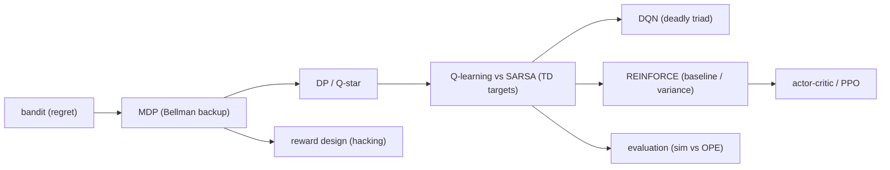

# Exercises — Work the Ladder by Hand and in Code

**One-paragraph intuition.** Reading about RL and *doing* RL are different skills. These exercises
make you compute the objects the rest of the showcase only describes: a Bellman backup, a TD target,
a regret sum, a policy-gradient variance argument. They walk the ladder
(contextual bandit → MDP → Q-learning → DQN → policy gradient → actor-critic → PPO) in three flavours
— **(a) pencil-and-paper** (you can do them with the numbers on this page), **(b) code/inspection**
(open an artifact or flip a flag and predict the effect), and **(c) conceptual short-answer** (state
a distinction precisely). Equations follow [math-notes.md](math-notes.md) (reward after acting
`R_{t+1}`; discount `γ`; action value `Q(s,a)`; TD error `δ = target − Q`); terms are defined in
[glossary.md](glossary.md). Every solution cross-links the exact code module or artifact it rests on,
and flags where a number is **seed/scenario dependent** rather than a theorem.

> **How to run the code tasks.** From the project root, generate the artifacts with `make smoke`
> (fast) or `make run` (full), then open files under `artifacts/`. For the "flip a flag" tasks,
> import the training function and call it directly (e.g. in a REPL with `PYTHONPATH=src`), or edit
> the call site in `scripts/` that produces the artifact. Concrete numbers quoted in the solutions
> come from the checked-in artifacts at the default seed (`seed=7`) and **will move** if you change
> the seed, episode count, or scenario mix — the *direction* of each effect is the point, not the
> third decimal.



The map above is also the rough order of the exercises: warm up on the bandit, build up the MDP and
its exact solution, contrast the two TD methods, then move to deep RL, policy gradients, reward
design, and evaluation. Solutions are in the **[Solutions](#solutions)** section at the bottom — try
each one before scrolling.

---

## Part A — Pencil-and-paper

### Exercise 1 — One Bellman optimality backup by hand *(MDP / DP)*

The medium-risk student's week-1 state is `s = (week=1, eng=2, comp=2, pres=2, risk=2, prior=0)`.
You are told two facts about the **deterministic** dynamics and the aligned `default_reward`
(see [mdp-and-environment.md](mdp-and-environment.md)):

- Taking **action 1** (`resource_email`) from `s` yields reward `R_{t+1} = 3.2` and lands in
  `s' = (2, 3, 3, 2, 1, 1)`.
- The successor's optimal value is `max_{a'} Q*(s', a') = 3.2`.

Using `γ = 0.9` and the finite-horizon optimality backup from §3 of [math-notes.md](math-notes.md),
compute `Q*(s, action=1)`. Then, given that the full optimal row is
`Q*(s, ·) = [4.782, 6.08, 5.82, 5.32]` for actions `0,1,2,3`, name the optimal action `π*(s)` and
state the one-sentence moral.

### Exercise 2 — SARSA vs Q-learning target for one transition *(value-based)*

An agent observes the transition `(S_t, A_t, R_{t+1}, S_{t+1})` with `R_{t+1} = 6.0`,
`A_t = 3` (`advisor_meeting`), and a **non-terminal** `S_{t+1}`. Its current table holds
`Q(S_t, 3) = 2.0` and the next-state row `Q(S_{t+1}, ·) = [1.0, 4.0, 0.5, −2.0]`. The behaviour
policy is ε-greedy and on *this* step it will explore, taking `A_{t+1} = 0`. With `γ = 0.9` and
`α = 0.35`:

1. Write the **Q-learning** target and its TD error `δ`, then the updated `Q(S_t, 3)`.
2. Write the **SARSA** target and its TD error `δ`, then the updated `Q(S_t, 3)`.
3. Which update is larger here, and what does the difference say about *what each method is
   estimating*? Reference §5–§6 of [math-notes.md](math-notes.md).

### Exercise 3 — Cumulative regret for a short bandit trace *(bandit)*

A contextual bandit plays five rounds. Per round you are given the expected reward of the **chosen**
arm `μ_{a_t}(x_t)` and of the **optimal** arm `μ*(x_t)` (these are knowable only because the reward
model is synthetic — see [exploration-and-bandits.md](exploration-and-bandits.md)):

| step | `μ*(x_t)` | `μ_{a_t}(x_t)` |
|---|---|---|
| 1 | 0.70 | 0.48 |
| 2 | 0.65 | 0.65 |
| 3 | 0.60 | 0.40 |
| 4 | 0.80 | 0.80 |
| 5 | 0.55 | 0.50 |

Compute the **instantaneous regret** each step and the **cumulative regret** `Regret_5` using the
definition in §7 of [math-notes.md](math-notes.md). Two of the rows have zero regret — explain in one
sentence what that means about the agent's choice, and why a *Bernoulli reward of 0* on a zero-regret
step would **not** add to regret.

### Exercise 4 — A two-step return, by hand *(MDP)*

A length-2 episode produces rewards `R_2 = 6.0` then `R_3 = 0.0` (this is the opening of the
checked-in high-risk trace in `artifacts/mdp/sample_episodes.csv`: an advisor meeting that resolves
the student, followed by a no-op). With `γ = 0.9`, compute the discounted return `G_1` and `G_2` from
the return definition in §1 of [math-notes.md](math-notes.md). Then state how the **undiscounted**
episode return reported by `evaluation.py` (`G_t = Σ_k R_{t+k+1}` with no `γ`) would differ, and why
that choice is defensible for a fixed horizon of `H = 6`.

---

## Part B — Code / inspection

### Exercise 5 — Where (and why) is the Q-learning gap largest? *(value-based / DP)*

Open `artifacts/dp/q_learning_gap.csv` (produced by `dynamic_programming.gap_rows`, comparing the
learned table from `q_learning.py` against exact `Q*`). Sort by `abs_gap` descending and inspect the
top ~10 rows. Answer:

1. What do the largest-gap states have in common in their `prior_interventions` and `learned_q_value`
   columns?
2. Why is `optimal_q_value` strongly **negative** there, while `learned_q_value` is exactly `0.0`?
3. Why is this *expected* rather than a bug — i.e. why does honest tabular Q-learning leave these
   entries wrong? Tie your answer to the convergence caveat in §11 of [math-notes.md](math-notes.md).

### Exercise 6 — Turn off the REINFORCE baseline and predict the effect *(policy gradient)*

`policy_gradient.train_reinforce` takes `use_baseline: bool = True`; with it on, the baseline `b` is
the **episode-mean return** subtracted from each `G_t` (see §8 of [math-notes.md](math-notes.md) and
[policy-gradient-and-actor-critic.md](policy-gradient-and-actor-critic.md)). Before running anything:

1. Predict what happens to the **variance** of the gradient updates when you set
   `use_baseline=False`, and why the optimum it converges to is (in expectation) **unchanged**.
2. Now run both settings, e.g.
   ```
   from student_support_rl.policy_gradient import train_reinforce
   on  = train_reinforce(use_baseline=True)
   off = train_reinforce(use_baseline=False)
   ```
   and compare the `total_reward` columns of the two `training_curve`s (the on-baseline curve is also
   dumped to `artifacts/policy_gradient/training_curve.csv`). What do you expect to see in the
   *roughness* of the curves, and what is the honest caveat about reading variance off a single seed?

### Exercise 7 — Add an exploration bonus to the bandit and measure regret *(bandit)*

The bandit in `bandit.py` is **plain ε-greedy ridge regression — not LinUCB**: the exploit branch
maximizes `θ_aᵀx` with **no** optimism bonus (see the `_estimated_reward` docstring and §7 of
[math-notes.md](math-notes.md)). As an experiment, add a crude count-based optimism bonus to the
exploit score — replace the greedy key with `θ_aᵀx + c / sqrt(counts[a] + 1)` for a small `c` (e.g.
`c = 0.1`) — keeping everything else fixed, and re-run `run_bandit_experiment`.

1. Read the final `cumulative_regret` from the last row of `artifacts/bandit/regret_trace.csv` for the
   baseline (it is ≈ 14.15 at `steps=120`, `seed=7`).
2. Predict the **direction** the bonus should push regret and *why* (think about which arm gets
   over-explored vs under-explored), then check against your modified run.
3. State honestly why this is **not** a fair benchmark of UCB, and what you'd need to claim an
   `O(√T)` regret rate.

### Exercise 8 — The learned policy is not strictly dominant *(evaluation / governance)*

Open `artifacts/eval/policy_comparison.csv` (from `evaluation.evaluate_policies`). The rows are sorted
by `avg_reward`, so `q_learning` is on top. But scan the **whole metric vector**, not just reward:

1. Compare `avg_unsafe_or_questionable_decisions` for `q_learning` vs `heuristic`. Which is *worse* on
   that axis, and by how much?
2. Look up how that metric is defined in `evaluation.evaluate_policies` (the `unsafe_or_questionable`
   counter) and explain, in MDP terms, what behaviour it is catching.
3. Why does this vindicate the module's design choice to report a **vector** of metrics rather than a
   single scalar reward? Connect to [evaluation-and-governance.md](evaluation-and-governance.md).

### Exercise 9 — Read the reward-hacking rank reversal *(reward design)*

Open `artifacts/reward/reward_hacking_report.md` (from `reward_design.reward_hacking_report`). It lists
four `avg_reward` numbers: `advisor_heavy` and `heuristic`, each under the **bad** proxy reward and the
**good** aligned reward.

1. Write the two rankings (best-first) under each reward and identify the **rank reversal**.
2. Point to the specific term in `reward_design.bad_reward` that *causes* `advisor_heavy` to win under
   the proxy, and the specific term(s) in `environment.default_reward` that punish it under the aligned
   reward.
3. Define **reward hacking** using exactly this example. See
   [reward-design-and-hacking.md](reward-design-and-hacking.md).

---

## Part C — Conceptual short-answer

### Exercise 10 — Off-policy vs on-policy in two sentences *(value-based)*

State precisely what makes Q-learning **off-policy** and SARSA **on-policy**, naming the one symbol in
each method's target that differs. Then answer: in this showcase, both are run with the *same*
ε-greedy behaviour and decay schedule — so when would you nonetheless *expect* their learned value
functions to differ, and is that gap guaranteed? (See §5–§6 and §11 of
[math-notes.md](math-notes.md).)

### Exercise 11 — Why is the bad reward hackable? *(reward design)*

Without re-reading the artifact, explain *structurally* why `reward_design.bad_reward` is exploitable.
Name its three defects (relative to `default_reward`) and, for each, name the agent behaviour it fails
to penalize. Why does "the agent optimizes the reward you wrote, not the one you meant" make this an
**alignment** problem rather than a bug in the learner? See
[reward-design-and-hacking.md](reward-design-and-hacking.md).

### Exercise 12 — Why is simulator evaluation not OPE? *(evaluation)*

`evaluation.py` re-simulates each policy inside the **known** `StudentSupportEnvironment`. Explain why
this is *not* off-policy evaluation (OPE), what OPE actually requires as input, and one concrete way a
policy that looks excellent in `artifacts/eval/policy_comparison.csv` could still fail on real
students. See the honesty note in §11 of [math-notes.md](math-notes.md) and
[evaluation-and-governance.md](evaluation-and-governance.md).

### Exercise 13 — Where does DQN re-use tabular Q-learning, and what breaks? *(deep RL)*

DQN keeps the Q-learning target of §5 but swaps the table for a network `Q_φ` (see
[deep-rl.md](deep-rl.md) and §10 of [math-notes.md](math-notes.md)). State which part of the tabular
update DQN reuses **verbatim** and which two stabilizers it must add — and name the "deadly triad" the
stabilizers exist to tame. Why is none of this needed in `q_learning.py`?

---

## Solutions

> **Honesty reminder.** Numbers quoted from `artifacts/` are at the default seed (`seed=7`). Behavioural
> results — training-curve roughness, regret totals, which metric a learned policy "wins" — are
> **seed/scenario dependent**. The arithmetic identities (Exercises 1–4) are exact; the empirical
> claims (5–9) state a *direction* you should reproduce, not a guaranteed constant.

### Solution 1

Apply the finite-horizon optimality backup (§3, [math-notes.md](math-notes.md)),
`Q*(s,a) = R_{t+1} + γ·max_{a'} Q*(s', a')` (the future term is non-zero because `s'` is
non-terminal):

```
Q*(s, 1) = 3.2 + 0.9 · 3.2 = 3.2 + 2.88 = 6.08
```

This matches the given row `Q*(s,·) = [4.782, 6.08, 5.82, 5.32]`, whose max is at **action 1**, so
`π*(s) = 1` (`resource_email`). **Moral:** the optimal action is the *cheap* email, not the costliest
`advisor_meeting` (action 3, value 5.32). The aligned reward charges `ACTION_COSTS` and an
over-intervention penalty, so escalating harder is not optimal — exactly the property
`environment.default_reward` is engineered to produce. You can reproduce the full row with
`dynamic_programming.optimal_action_values()` and read it from
`artifacts/dp/optimal_action_values.csv`.

### Solution 2

TD error and update are `δ = target − Q(S_t,A_t)`, `Q ← Q + α·δ` (§4, [math-notes.md](math-notes.md)),
with `Q(S_t,3) = 2.0`, `γ = 0.9`, `α = 0.35`.

**Q-learning** bootstraps from the greedy next value `max_{a'} Q(S_{t+1},a') = max[1,4,0.5,−2] = 4.0`:

```
target = 6.0 + 0.9 · 4.0 = 9.6
δ      = 9.6 − 2.0 = 7.6
Q(S_t,3) ← 2.0 + 0.35 · 7.6 = 4.66
```

**SARSA** bootstraps from the *actually chosen* `A_{t+1}=0`, i.e. `Q(S_{t+1},0) = 1.0`:

```
target = 6.0 + 0.9 · 1.0 = 6.9
δ      = 6.9 − 2.0 = 4.9
Q(S_t,3) ← 2.0 + 0.35 · 4.9 = 3.715
```

The Q-learning update is **larger** (`4.66` vs `3.715`) because its target uses the *best* next action
(`max`, value 4.0) while SARSA folds in the cost of the exploratory `A_{t+1}=0` (value 1.0). This is
the whole off-policy/on-policy seam: Q-learning estimates the value of the **greedy** policy `Q*`;
SARSA estimates the value of the **behaviour** policy it actually follows, exploration included. Code:
the `max(q_table[next_key])` line in `q_learning.py` vs `q_table[next_key][next_action]` in `sarsa.py`.

### Solution 3

Instantaneous regret is `μ*(x_t) − μ_{a_t}(x_t)` (§7, [math-notes.md](math-notes.md)):

| step | regret |
|---|---|
| 1 | 0.70 − 0.48 = 0.22 |
| 2 | 0.65 − 0.65 = 0.00 |
| 3 | 0.60 − 0.40 = 0.20 |
| 4 | 0.80 − 0.80 = 0.00 |
| 5 | 0.55 − 0.50 = 0.05 |

```
Regret_5 = 0.22 + 0.00 + 0.20 + 0.00 + 0.05 = 0.47
```

Zero regret on steps 2 and 4 means the agent **chose the optimal arm** (`a_t = a*`), so it lost nothing
*in expectation* relative to the oracle. A *sampled* Bernoulli reward of 0 on such a step still adds
**nothing** to regret: regret is defined on the **expected** rewards `μ`, not the realized draw — the
agent is judged on the quality of its decision, not on the coin flip. This is exactly how
`bandit.run_bandit_experiment` accumulates `cumulative_regret` (it uses `expected_rewards`, never the
sampled `reward`); inspect `artifacts/bandit/regret_trace.csv`. See
[exploration-and-bandits.md](exploration-and-bandits.md).

### Solution 4

From `G_t = Σ_{k≥0} γ^k R_{t+k+1}` (§1, [math-notes.md](math-notes.md)) with `R_2 = 6.0`, `R_3 = 0.0`,
`γ = 0.9`:

```
G_2 = R_3                = 0.0
G_1 = R_2 + γ · R_3      = 6.0 + 0.9 · 0.0 = 6.0
```

(Here `G_1` is unchanged because the second reward is zero; with a non-zero `R_3` the discount would
shrink its contribution by `0.9`.) `evaluation.py` instead sums the **undiscounted** finite-horizon
return `Σ_k R_{t+k+1}`, so it would report `6.0 + 0.0 = 6.0` for this pair — identical here, but in
general the evaluator weights a reward at week 6 the same as one at week 1. That is defensible because
the horizon is **fixed and short** (`H = 6`): there is no infinite tail to tame, and for governance you
usually care about *total* term outcome, not a present-discounted one. The agents still *train* with
`γ = 0.9` (it shapes credit assignment during learning); the discount and the reporting metric are
deliberately separate choices. Transition source: `artifacts/mdp/sample_episodes.csv`, row 1.

### Solution 5

1. The largest-gap rows are all **high-`prior_interventions` tail states** (`prior = 5, 6, 7`) and every
   one has `learned_q_value = 0.0`. (At `seed=7` the top entry is `(4,4,4,0,1,6)` action 3 with
   `optimal_q_value ≈ −17.25`, `abs_gap ≈ 17.25`.)
2. `optimal_q_value` is strongly negative because reaching `prior ≥ 5` means the student has been
   intervened on far past the threshold of 2, so `default_reward`'s `over_intervention_penalty`
   (`0.6 · max(0, prior − 2)`) plus accumulated action costs dominate — DP computes the true (bad) value
   of those states. `learned_q_value` is exactly `0.0` because Q-learning **never visited** them: a
   sensible ε-greedy run starting from the five scenarios essentially never stacks 5+ interventions, so
   those table entries keep their `0.0` initialization.
3. This is **expected, not a bug**: tabular Q-learning only converges on the state-actions it actually
   samples (§11, [math-notes.md](math-notes.md)). `Q*` from `dynamic_programming.py` is defined on the
   whole *reachable* set (via BFS), but the learner's coverage is a strict subset, so the gap is large
   precisely on the rarely/never-reached tail. The fair comparison is restricted to **shared** states —
   see `_shared_abs_gaps` in `dynamic_programming.py` — and even there the gap is non-zero because
   training is finite. See [value-based-learning.md](value-based-learning.md).

### Solution 6

1. Setting `use_baseline=False` makes `b = 0`, so the gradient weight becomes the raw return `G_t`
   instead of the centered `G_t − b`. The per-episode returns here span a wide, signed range (at
   `seed=7` the on-baseline `total_reward` column runs from roughly `−27` to `+9`), so the
   score-function estimator `(G_t − b)·∇log π` has **higher variance** — updates swing harder
   episode-to-episode. The optimum is **unchanged in expectation** because subtracting a
   state-independent (here, episode-level) baseline leaves the gradient *unbiased*:
   `E[∇log π · b] = 0`, so `b` only rescales noise, not the expected ascent direction (§8,
   [math-notes.md](math-notes.md)).
2. You should expect the **no-baseline** curve to be visibly *rougher* (larger episode-to-episode swings
   in `total_reward`) than the baseline curve. The *roughness contrast* is the prediction to look for —
   not a clean upward trend: the curve here is dominated by the fixed five-scenario cycle (every fifth
   episode is a hard high-risk start), so at a single seed the mean barely climbs over the 400 episodes.
   **Honest caveat:** variance is a property of the *update distribution*, and you are eyeballing **one
   seed** — a single run can look misleadingly smooth or jagged. To make a real claim, average several
   seeds and compare the spread of returns, not one trace. The on-baseline curve is in
   `artifacts/policy_gradient/training_curve.csv`; the `baseline` column there shows the per-episode `b`
   that the off-setting zeroes out. See [policy-gradient-and-actor-critic.md](policy-gradient-and-actor-critic.md).

### Solution 7

1. Baseline final cumulative regret is the last `cumulative_regret` cell of
   `artifacts/bandit/regret_trace.csv`: **≈ 14.15** at `steps = 120`, `seed = 7`.
2. A count-based bonus `c/√(counts[a]+1)` inflates the score of **under-pulled** arms, so early on the
   agent samples *every* arm more deliberately instead of locking onto whatever ε-greedy's first few
   exploit picks favoured. The expected direction: a well-tuned bonus **reduces** regret on contexts
   where the truly-best arm was being under-explored (it finds `a*` faster), but a too-large `c` keeps
   pulling known-suboptimal arms and **increases** regret. Which way your run moves depends on `c`, the
   seed, and the scenario cycle — verify, do not assume.
3. This is **not** a fair UCB benchmark: the bonus is an ad-hoc count term, not the
   uncertainty-of-the-estimate bonus that LinUCB derives from the ridge design matrix `A_a` (it would
   scale with `√(xᵀ A_a⁻¹ x)`, the predictive variance — see the `_estimated_reward` docstring and §7 of
   [math-notes.md](math-notes.md)). To claim an `O(√T)` regret rate you need the optimism bonus tied to
   a confidence set on `θ_a`, and you must hold exploration to that bonus alone (drop the ε coin flip),
   then show the regret curve grows sublinearly. The shipped bandit is a deliberately simple ε-greedy
   teaching baseline, not a no-regret algorithm. See [exploration-and-bandits.md](exploration-and-bandits.md).

### Solution 8

1. From `artifacts/eval/policy_comparison.csv` (`seed`/scenario defaults): `q_learning` has
   `avg_unsafe_or_questionable_decisions = 0.6667` while `heuristic` has `0.0`. On *that* axis the
   **learned policy is worse**, by about `0.67` flagged decisions per episode — even though it ranks
   first by `avg_reward` (`0.22` vs `−2.11`).
2. The counter in `evaluation.evaluate_policies` flags a decision as unsafe/questionable when the agent
   does **nothing at maximum risk** (`action == 0 and state.risk >= 3`) **or escalates to an advisor at
   minimal risk** (`action == 3 and state.risk <= 1`). In MDP terms it is catching `(s,a)` pairs where
   the chosen action is qualitatively mismatched to the state's danger level — the kind of mistake a
   pure return number can hide if the reward still nets out positive.
3. It vindicates reporting a **vector** of metrics: a policy can win on scalar reward yet still make
   governance-relevant mistakes (here, occasional needless escalation or risky inaction). Collapsing to
   one number would let that slip; surfacing `final_risk`, `over_intervention_count`,
   `escalation_count`, `unsafe_or_questionable_decisions`, and `solved_rate` keeps the trade-off legible.
   This is exactly the argument of [evaluation-and-governance.md](evaluation-and-governance.md). *(All
   figures seed/scenario dependent.)*

### Solution 9

1. From `artifacts/reward/reward_hacking_report.md`:
   - **Bad (proxy) reward** ranking: `advisor_heavy` (**10.68**) > `heuristic` (4.486).
   - **Good (aligned) reward** ranking: `heuristic` (**−2.04**) > `advisor_heavy` (−18.72).
   The ranking **reverses**: the policy that looks best under the proxy is worst under the true
   objective.
2. **Cause under the proxy:** `reward_design.bad_reward` adds `intervention_bonus = 0.45 * action`, which
   literally pays more for heavier interventions, so the always-escalate `AdvisorHeavyPolicy` (action 3
   every step) farms the maximum bonus. **Punished under the aligned reward:** `environment.default_reward`
   charges the full `ACTION_COSTS[3] = 1.2`, adds the `over_intervention_penalty`
   (`0.6 · max(0, prior − 2)`) that compounds as the advisor-heavy policy stacks interventions, and adds
   the terminal `unresolved_high_risk_penalty` — none of which the proxy levies (it even discards `done`).
3. **Reward hacking** is a policy scoring high on a flawed *proxy* reward while *degrading the true
   objective*: here, `advisor_heavy` maximizes `bad_reward` by over-intervening yet produces the worst
   real student outcomes under `default_reward`. The diagnostic signature is precisely this proxy-vs-true
   **rank reversal**. See [reward-design-and-hacking.md](reward-design-and-hacking.md).

### Solution 10

Q-learning is **off-policy** because its target uses `max_{a'} Q(s', a')` — the value of the *greedy*
next action, regardless of what the ε-greedy behaviour actually does next; that `max` is the
distinguishing symbol. SARSA is **on-policy** because its target uses `Q(s', A')` for the action `A'`
it *actually takes next*, so it evaluates the policy it follows. Even with identical ε-greedy behaviour
and decay, you'd expect the value functions to differ wherever **exploratory mistakes are costly**:
SARSA's target absorbs the cost of those exploratory `A'` moves and so can learn a more *conservative*
value function (the textbook Cliff-Walking effect). But that gap is **not guaranteed** — whether it
appears, and its sign, depends on the reward structure and the seed (see the honest hedge in the
`sarsa.train_sarsa` docstring and §6/§11 of [math-notes.md](math-notes.md)). Compare
`artifacts/q_learning/training_curve.csv` and `artifacts/sarsa/training_curve.csv` to look for it.

### Solution 11

`bad_reward` is exploitable because of three defects relative to `default_reward`:

1. **Intensity bonus** `0.45 * action` — rewards the *act* of intervening harder, not the *outcome*. It
   fails to penalize **over-intervention / always-escalating** (the `advisor_heavy` failure).
2. **Progress clipped at zero** (`max(0, progress)`) — the agent is never charged for **backsliding**, so
   it fails to penalize letting engagement/completion *drop*.
3. **`done` discarded** — fails to penalize **finishing the term with the student still at risk** (no
   `unresolved_high_risk_penalty`).

It is an **alignment** problem, not a learner bug, because every method on the ladder faithfully
*maximizes the scalar it is given*; the learner is working correctly. The error is in the **objective
specification** — "the agent optimizes the reward you wrote, not the one you meant." No better optimizer
fixes a mis-specified reward; only fixing the reward does. See
[reward-design-and-hacking.md](reward-design-and-hacking.md).

### Solution 12

It is not OPE because `evaluation.py` has **white-box access** to the environment and simply *re-runs*
each policy inside the known `StudentSupportEnvironment`. **OPE** instead estimates a target policy's
value from a **fixed log of trajectories collected by a different behaviour policy**, *without ever
running the target* — via importance sampling, doubly-robust estimators, or fitted-Q evaluation. The
inputs differ: simulator evaluation needs the *model*; OPE needs *logged data* and must correct for the
behaviour/target mismatch. **Concrete failure mode:** the simulator's hand-built dynamics
(`_transition`) and heuristic `risk` are an approximation of reality, so a policy that tops
`artifacts/eval/policy_comparison.csv` is only certified *good in this model* — on real students the
transitions could differ (e.g. an advisor meeting might help less, or fatigue hit harder), and the
ranking could change. The numbers are a comparison harness, **not a deployment certificate** (§11,
[math-notes.md](math-notes.md); [evaluation-and-governance.md](evaluation-and-governance.md)).

### Solution 13

DQN reuses the Q-learning **TD target verbatim**:
`target = R_{t+1} + γ·max_{a'} Q(s', a')` with `δ = target − Q(s,a)` (§5, [math-notes.md](math-notes.md)).
The only change is *representation* — a network `Q_φ` replaces the lookup table, and the update becomes a
**squared-error regression** toward that target (§10). DQN must add two stabilizers:
**experience replay** (train on random minibatches from a buffer, decorrelating consecutive samples) and
a **target network** `Q_{φ⁻}` (compute the bootstrap target from a slowly-updated copy so it doesn't chase
the weights being trained). These tame the **deadly triad** — the unstable combination of *bootstrapping*
+ *function approximation* + *off-policy data*. None of this is needed in `q_learning.py` because a
**table** is not a function approximator: each `Q(s,a)` is an independent cell with no generalization to
destabilize, so plain online updates converge under standard conditions. See [deep-rl.md](deep-rl.md).

---

## See also

- **Sibling guides:** [mdp-and-environment.md](mdp-and-environment.md) ·
  [exploration-and-bandits.md](exploration-and-bandits.md) ·
  [value-based-learning.md](value-based-learning.md) · [deep-rl.md](deep-rl.md) ·
  [policy-gradient-and-actor-critic.md](policy-gradient-and-actor-critic.md) ·
  [reward-design-and-hacking.md](reward-design-and-hacking.md) ·
  [evaluation-and-governance.md](evaluation-and-governance.md)
- **References:** [math-notes.md](math-notes.md) (every equation used above) ·
  [glossary.md](glossary.md) (term definitions) · [algorithm-ladder.md](algorithm-ladder.md) (the
  narrative arc these exercises traverse)
