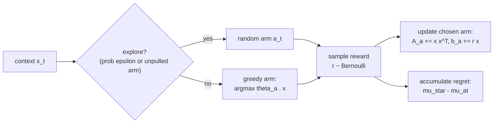

# Exploration and Contextual Bandits — the one-step warm-up

## 1. Intuition

A **contextual bandit** is the bottom rung of the RL ladder (contextual bandit → MDP →
Q-learning → DQN → policy gradient → actor-critic → PPO). It strips reinforcement learning down to
its single irreducible difficulty. Each round a context `x` arrives (a student's situation), the
agent picks **one** of four support actions, and it receives an immediate reward — then the round
ends. There is **no next state to plan for**, no transition, and no discounting: it is the
degenerate single-step special case of an MDP. What survives this stripping-down is exactly the
**exploration-vs-exploitation** trade-off. The agent must decide between repeating the action it
currently believes is best (exploit) and trying an action whose payoff it is still unsure about
(explore), because acting greedily on a half-learned model can lock you onto a mistake forever. The
bandit isolates that tension so you can study it before transitions and credit assignment arrive in
[`mdp-and-environment.md`](mdp-and-environment.md).

## 2. Core mechanism

### Estimating each action's payoff (linear / ridge regression)

The agent maintains an **independent linear model per action**. For action `a` it assumes the
expected reward is `θ_aᵀ·x` and fits `θ_a` by **ridge regression** (regularized least squares) over
the rounds in which `a` was actually played. Maintained online via a design matrix `A_a` and a
reward–feature accumulator `b_a`:

```
A_a = λ·I + Σ x·xᵀ            (sum over rounds where a was chosen)
b_a = Σ r·x                   (same rounds; r is the realized reward)
θ_a = A_a⁻¹·b_a               (ridge weight estimate)
μ̂_a(x) = θ_aᵀ·x              (predicted payoff of a in context x)
```

The regularizer `λ` seeds each matrix as `A_a = λ·I` so it is invertible **before any data
arrives** and shrinks `θ_a` toward `0` — the standard ridge effect. (Full derivation in §7 of
[math-notes.md](math-notes.md); this guide does not re-derive it.)

### Acting: ε-greedy

The agent selects an action with the **ε-greedy** rule: with probability `ε` it picks a uniformly
random action (explore); otherwise it picks the action with the highest current prediction
(exploit). A forced warm-up pulls every arm at least once first, so `μ̂_a` is never read from an
arm with zero data.

```
a_t = argmax_a μ̂_a(x_t)      with probability 1 − ε   (exploit)
a_t ~ Uniform{0,1,2,3}        with probability ε        (explore)
```

### Measuring performance: cumulative regret

You cannot score a bandit by reward alone — a high reward might still be far below what the *best*
action would have earned. The right metric is **regret**: the expected reward you *gave up* by not
always playing the optimal action. Per round you compare the optimal arm's expected reward
`μ*(x_t) = max_a μ_a(x_t)` against the expected reward of the arm you actually chose, and sum:

```
Regret_T = Σ_{t=1}^{T} [ μ*(x_t) − μ_{a_t}(x_t) ]
```

Note these are **expected** rewards `μ_a(x)`, not sampled ones — regret is defined against the
mean payoff, so it isolates the quality of the *decision* from the noise of a single Bernoulli draw.
A good learner drives the *slope* of `Regret_T` toward zero as it stops choosing poorly. The
flowchart below is one round:



## 3. Honest caveats (read this first)

- **This is ε-greedy linear bandit, NOT LinUCB.** There is **no** upper-confidence-bound / optimism
  bonus added to `μ̂_a(x)`. The greedy branch maximizes the bare point estimate `θ_aᵀ·x` —
  `A_a⁻¹` is used only to *solve* for `θ_a`, never to add a `√(xᵀ A_a⁻¹ x)` confidence width. All
  exploration comes from the `ε` coin flip (plus the one-pull warm-up), and is **independent of the
  agent's uncertainty**: a barely-tried arm and a heavily-tried arm are explored at the same rate.
  LinUCB would instead explore *more* where it is *less certain*.
- **Regret is measurable only because the reward model is synthetic.** The ground-truth means
  `μ_a(x) = σ(w_aᵀ·x)` come from fixed weights `w_a` baked into the simulator (`σ` is the logistic
  sigmoid). That oracle lets us name the optimal arm `a*` and compute exact regret. With real logged
  data you would not know `μ*` and could not compute `Regret_T` directly — you would need off-policy
  evaluation instead (see §11 of [math-notes.md](math-notes.md) and
  [`evaluation-and-governance.md`](evaluation-and-governance.md)).
- **No `O(√T)` guarantee.** Because exploration is `ε`-driven rather than optimism-driven, this
  algorithm does **not** enjoy the sublinear `O(√T)` regret bound of UCB-style methods. It is a
  deliberately simple teaching baseline, not a state-of-the-art bandit.

### Where the alternatives sit (NOT implemented here)

So you know the landscape, two principled exploration strategies this showcase does **not**
implement:

- **UCB / optimism in the face of uncertainty.** Add a confidence bonus to the estimate and act
  greedily on `μ̂_a(x) + c·√(xᵀ A_a⁻¹ x)` (this is LinUCB). Exploration is *targeted* at uncertain
  arms and decays automatically as data accumulates; yields `O(√T)` regret.
- **Thompson sampling.** Keep a posterior over each `θ_a`, sample a `θ̃_a` from it each round, and
  act greedily on the sample. Exploration is *probability-matched* to the posterior — arms more
  likely to be optimal are tried more often — without an explicit bonus term.

Both replace the blunt `ε` coin flip with uncertainty-aware exploration. The point of starting with
ε-greedy is pedagogical: it makes the explore/exploit knob explicit and trivial to reason about.

## 4. In this showcase

**Code — [`src/student_support_rl/bandit.py`](../src/student_support_rl/bandit.py).**
`run_bandit_experiment(steps, epsilon, seed)` is the whole experiment. Open it and trace one
iteration of the loop:

- `_context_vector(...)` builds the 7-feature vector `x = (1, engagement/4, completion/4,
  pressure/4, prior_interventions/3, risk/3, [pressure≥3])` — the leading `1.0` is the intercept.
  Contexts **cycle through a fixed catalog** (`scenarios[(step-1) % len(scenarios)]`), which is what
  makes this a bandit and not an MDP: the next `x` does not depend on the action just taken.
- `_estimated_reward(...)` is `μ̂_a(x)` — it solves `A_a θ_a = b_a` with `np.linalg.solve` and
  returns `θ_aᵀ·x`. **Confirm for yourself there is no UCB term**: the function adds no bonus.
- The ε-greedy branch (`if rng.random() < epsilon or min(counts) == 0`) is the explore/exploit
  switch, including the forced warm-up.
- `CONTEXTUAL_REWARD_WEIGHTS` are the synthetic `w_a`; `_expected_reward(...)` is `σ(w_aᵀ·x)`. The
  optimal arm and regret are computed from these — this is the oracle that does not exist in
  real life.
- The online update `A_a += np.outer(x, x)` and `b_a += r·x` is exactly the ridge recursion above.

**Artifacts** (regenerate with `make run` / `make smoke`):

- `artifacts/bandit/reward_trace.csv` — one row per step
  with `action_label`, sampled `reward`, the model's `estimated_value` (`μ̂`), `expected_reward`
  (`μ` for the chosen arm), `cumulative_reward`, and the oracle `optimal_action_label`. **Look for**
  the chosen `action_label` converging to `optimal_action_label` as steps grow, and `estimated_value`
  tightening toward the true `expected_reward` on frequently-pulled arms. Mismatches between chosen
  and optimal early on are exploration (or an undertrained estimate) in action.
- `artifacts/bandit/regret_trace.csv` — `instantaneous_regret`
  (`μ*(x) − μ_{a_t}(x)`) and its running sum `cumulative_regret`. **Look for** the *slope* of
  `cumulative_regret` flattening over time — that flattening, not the absolute value, is the signal
  the agent is learning. It will not flatten to a perfectly horizontal line, because the fixed `ε`
  keeps paying a small exploration tax on every round forever (a direct consequence of the caveat
  above).

A grounding example from row 1 of the trace: context `low_risk_student` has optimal action
`no_intervention`, but the under-trained agent (warm-up) plays `resource_email`, paying
`instantaneous_regret ≈ 0.22`. Watching that gap shrink for recurring contexts is the lesson.

## 5. See also

- Sibling guides: [`mdp-and-environment.md`](mdp-and-environment.md) (what the bandit becomes once
  transitions appear) · [`value-based-learning.md`](value-based-learning.md) (estimating values then
  acting greedily, with bootstrapping) · [`reward-design-and-hacking.md`](reward-design-and-hacking.md)
  (the synthetic reward model and why proxies can be gamed) ·
  [`evaluation-and-governance.md`](evaluation-and-governance.md) (regret as a metric; why real-data
  evaluation is harder) · [`exercises.md`](exercises.md).
- [`glossary.md`](glossary.md) — *contextual bandit*, *epsilon-greedy*, *exploration vs
  exploitation*, *regret*, *ridge regression*.
- [`math-notes.md`](math-notes.md) — §7 for the full bandit equations and notation.
- [`algorithm-ladder.md`](algorithm-ladder.md) — the narrative arc this rung opens.
