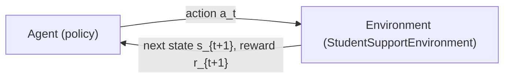
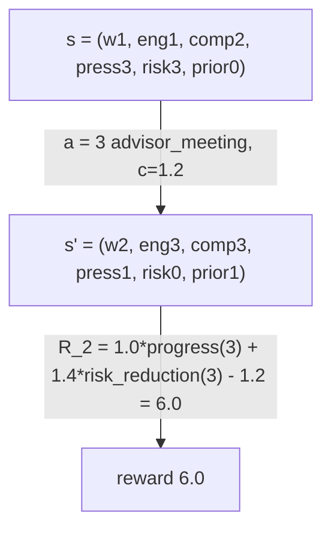

# The MDP and the Environment

## Intuition

Every method in this showcase — from the contextual-bandit warm-up to the optional PPO bridge —
acts against one shared world: a single student moving through a six-week term while an
academic-support agent decides, each week, whether and how to intervene. Before you can *learn* a
policy you must *specify the problem*, and the formal object that does that is the **Markov
decision process (MDP)**. The MDP is the foundation at the bottom of the ladder
(`contextual bandit -> MDP -> Q-learning -> DQN -> policy gradient -> actor-critic -> PPO`): the
contextual bandit is the degenerate one-step case (a context arrives, you act once, there is no
next state), and every rung above the MDP — value-based control, policy gradients, actor-critic —
is a different *algorithm* for solving the *same* MDP defined here. This guide pins down that MDP
concretely: its states, its four actions, its (deterministic) dynamics, its shaped reward, and its
finite horizon. Get this right and the rest of the showcase is "just" choosing how to solve it.

## The core mechanism: the MDP tuple `(S, A, P, R, γ, H)`

An MDP is the tuple `(S, A, P, R, γ, H)`, and the agent–environment interaction produces a
trajectory `S_1, A_1, R_2, S_2, A_2, R_3, …`. We follow the Sutton & Barto convention of
[`math-notes.md`](math-notes.md): the reward received **after** acting in `S_t` is `R_{t+1}`. Here
is each component, instantiated for this domain by `src/student_support_rl/environment.py`.

### `S` — the state space

A state `s` is a 6-tuple of discrete integer variables (`StudentState`):

```
s = (week, engagement, completion, pressure, risk, prior_interventions)
```

| Variable | Range | Meaning | Direction |
|---|---|---|---|
| `week` | `1..H` | within-episode clock | — |
| `engagement` | `0..4` | how engaged the student is | higher is better |
| `completion` | `0..4` | assignment completion | higher is better |
| `pressure` | `0..4` | workload pressure | higher is worse |
| `risk` | `0..3` | derived danger level | higher is worse |
| `prior_interventions` | `≥ 0` (bounded) | cumulative non-null interventions so far | — |

Note that `prior_interventions` is **not** capped at `H`: it starts from the scenario's baseline
(`0` for most starts, `3` for `repeated_prior_interventions`) and rises by `1` for each non-null
action, so over the term it can exceed `H` (it reaches `8` in reachable acting states here). It is
still a *bounded* integer — the finite horizon caps how many increments can occur — so the joint
state space stays finite. Every other field is bounded directly by its band above. Because every
field is a bounded integer, the joint state space is **finite and discrete** — which
is exactly what lets the tabular methods on the lower rungs key a Q-table or a policy directly on
`s.as_tuple()`. The state is also fully observed: the agent's observation *equals* the state, so
there is no hidden information and this is an MDP, not a POMDP (see *state vs. observation* in
[`glossary.md`](glossary.md)).

One subtlety worth flagging now: `risk` is **not an independent variable**. It is a *derived
feature* recomputed from the other metrics by `risk_from_metrics` via a fixed, hand-tuned
threshold rule (`score = 5 − engagement − completion + pressure + max(0, prior_interventions − 2)`,
then bucketed into `{0,1,2,3}`). HONESTY: this is a heuristic danger signal, **not** a learned or
calibrated risk model. It exists so the agent and the reward share one salient "how worried are we"
scalar.

### `A` — the action space

Four discrete interventions with **strictly rising costs** `c(a)` (`ACTION_LABELS`, `ACTION_COSTS`):

| `a` | Label | Cost `c(a)` |
|---|---|---|
| `0` | `no_intervention` | `0.0` |
| `1` | `resource_email` | `0.2` |
| `2` | `ta_session` | `0.7` |
| `3` | `advisor_meeting` | `1.2` |

The rising cost is the whole point: a good policy cannot simply escalate to the advisor every week,
because the reward charges for that price. The trade-off between *efficacy* and *cost* is what makes
this a decision problem rather than a one-line rule.

### `P` — the transition kernel (deterministic here)

`P` answers "given that I take `a` in `s`, what is `s'`?" In this showcase the transition is a pure,
**deterministic** function `s' = T(s, a)`, implemented by the private `_transition` method — there
is no sampling anywhere in a step:

```
s' = T(s, a)      (deterministic: same (s, a) -> same s')
```

The dynamics encode the domain story through hand-crafted deltas on
`engagement`/`completion`/`pressure`, clamped back into `[0, 4]`, after which `prior_interventions`
increments for any non-null action and `risk` is recomputed. Two structural effects shape the
optimal policy:

- **Diminishing returns / fatigue.** Repeated active interventions help *less*: the engagement gain
  of the TA session and advisor meeting is reduced by `fatigue = max(0, prior_interventions − 1)`.
  Over-helping a student who has already been helped a lot yields little.
- **Pressure-sensitive drift under inaction.** Under `no_intervention`, high `pressure` (`≥ 3`)
  erodes engagement, elevated `risk` (`≥ 2`) erodes completion, and low `completion` (`≤ 2`)
  ratchets `pressure` upward. Doing nothing is not neutral for a struggling student — the situation
  can decay on its own.

HONESTY (read this twice): the dynamics are deterministic given `(s, a)`. The only randomness in the
whole environment is in `reset(seed=...)`, which jitters each *start* metric by `±1` to give a
scenario a small family of nearby start states. That seed is consumed entirely inside `reset` and
**never reaches `step`** — so the same seed reproduces the same `S_0` exactly, and from any fixed
state the future is fully determined. This is a *deterministic finite-horizon MDP*, and that fact is
precisely what makes exact planning by dynamic programming possible (next section, and
[`value-based-learning.md`](value-based-learning.md)).

### `R` — the reward function

`R` is the *objective* of the entire problem: everything the agent optimizes flows from this one
scalar, emitted as `R_{t+1}` after acting. The default reward (`default_reward`) is a deliberately
**shaped** signal:

```
R_{t+1} = 1.0·progress + 1.4·risk_reduction − c(a)
          − over_intervention_penalty − unresolved_high_risk_penalty
```

where, with `s` the previous state and `s'` the next state:

```
progress                    = (s'.engagement + s'.completion) − (s.engagement + s.completion)
risk_reduction              = s.risk − s'.risk
over_intervention_penalty   = 0.6 · max(0, s'.prior_interventions − 2)
unresolved_high_risk_penalty = 1.2   if done and s'.risk ≥ 2   else 0
```

The weighting reflects the mission: `risk_reduction` is weighted `1.4` — **above** raw `progress`
(`1.0`) — because de-risking the student is the primary goal. The two penalty terms close
reward-hacking loopholes (spamming interventions; coasting into a high-risk final week). The full
treatment of *why each term exists and how it can still be gamed* lives in
[`reward-design-and-hacking.md`](reward-design-and-hacking.md); this guide only places `R` inside
the tuple.

### `γ` and `H` — discount and horizon

`γ ∈ [0, 1]` is the **discount factor** weighting future rewards. Note an important design choice:
`γ` is owned by the *agent*, **not** stored in the environment — the same world is solved with
`γ = 0.9` by the tabular methods and `γ = 0.95` in the DRL bridge (see the notation table in
[`math-notes.md`](math-notes.md)). `H` is the **horizon**: the episode runs for `H = 6` weekly
decisions and then terminates. The `step` method flags `done` once a transition pushes the week past
`H`, and clamps the reported terminal week back to `H` (the metrics of `s'` are preserved). The
finiteness of `H` is what makes exact backward induction cheap.

### The Markov property and the return `G_t`

The defining assumption is the **Markov property**: the next state and reward depend only on the
current state and action, not on the path taken to reach them —
`P(s', r | s, a, history) = P(s', r | s, a)`. This holds by construction here because `_transition`
and `default_reward` are pure functions of `(s, a)` (and `done`); they never read history. Anything
the future depends on — including the `week` clock and the `prior_interventions` fatigue counter — is
*packed into the state itself*, which is the whole trick that makes the Markov assumption honest
rather than a simplification.

The agent maximizes the **(discounted) return** from step `t`, which for this finite-horizon problem
is a finite sum (full derivation in §1 of [`math-notes.md`](math-notes.md)):

```
G_t = R_{t+1} + γ·R_{t+2} + γ²·R_{t+3} + … = Σ_{k=0}^{H−t−1} γ^k · R_{t+k+1}
```

## Diagram (a): the agent–environment loop

Each week the agent observes the state, picks an intervention, and the environment returns the next
state together with the reward for that move. This is the loop `reset`/`step` realizes.



## Diagram (b): one deterministic transition

A concrete `s -> s'` for a single action makes the determinism tangible. This is the first row of
`artifacts/mdp/sample_episodes.csv`: the `high_risk_student` in week 1 receives an
`advisor_meeting` (action `3`). Because dynamics are deterministic, this arrow is the *only*
possible outcome of that `(s, a)`.



Trace it against the formula: `progress = (3+3) − (1+2) = 3`, `risk_reduction = 3 − 0 = 3`,
`c(3) = 1.2`, no over-intervention penalty (`prior_interventions = 1 ≤ 2`), not terminal — so
`R_2 = 1.0·3 + 1.4·3 − 1.2 = 6.0`, exactly the value logged in the artifact. One well-timed
escalation de-risked the student completely; the rest of that episode (rows 2–6) is `no_intervention`
earning `0.0`, since there is nothing left to fix and inaction here costs nothing once `risk = 0` and
`pressure` is low.

## In this showcase

Open these in order to connect the formalism to the running code and artifacts:

- **`src/student_support_rl/environment.py`** — the MDP made concrete. Read `StudentState` (the
  state `S`), `ACTION_LABELS`/`ACTION_COSTS` (the actions `A` and `c(a)`), `_transition` (the
  deterministic kernel `P` — look for the `fatigue` line and the `action == 0` drift block),
  `default_reward` (the reward `R`), and `reset`/`step` (the `S_0` draw and the
  `(s', r, done, info)` loop). Confirm for yourself that the only `random` call is inside `reset`.
- **`src/student_support_rl/dynamic_programming.py`** — *why the determinism matters*. Because `P`
  and `R` are a **known** model, `optimal_action_values` solves the Bellman optimality equation
  exactly by one backward sweep (states processed by descending `week`), yielding the ground-truth
  `Q*` that the model-free methods only *approximate*. This is the planning rung; see §3 of
  [`math-notes.md`](math-notes.md) and [`value-based-learning.md`](value-based-learning.md).
- **`artifacts/mdp/sample_episodes.csv`** — a logged rollout. Each row is one `step`:
  `(scenario_name, week, engagement, completion, pressure, risk, prior_interventions, action,
  action_cost, reward, next_risk)`. Use it to *watch* `T` and `R` operate — e.g. verify the
  worked transition in diagram (b), or notice how `risk` collapses to `0` after the escalation.
- **`artifacts/concepts/mdp_spec.md`** — the one-page prose summary of this same tuple (state,
  actions, deterministic transition, `H = 6`, the policy set, and the reward bridge), handy as a
  quick reference card alongside this guide.

## Honest caveats

- **Determinism.** Transitions are deterministic given `(s, a)`. The `reset` seed only jitters the
  *start* state and is never used during a step; from any fixed state the trajectory under a fixed
  policy is reproducible. Do not mistake the start-state jitter for stochastic dynamics.
- **`risk` is a heuristic, not a model.** `risk_from_metrics` is a hand-tuned threshold rule, not a
  calibrated or learned predictor. It is a teaching signal for "danger," nothing more.
- **The reward is shaped, hence gameable in principle.** `default_reward` is engineered, not derived
  from first principles; its penalty terms exist *because* a naive reward would be exploitable. The
  contrast against a deliberately hackable proxy reward is the subject of
  [`reward-design-and-hacking.md`](reward-design-and-hacking.md).
- **Small and synthetic by design.** Five start scenarios, four actions, six weeks — this world is
  intentionally tiny so the *exact* optimum is computable and every method can be compared against
  it. It is a pedagogical simulator, not a model of real students.

## See also

- [`value-based-learning.md`](value-based-learning.md) — planning (`Q*`) vs. model-free TD control on this MDP
- [`exploration-and-bandits.md`](exploration-and-bandits.md) — the one-step (`H = 1`) special case below the MDP
- [`reward-design-and-hacking.md`](reward-design-and-hacking.md) — why `R` is shaped the way it is, and how it can be gamed
- [`policy-gradient-and-actor-critic.md`](policy-gradient-and-actor-critic.md) — solving the same MDP by optimizing the policy directly
- [`deep-rl.md`](deep-rl.md) — swapping the table for a function approximator on this environment
- [`evaluation-and-governance.md`](evaluation-and-governance.md) — scoring policies across the start-state distribution
- [`exercises.md`](exercises.md) — practice problems on the tuple and the dynamics
- [`glossary.md`](glossary.md) — term definitions (MDP, state vs. observation, transition, return)
- [`math-notes.md`](math-notes.md) — the equations (MDP tuple §1, Bellman/DP §2–3) with full derivations
