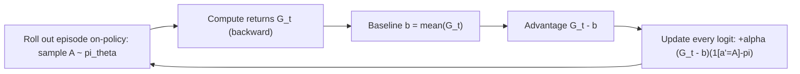
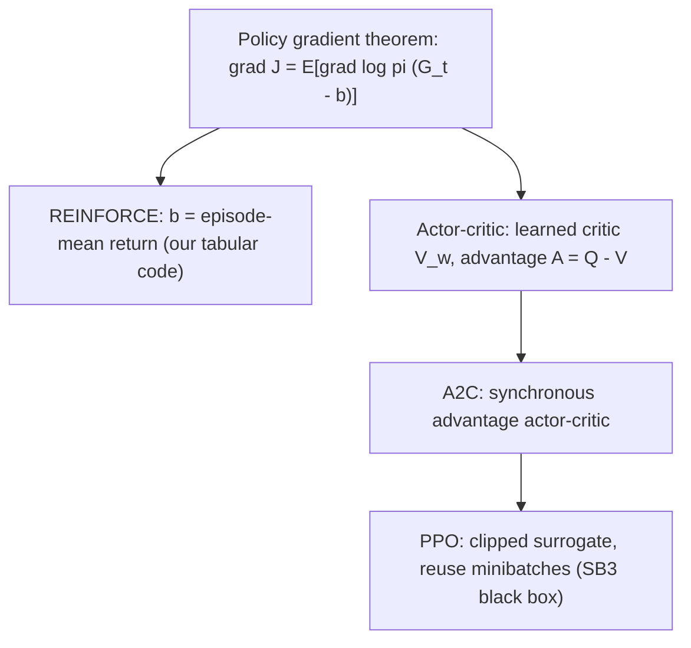

# Policy Gradients and Actor-Critic

## 1. Intuition

Value-based methods ([value-based-learning.md](value-based-learning.md)) learn `Q(s,a)` and then *derive* a policy by acting greedily. Policy-gradient methods skip the middleman: they parameterize the policy `π_θ(a|s)` itself and push its parameters `θ` *uphill* on expected return by gradient ascent. This is the rung after DQN on the ladder — contextual bandit → MDP → Q-learning → DQN → **policy gradient → actor-critic → PPO**. Why bother, when a Q-table already works on a four-action problem? Three reasons that matter at scale: (1) the policy can be stochastic, which is exactly right when exploration must come from the policy and when the optimal behaviour genuinely mixes actions; (2) you optimize the thing you actually deploy (the policy), not a value surrogate; and (3) it extends cleanly to enormous or continuous action spaces where `argmax_a Q(s,a)` is intractable. The showcase implements the foundational algorithm — **REINFORCE** — in fully **tabular** form (one logit per state-action pair, no neural network), so you can read the entire policy-gradient update in a few lines before meeting the same estimator hidden behind a deep network in **PPO**.

## 2. The core mechanism

### Softmax policy

We give every state `s` a vector of per-action **logits** `θ_{s,·}` (a row in a lookup table) and turn them into action probabilities with a softmax:

```
π_θ(a|s) = exp(θ_{s,a}) / Σ_{a'} exp(θ_{s,a'})
```

This is a *valid* distribution for any finite logits, and it is differentiable in `θ` — the two properties gradient ascent needs. (Implementation note: `softmax` in `policy_gradient.py` subtracts `max(logits)` before exponentiating for numerical stability; the shift cancels in the ratio.)

### Objective and the policy gradient theorem

The objective is expected return from the start of an episode, `J(θ) = E_{π_θ}[G_1]`, where the return uses the reward-after-acting convention `R_{t+1}` and discount `γ` (see [math-notes.md §1](math-notes.md#1-mdp-return-and-value-functions)):

```
G_t = Σ_{k≥0} γ^k · R_{t+k+1}
```

The **policy gradient theorem** rewrites `∇_θ J` as an expectation we can sample from rollouts — crucially, **without** differentiating through the environment's unknown dynamics:

```
∇_θ J(θ) = E_{π_θ}[ Σ_t ∇_θ log π_θ(A_t|S_t) · (G_t − b(S_t)) ]
```

The term `∇_θ log π_θ(A_t|S_t)` is the **score function**. Intuitively: weight each action's score by how good the return that followed it was (`G_t`), and the policy drifts toward actions that preceded high return. The baseline `b(S_t)` is subtracted from the return — more on that below. Full derivation lives in [math-notes.md §8](math-notes.md#8-policy-gradients-optimize-the-policy-directly); we do not repeat it here.

### The closed-form score for softmax

For the softmax parameterization the score has an exact, cheap closed form for *every* logit `θ_{s,a'}` (not only the sampled action):

```
∂/∂θ_{s,a'} log π_θ(A_t|s) = 1[a' = A_t] − π_θ(a'|s)
```

Read it as "raise the chosen action's logit, lower every action's logit in proportion to its current probability." It is `(1 − π)` for the action actually taken and `(−π)` for the others, so probability mass is conserved.

### The REINFORCE update (our tabular implementation)

Combine the score with the (baseline-subtracted) Monte-Carlo return and you get the update `train_reinforce` applies to every visited state-action pair, looping over **all** candidate actions `a'`:

```
θ_{s,a'} ← θ_{s,a'} + α·(G_t − b)·( 1[a'=A_t] − π_θ(a'|s) )
```

This is Monte-Carlo policy gradient: roll out a whole episode on-policy, compute the true returns `G_t` by backward accumulation, *then* update. There is no bootstrapping and no TD error here — unlike Q-learning/SARSA, the signal is the full sampled return, not a one-step estimate.



### Baseline → critic → advantage → A2C

The baseline `b(S_t)` reduces the **variance** of the gradient estimate **without introducing bias** (it works for any function of state, because `E[∇ log π_θ · b(S_t)] = 0`). Our implementation uses the simplest possible baseline: the **episode-mean return** (`use_baseline=True` by default; set it `False` and `b = 0`). It answers "was this return better or worse than typical?" rather than "was it positive?".

That single idea is the **seed of a critic**. Replace the crude mean baseline with a *learned* state-value estimate `V_w(s)` and the weighting term becomes the **advantage**:

```
A^π(s,a) = Q^π(s,a) − V^π(s)
```

— "how much better is action `a` than the state's average?" A method that learns `V_w` (the **critic**) alongside `π_θ` (the **actor**) and uses the advantage in the gradient is an **actor-critic** method; **A2C** (Advantage Actor-Critic) is the canonical synchronous form. Our REINFORCE is the degenerate actor-critic where the "critic" is a constant per episode. See [math-notes.md §9](math-notes.md#9-actor-critic-and-ppo).

### PPO's clipped surrogate

Vanilla policy gradient takes one gradient step per batch of fresh on-policy data, which is sample-hungry and brittle: a single large step can collapse the policy. **PPO** makes several optimization steps on the same batch while preventing the new policy from moving too far from the one that *collected* the data. With the probability ratio `ρ_t(θ) = π_θ(A_t|S_t) / π_{θ_old}(A_t|S_t)` and an advantage estimate `Â_t`, it maximizes the **clipped surrogate**:

```
L(θ) = E[ min( ρ_t·Â_t , clip(ρ_t, 1−ε, 1+ε)·Â_t ) ]
```

The `clip` flattens the objective once `ρ_t` leaves `[1−ε, 1+ε]`, removing the incentive to push the ratio further; the outer `min` keeps the bound *pessimistic* so the policy is never rewarded for an over-large update. **PPO is still the policy gradient above** — same `∇ log π · advantage` skeleton — just made trust-region-safe and reusable across minibatches, with a neural net in place of our lookup table.



## 3. In this showcase

- **`src/student_support_rl/policy_gradient.py`** — the inspectable heart of this guide. Read `train_reinforce`: the on-policy rollout loop (`_sample_action` draws `A ~ π_θ(·|s)`, so *exploration comes from the policy itself*, not ε-greedy), the backward return accumulation, the `baseline` line, and the double loop that applies the closed-form softmax update to every `(s, a')`. The line `grad_log = indicator - probabilities[candidate]` is the score `1[a'=A_t] − π(a'|s)` verbatim. `ReinforcePolicy.select_action` then deploys the **mode** (argmax logit) for evaluation, falling back to action `0` (`no_intervention`) on unseen states.
- **`artifacts/policy_gradient/training_curve.csv`** — one row per episode (`episode, scenario_id, total_reward, baseline, steps`); 400 rows under `--quick`/`make smoke`, 2000 under a full `make run`. The `baseline` column is the mean of *that episode's* per-step returns `G_t` (recomputed each episode — it is **not** a running cross-episode average). During training each visited step `t` is nudged by its own advantage `(G_t − baseline)`, so the per-step quantity drives the update, not `(total_reward − baseline)`; `total_reward` is the undiscounted episode return shown only for context. **Look honestly at the noise** (see caveats): early episodes are mostly negative, and later episodes mix clear wins with large negative outliers rather than climbing monotonically.
- **`src/student_support_rl/drl.py`** — the bridge to the *scaled-up* version. `run_drl_comparison` trains a **PPO** agent (Stable-Baselines3, `MlpPolicy`, on-policy with `n_steps` rollouts and the clipped surrogate) and a DQN agent on the *same* environment, horizon, and seed family as tabular Q-learning. The helper `_policy_family` tags PPO as `actor_critic_policy_gradient` — the exact rung this guide describes. PPO here is a **black box**: the clipping and advantage estimation you just read about live inside SB3, not in our code.
- **`artifacts/drl_optional/policy_gradient_notes.md`** — the generated same-environment comparison. On the recorded run PPO reached `avg_reward 0.61` and DQN `0.34`, versus tabular Q-learning's `−3.62`, illustrating that the deep policy-gradient method does competitively on this MDP. Treat these as a single seeded demo run, not a benchmark.

Together: `policy_gradient.py` is the *inspectable* version of what `drl.py`'s PPO scales up. Same theorem, same score function, same advantage idea — one you can step through line by line, the other delegated to a tuned library.

## 4. Honest caveats

- **Monte-Carlo REINFORCE is high variance.** The gradient is weighted by the *full* sampled return, so an unlucky trajectory swings the update hard. The episode-mean baseline helps but does not tame it: the training curve does **not** show a clean monotone climb, and you should not expect one. A learned critic (true actor-critic) and/or step-size tuning would reduce variance; we deliberately keep the simplest version for inspectability.
- **The baseline here is the episode mean, not a learned `V_w(s)`.** It is state-*independent* within an episode, so it is a weaker variance reducer than a real critic and does **not** make this an actor-critic method. It is the *seed* of one.
- **No bias-free guarantee of finding the global optimum.** Policy gradient ascends `J(θ)` to a *local* optimum of a non-concave objective; the softmax can also drive logits large and the policy near-deterministic, slowing further learning. Outcomes depend on `α`, `γ`, episode count, and seed.
- **We deploy the greedy mode, but trained on samples.** Evaluation uses `argmax_a θ_{s,a}`, discarding the stochasticity that exploration relied on. Unseen states fall back to `no_intervention` — safe, but it means tail states the policy never visited get no learned behaviour.
- **PPO in `drl.py` is not re-derived or tuned.** Hyperparameters (`n_steps=32`, tiny rollouts) are sized for a fast teaching demo, and the comparison numbers in `policy_gradient_notes.md` come from one seeded run on a deterministic-transition MDP — not a statement about PPO vs DQN in general.

## 5. See also

- [value-based-learning.md](value-based-learning.md) — the value-based contrast (`Q(s,a)`, TD error `δ`) this guide departs from.
- [deep-rl.md](deep-rl.md) — DQN and the optional Stable-Baselines3 bridge (`drl.py`), where PPO actually runs.
- [exploration-and-bandits.md](exploration-and-bandits.md) — the one-step special case; here exploration came from ε-greedy, whereas REINFORCE explores via the stochastic policy.
- [mdp-and-environment.md](mdp-and-environment.md) — the MDP, states, actions, and `R_{t+1}` these returns are built from.
- [reward-design-and-hacking.md](reward-design-and-hacking.md) — what `G_t` is actually rewarding, and how that shapes the policy.
- [evaluation-and-governance.md](evaluation-and-governance.md) — how the deployed greedy policy is scored.
- [exercises.md](exercises.md) — practice problems on the policy gradient theorem and REINFORCE.
- [algorithm-ladder.md](algorithm-ladder.md) — the full narrative arc across all rungs.
- [glossary.md](glossary.md) · [math-notes.md](math-notes.md) — term definitions and the equations behind this guide ([§8](math-notes.md#8-policy-gradients-optimize-the-policy-directly), [§9](math-notes.md#9-actor-critic-and-ppo)).
