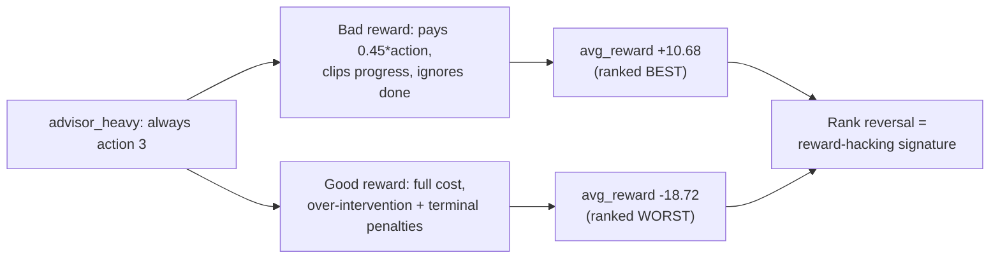

# Reward Design and Reward Hacking

## 1. Intuition

Every method on the ladder — contextual bandit → MDP → Q-learning → DQN → policy gradient →
actor-critic → PPO — optimizes one scalar: the reward `R_{t+1}`. The reward is not a side detail
you tune last; it *is* the objective, and it sits *upstream* of every learner. Choose it well and a
good agent does the right thing; choose it badly and a *more capable* agent does the wrong thing
*harder*, because it optimizes exactly what you wrote rather than what you meant. This guide is the
showcase's central lever: it pairs an aligned reward (`default_reward`) with a deliberately
misspecified proxy (`bad_reward`) and *measures* the gap. The headline result is a **rank
reversal** — the always-escalate `advisor_heavy` policy looks *best* under the bad reward and
*worst* under the good one. That reversal is the diagnostic signature of **reward hacking**: a
policy scoring high on the proxy while degrading true success. The constructive flip side, **reward
shaping**, shows that *adding* the right kind of term can speed learning *without* changing the
optimal policy at all.

## 2. The core mechanism

### 2.1 The reward is the objective

The agent maximizes the discounted return `G_t` (notation from
[math-notes.md §1](math-notes.md)):

```
G_t = R_{t+1} + γ·R_{t+2} + … = Σ_{k=0}^{H-t-1} γ^k · R_{t+k+1}
```

Two different reward functions `R` define two different return surfaces, hence two different
optimal policies `π*`. Nothing else in the MDP `(S, A, P, R, γ, H)` need change for the "best"
policy to flip — only `R`. That is why reward design dominates.

### 2.2 The good (aligned) reward

`default_reward` (re-exported as `GOOD_REWARD`) encodes the *true* objective: improve the student
and de-risk them, while paying honestly for the cost and side effects of intervening. Writing
`progress = (eng' + comp') − (eng + comp)` and `risk_reduction = risk − risk'` (deltas from `s` to
`s'`):

```
R_{t+1} = 1.0·progress + 1.4·risk_reduction − c(a)
          − 0.6·max(0, prior_interventions' − 2)        (over-intervention penalty)
          − 1.2·[done and risk' ≥ 2]                    (unresolved end-of-horizon risk)
```

Each negative term closes a loophole an optimizer would otherwise exploit. Risk reduction is
weighted `1.4` above raw progress (`1.0`) because de-risking is the primary mission; `c(a)` is the
rising action cost (`{0, 0.2, 0.7, 1.2}`); the over-intervention term punishes spamming help; the
terminal term punishes coasting into a high-risk finish. Crucially, `progress` here is **signed** —
backsliding is charged — and `done` is **used**.

### 2.3 The bad (hackable) proxy reward

`bad_reward` *looks* sensible but is exploitable. It introduces three classic reward-design
mistakes:

```
R_{t+1} = 1.1·max(0, progress) + 0.45·action − 0.1·c(a)
```

- **Pays for intensity, not outcomes.** The `0.45·action` term literally pays more for a *heavier*
  intervention (action index `0…3`), independent of whether the student improves. This is the
  loophole.
- **Never charged for backsliding.** `max(0, progress)` clips the progress term at zero, so a
  decline in engagement/completion costs the agent *nothing*.
- **Ignores fatigue and end-of-horizon risk.** There is no over-intervention penalty, and `done` is
  discarded entirely — unresolved risk at the end of the term goes unpunished. (The action cost is
  also discounted to a token `0.1·c(a)`, so even the price barely bites.)

### 2.4 Why the proxy inverts the ranking

`advisor_heavy` is a constant policy: it plays action `3` every week regardless of state. Trace the
two rewards against it:

- **Under the bad reward**, every step banks `0.45·3 = 1.35` in pure intensity bonus before any
  outcome is even considered, and the clipped progress term can only *add*. Over a six-week
  horizon and five scenarios that constant farm dominates — `advisor_heavy` scores **+10.68**,
  beating the sensible `heuristic` at **+4.486**.
- **Under the good reward**, the same constant escalation soon triggers the over-intervention
  penalty (it fires once cumulative interventions exceed `2` — from week 3 on for the four
  scenarios that start fresh, and from week 1 for the already-supported scenario 4), runs into
  transition *fatigue* (repeated interventions yield
  diminishing engagement gains — see `_transition` in `environment.py`), pays the full action cost
  `1.2` each step, and still risks the terminal high-risk penalty. It collapses to **−18.72**,
  far below `heuristic` at **−2.04**.

So the rank flips: best→worst. This is **Goodhart's law** in one table — *"when a measure becomes a
target, it ceases to be a good measure."* The proxy `avg_reward` correlated with true success only
until a policy optimized the proxy directly; `advisor_heavy` does exactly that and the correlation
breaks.



### 2.5 The honest cross-check: a side-metric

The reversal is only *legible* because the evaluation harness reports more than the reward it is
optimizing. `evaluate_policies` (in `evaluation.py`) surfaces `avg_final_risk` alongside
`avg_reward` precisely so a proxy win that leaves students at risk cannot hide. The general
lesson: **never trust a single scalar to certify success** — instrument the true outcome directly
and watch it whenever the optimized score moves. This is the bridge to governance
([evaluation-and-governance.md](evaluation-and-governance.md)).

### 2.6 Reward shaping: the benign cousin

Reward hacking *changes which policy is optimal* (a bug). **Reward shaping** is the opposite by
construction: an *additive* term that speeds learning while provably leaving `π*` unchanged. The
classic safe form is **potential-based** shaping (Ng, Harada & Russell, 1999): given any state
potential `Φ(s)`, add

```
F(s, a, s') = γ·Φ(s') − Φ(s)
```

Telescoping `F` over an episode contributes a constant that depends only on the start and terminal
potentials, so it shifts every policy's return by the *same* offset and cannot reorder them — the
optimal policy is invariant. Contrast the two failure modes sharply:

| | Mechanism | Effect on `π*` | Status |
|---|---|---|---|
| `bad_reward`'s `0.45·action` | bonus for *intensity* (not potential-based) | **changes** `π*` | reward hacking (bug) |
| potential-based `γ·Φ(s') − Φ(s)` | telescoping additive term | **invariant** | reward shaping (feature) |

The takeaway: *adding* to a reward is safe only when the addition is structured so it cannot change
the argmax over policies. The `0.45·action` term is the unsafe kind; `γ·Φ(s') − Φ(s)` is the safe
kind. (The showcase does not ship a shaped reward — this contrast is conceptual, to delineate the
line `bad_reward` crosses.)

## 3. In this showcase

- **Code — `src/student_support_rl/reward_design.py`.** Open `bad_reward` and read the three
  inline comments marking each mistake (`del done`, the `max(0, …)` clip, and the
  `0.45 * action` intensity bonus). `GOOD_REWARD` re-exports `environment.default_reward`;
  `compare_reward_models` runs the *controlled experiment* — identical policies, scenarios
  `(0,1,2,3,4)`, and horizon `6`, swapping **only** `reward_fn` — so any ranking change is
  attributable to the reward alone. `reward_hacking_report` indexes the resulting 2×2 (reward ×
  policy) table and lays out the four `avg_reward` cells.
- **Code — `src/student_support_rl/environment.py`.** `default_reward` is the aligned objective;
  read its term-by-term comments to see each guardrail. `_transition` is where *fatigue* and
  *pressure-sensitive drift* live — the dynamics that make constant escalation genuinely harmful
  under the good reward.
- **Code — `src/student_support_rl/policies.py`.** `AdvisorHeavyPolicy` (always action `3`) is the
  hacking foil; `HeuristicPolicy` is the sensible escalation baseline it must beat. Both are fixed
  (non-learning) policies, so the comparison isolates the reward, not training noise.
- **Artifact — `artifacts/reward/reward_hacking_report.md`.** The punchline. Look for the rank
  reversal in the four numbers: bad-reward advisor `10.68` > heuristic `4.486`, but good-reward
  advisor `−18.72` < heuristic `−2.04`.
- **Artifacts — `artifacts/reward/reward_spec_good.md` and `reward_spec_bad.md`.** The
  plain-language design intent behind each reward (from `reward_model_specs`). Read them next to
  the numbers above to connect *stated intent* to *realized behavior*.

Regenerate all four artifacts with `make run` (or the standalone
`scripts/run_reward_hacking_check.py`); `make smoke` produces the deterministic quick variant.

## 4. Honest caveats

- **The flaw in `bad_reward` is deliberate and pedagogical**, not a latent bug. Its docstring says
  so. Real reward-hacking incidents are rarely this legible — the loophole is usually subtle and
  found *only* by an optimizer, which is the danger.
- **The numbers are exact, not stochastic.** The transition `P` is deterministic given `(s, a)`
  (the reset seed only jitters `S_0` — see [math-notes.md §11](math-notes.md)), so `10.68 /
  4.486 / −18.72 / −2.04` reproduce exactly. Do not read them as having a confidence interval.
- **`avg_reward` is simulator-based evaluation, not off-policy evaluation.** Each policy is
  re-simulated in the *known* environment (`evaluation.py`); this is not OPE from logged real data.
  We can name the "true" objective here only because we wrote it.
- **`risk` itself is a hand-tuned heuristic**, not a calibrated model (`risk_from_metrics` in
  `environment.py`). The good reward de-risks *that* heuristic. In a real deployment, a flawed risk
  proxy is itself a reward-hacking surface one rung up — Goodhart applies to the *metric* as much
  as to the reward.
- **`advisor_heavy` is a degenerate constant policy.** It exposes the loophole cleanly precisely
  because it ignores the state; it is not a claim that a *learned* agent would converge to exactly
  this policy under `bad_reward`, only that the proxy *rewards* this behavior.

## See also

- [mdp-and-environment.md](mdp-and-environment.md) — where `R` sits in the MDP tuple and how
  `step` emits `R_{t+1}`.
- [evaluation-and-governance.md](evaluation-and-governance.md) — side-metrics, audits, and catching
  hacks at evaluation time.
- [value-based-learning.md](value-based-learning.md) ·
  [policy-gradient-and-actor-critic.md](policy-gradient-and-actor-critic.md) ·
  [deep-rl.md](deep-rl.md) — the learners that all inherit whichever reward you hand them.
- [exercises.md](exercises.md) — try patching `bad_reward` and re-running the check.
- [glossary.md](glossary.md) (reward, reward hacking, reward shaping) ·
  [math-notes.md](math-notes.md) (return `G_t`, the MDP `R`, deterministic `P`).
