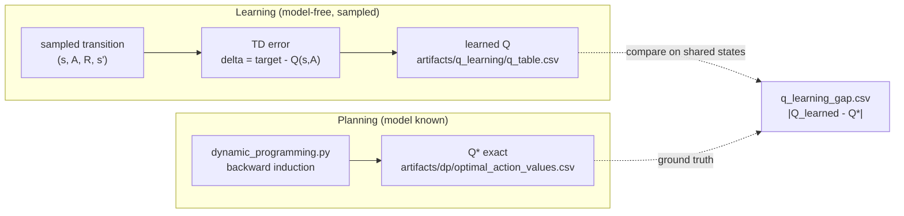

# Value-Based Learning — Bellman Optimality, DP, and TD Control

## Intuition

Value-based control is the heart of this showcase: instead of optimizing a policy directly, you
learn **how good each action is** — the action-value `Q(s,a)` — and then act greedily with respect
to it. This guide walks one rung of the ladder
(contextual bandit → **MDP → Q-learning →** DQN → policy gradient → actor-critic → PPO) from two
sides at once. From the **planning** side, when the model `P, R` is known you can compute the exact
optimum `Q*` by dynamic programming — the ground truth. From the **learning** side, model-free
temporal-difference methods (Q-learning, SARSA) sample transitions and nudge their estimates toward
that same optimum *without ever seeing the model*. Laying the learned table beside the planned one
turns "model-free approaches the model-based optimum" into a measurable claim — and exposes exactly
where the approximation breaks down (the coverage caveat in §7). DQN, the next rung, keeps the
Q-learning target verbatim and only swaps the table for a neural network; everything here is its
tabular skeleton.

## Core mechanism

### 1. Bellman optimality — the fixed point everything chases

An MDP is `(S, A, P, R, γ, H)` and the agent maximizes the discounted return
`G_t = Σ_k γ^k · R_{t+k+1}`. The **optimal** action-value function is the unique fixed point of the
Bellman optimality operator:

```
Q*(s,a) = E[ R_{t+1} + γ·max_{a'} Q*(S_{t+1}, a') | S_t=s, A_t=a ]
V*(s)   = max_a Q*(s,a),     π*(s) = argmax_a Q*(s,a)
```

The `max` over next actions — "assume you act optimally from `s'` onward" — is the single feature
that separates *optimal* values from *on-policy* values, and it is exactly the seam between
Q-learning (§4) and SARSA (§5). Full derivation: [math-notes.md](math-notes.md) §2.

### 2. Dynamic programming — exact `Q*` by backward induction (the ground truth)

When the model is **known** and the horizon `H` is finite, you do not sample — you solve the
optimality equation directly. This showcase's transition is **deterministic** (`s' = T(s,a)`), so
the expectation collapses and each acting state is solved in one shot:

```
Q*(s,a) = R(s,a) + ( 0                        if the step terminates
                     γ·max_{a'} Q*(s', a')    otherwise )
```

The trick that makes one sweep sufficient: every acting state reached at decision step `t` has
`week == t`, so processing states in **descending `week`** guarantees that each successor's
`Q*(s', ·)` is already computed before it is needed. No iteration to a fixed point is required —
this is value iteration specialized to a finite horizon (backward induction). The implementation
even injects a known state into a fresh environment (`model_step`) so the *exact same* transition,
reward, and terminal logic are reused rather than reimplemented. This is the **planning** rung; the
model-free methods below approximate this `Q*` while deliberately denied access to `P` and `R`.
Derivation: [math-notes.md](math-notes.md) §3.

### 3. The TD error — the engine of model-free learning

Model-free methods learn from sampled transitions `(S_t, A_t, R_{t+1}, S_{t+1})`. They build a
**target** and nudge the current estimate toward it by the signed surprise, the **TD error**:

```
δ_t = target − Q(S_t, A_t)
Q(S_t, A_t) ← Q(S_t, A_t) + α·δ_t
```

In both `q_learning.py` and `sarsa.py` the literal `target − old_value` expression **is** `δ_t`,
and the update `Q ← Q + α·δ` is identical line-for-line. The *only mathematical* difference between
the two methods is how they build `target` (§4 vs §5); the one *structural* difference follows from
it — SARSA must pick the next action to form its target, so it carries `(s, A)` across the loop
(see §5). See [math-notes.md](math-notes.md) §4.

### 4. Q-learning — off-policy TD control

Q-learning bootstraps from the **greedy** next value, no matter which action the exploratory
behaviour policy actually takes next. That `max` is the entire off-policy mechanism: it lets the
update target the *optimal* policy `Q*` while the data is generated by an ε-greedy behaviour policy.

```
target = R_{t+1} + γ·max_{a'} Q(S_{t+1}, a')     (0 at a terminal step)
δ_t    = target − Q(S_t, A_t)
```

*Implemented by:* `q_learning.train_q_learning` (ε-greedy behaviour with multiplicative ε-decay
floored at `epsilon_min`). The greedy deployment policy is `QLearningResult.greedy_policy()` —
`argmax_a Q(s,a)`. See [math-notes.md](math-notes.md) §5.

### 5. SARSA — on-policy TD control

SARSA bootstraps from the action `A'` it **actually takes next** under its own ε-greedy policy.
It therefore learns the value of the policy it *follows* (exploration cost included), not of a
hypothetical greedy policy. Note the structural tell in `sarsa.py`: it commits to the first action
*before* the loop and carries `(s, A)` forward, because the target needs the next chosen action.

```
target = R_{t+1} + γ·Q(S_{t+1}, A')              (0 at a terminal step)
δ_t    = target − Q(S_t, A_t)
```

*Implemented by:* `sarsa.train_sarsa` (same signature and hyperparameters as Q-learning, so the
only moving part is the target). See [math-notes.md](math-notes.md) §6.

### 6. Off-policy vs on-policy — one crisp comparison

The two methods are the same algorithm with one substitution in the target:

| | Q-learning (off-policy) | SARSA (on-policy) |
|---|---|---|
| Target | `R_{t+1} + γ·max_{a'} Q(s',a')` | `R_{t+1} + γ·Q(s',A')` |
| Bootstraps from | the **greedy** next action | the **actually-chosen** next action `A'` |
| Learns the value of | the optimal policy `Q*` | the behaviour (ε-greedy) policy |
| Effect | ignores exploration cost → chases `Q*` | folds in exploration cost → can be more conservative near costly mistakes |
| Code | `q_learning.py`: `max(q_table[next_key])` | `sarsa.py`: `q_table[next_key][next_action]` |

**In one line:** Q-learning's target uses `max_{a'} Q(s',a')` (value of the *greedy* policy);
SARSA's uses `Q(s', A')` for the *sampled* `A'` (value of the *behaviour* policy). The classic
consequence is Cliff-Walking, where SARSA learns a safer path because exploratory steps off the
cliff hurt its target — but whether and in which direction that gap appears **here** depends on this
environment's reward structure and the seed, so treat it as something to observe in the artifacts,
not assume.



### 7. Convergence and the coverage caveat (read this)

Tabular Q-learning and SARSA converge to `Q*` and `Q^π` respectively under the standard conditions:
**every** state-action pair visited infinitely often, plus a suitable step-size schedule. The honest
qualifier is the word *visited*. In a finite run a tabular method can only update entries it has
actually sampled; every other entry stays at its initialization (`0.0` here).

This is exactly why [`artifacts/dp/q_learning_gap.csv`](../artifacts/dp/q_learning_gap.csv) shows
large residual error on rarely-reached **tail states** while `Q*` is defined **everywhere**. Two
load-bearing facts from that file:

- The comparison is restricted to the **intersection** of the two tables (`_shared_abs_gaps` in
  `dynamic_programming.py`) — an apples-to-apples view over states Q-learning actually reached. Even
  so, a large share of those shared `(s,a)` rows still have `learned_q_value == 0.0`: the state
  *tuple* was visited at least once, but that *particular action* in it was never selected, so its
  entry never moved.
- The worst gaps land on states with many `prior_interventions` deep in an episode — long-horizon,
  rarely-reached corners where `Q*` is a large negative number (e.g. an `optimal_q_value` near
  `-17`) but the learned value is still `0.0`. The model-based planner assigns these the value they
  deserve; the sampler simply never got there.

The takeaway is the core pedagogical point of this rung: **`Q*` is global, model-free `Q` is only
as good as its coverage.** That gap is not a bug in the training — it is the price of being
model-free, and it is precisely what DQN's experience replay and what better exploration are trying
to buy back. See [math-notes.md](math-notes.md) §11.

## In this showcase

Open these together — the whole point is the side-by-side:

- **`src/student_support_rl/dynamic_programming.py`** → `optimal_action_values` computes exact `Q*`
  by backward induction; `q_learning_gap` / `gap_rows` measure the residual. Look at how `model_step`
  reuses the real environment as the model so planning and learning share identical dynamics.
- **`src/student_support_rl/q_learning.py`** → `train_q_learning`. Find
  `future_value = max(q_table[next_key])` — that single `max` is what makes it off-policy.
- **`src/student_support_rl/sarsa.py`** → `train_sarsa`. Find
  `future_value = q_table[next_key][next_action]` — the same line, but indexed by the *chosen* `A'`.
- **[`artifacts/dp/optimal_action_values.csv`](../artifacts/dp/optimal_action_values.csv)** — the
  ground-truth optimum, one row per `(state, action)`. This is "what the agent *should* do."
- **[`artifacts/dp/q_learning_gap.csv`](../artifacts/dp/q_learning_gap.csv)** — sort by `abs_gap`
  descending to find the exact decisions the learner still gets wrong; note the `learned_q_value` is
  `0.0` on the worst-offending tail rows (the coverage caveat made concrete).
- **[`artifacts/q_learning/q_table.csv`](../artifacts/q_learning/q_table.csv)** and
  **[`artifacts/q_learning/training_curve.csv`](../artifacts/q_learning/training_curve.csv)** — the
  learned values and the per-episode `total_reward` / `epsilon` / `steps` trace.
- **[`artifacts/sarsa/q_table.csv`](../artifacts/sarsa/q_table.csv)** and
  **[`artifacts/sarsa/training_curve.csv`](../artifacts/sarsa/training_curve.csv)** — the on-policy
  counterparts. The curves share the same schema as Q-learning's, so you can diff them directly.

Regenerate everything with `make run` (or the smaller `make smoke`).

## Honest caveats

- **Convergence is asymptotic and coverage-bounded.** See §7. The finite-run gap on tail states is
  expected behaviour, not a defect; `Q*` from DP is the only table defined on every reachable state.
- **Determinism is what makes the DP exact.** Backward induction here works in a single sweep
  *because* the transition is deterministic given `(s, a)`. In a stochastic MDP you would need the
  expectation `Σ_{s'} P(s'|s,a)·max_{a'} Q*(s',a')` and value iteration would generally take several
  sweeps to converge.
- **The SARSA-vs-Q-learning behavioural gap is environment-and-seed dependent.** The Cliff-Walking
  intuition is real in general but is not guaranteed to manifest with this reward structure; verify
  against the artifacts rather than asserting it.
- **No off-policy evaluation.** The comparison to `Q*` is possible only because the model is known
  and synthetic. With logged real-world data you would have no `Q*` to diff against and would need
  OPE — see [evaluation-and-governance.md](evaluation-and-governance.md).

## See also

- [mdp-and-environment.md](mdp-and-environment.md) — the MDP, state, reward, and horizon this all
  runs on.
- [exploration-and-bandits.md](exploration-and-bandits.md) — the one-step special case and where
  ε-greedy comes from.
- [deep-rl.md](deep-rl.md) — DQN keeps the §4 target and replaces the table with a network.
- [policy-gradient-and-actor-critic.md](policy-gradient-and-actor-critic.md) — the alternative that
  optimizes the policy directly instead of learning `Q`.
- [reward-design-and-hacking.md](reward-design-and-hacking.md) · [exercises.md](exercises.md)
- [glossary.md](glossary.md) — term definitions · [math-notes.md](math-notes.md) §§2–6 — full
  equations and derivations · [algorithm-ladder.md](algorithm-ladder.md) — the narrative arc.
